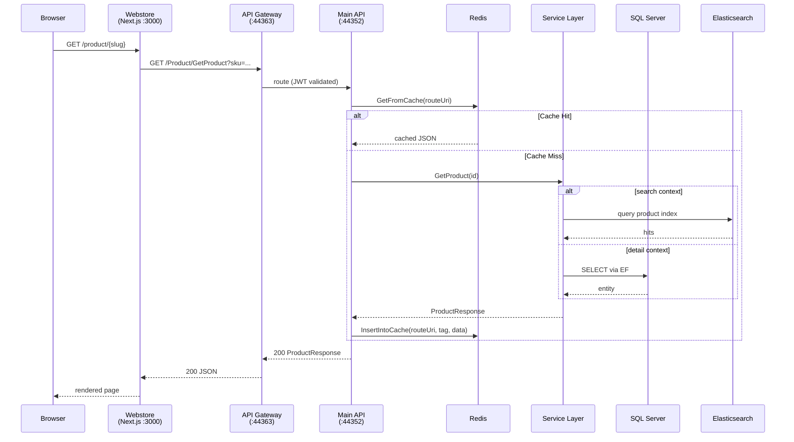
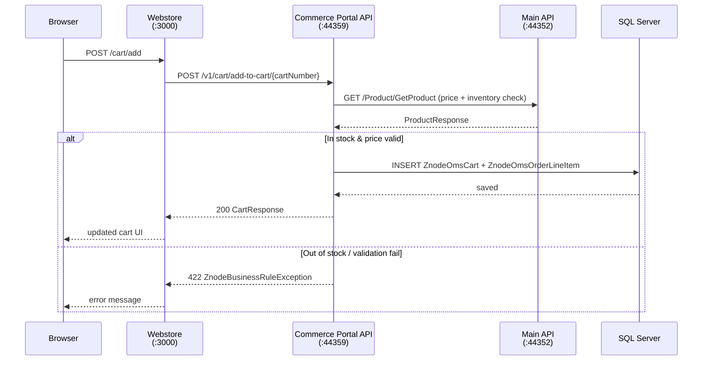
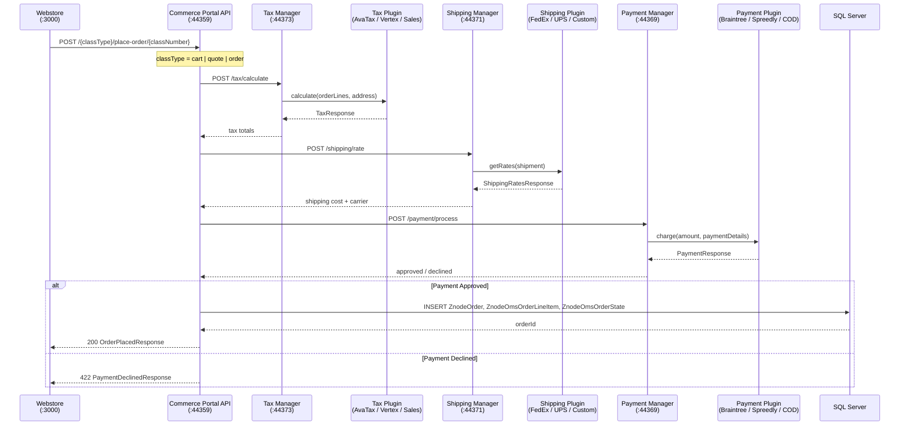
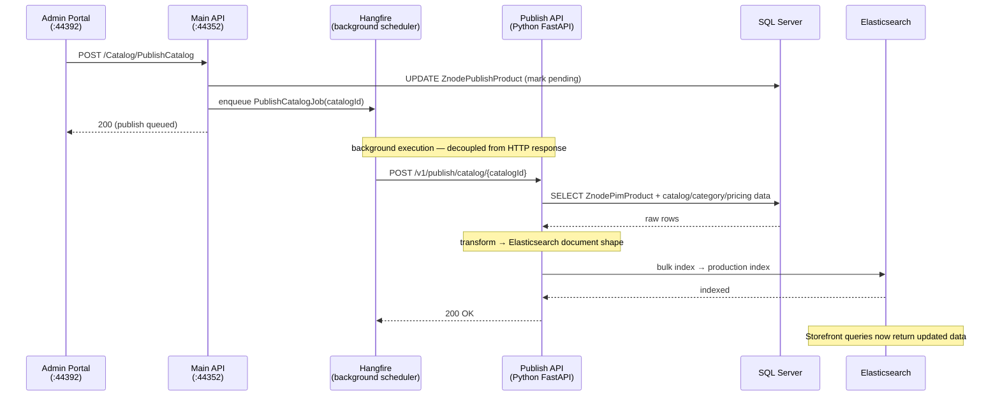
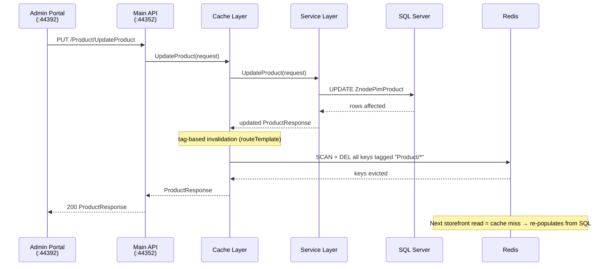
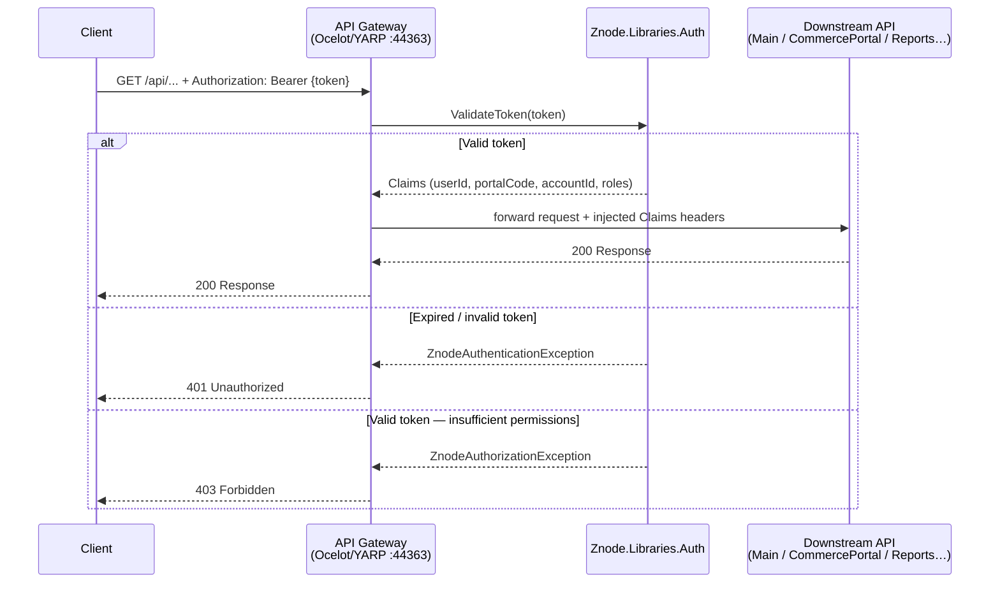

# Znode10 Platform — Architecture Overview

> **Znode10x** is a multi-tenant, headless B2B/B2C e-commerce platform built on **ASP.NET Core 8.0 (C#)**. It exposes a versioned REST API (V1 + V2) consumed by four front-facing applications: an **Admin Portal** (merchant back-office, port 44392), a **Webstore** (Next.js customer storefront, port 3000), a **Page Builder** (Next.js visual editor embedded in Admin, port 3001), and a **Commerce Portal** (primary OMS surface for B2B/sales-rep workflows, port 44396 — backed by `znode10-commerceportal-api`). Core business domains are **PIM** (products, catalogs, categories, attributes), **OMS** (orders, quotes, pricing, inventory, returns — primarily served via Commerce Portal API rather than the main API), **CMS** (pages, banners, themes, page builder), **Customer** (accounts, users, B2B approval workflows), and **BStores** (sub-store management). The internal architecture is strictly layered: **Controller → Cache (Redis) → Service → Repository (SQL Server/EF)**. Supporting infrastructure includes Elasticsearch (product/CMS search), RabbitMQ via MassTransit (domain events, cache invalidation), Hangfire (background jobs), MongoDB (log storage), and a plugin system for swappable payment, shipping, and tax providers. This workspace (`d:\10x`) contains all ~24 repositories that comprise the platform.

---

## Table of Contents

1. [Workspace Repository Map](#workspace-repository-map)
2. [Infrastructure Stack](#infrastructure-stack)
3. [Application Boundaries & URL Surface](#application-boundaries--url-surface)
4. [Technology Stack](#technology-stack)
5. [Domain Architecture](#domain-architecture)
6. [Repository Structure Details](#repository-structure-details)
7. [Frontend Architecture (Next.js Monorepo)](#frontend-architecture-nextjs-monorepo)
8. [Layered Architecture (Request Flow)](#layered-architecture-request-flow)
9. [Cross-Service Sequence Diagrams](#cross-service-sequence-diagrams)
10. [API Versioning Strategy](#api-versioning-strategy)
10. [Core Design Patterns](#core-design-patterns)
11. [Plugin System](#plugin-system)
12. [Messaging & Events](#messaging--events)
13. [Caching Strategy](#caching-strategy)
14. [Background Jobs](#background-jobs)
15. [Networking (Docker)](#networking-docker)
16. [Cross-Cutting Concerns](#cross-cutting-concerns)
17. [Authentication \& Security Model](#authentication--security-model)
18. [Multi-tenancy: Portal / Store Model](#multi-tenancy-portal--store-model)
19. [Commerce Portal](#commerce-portal)
20. [Publish Pipeline](#publish-pipeline)
21. [B2B Account Hierarchy \& Approvals](#b2b-account-hierarchy--approvals)
22. [Promotions \& Coupons](#promotions--coupons)
23. [Price Lists](#price-lists)
24. [Infrastructure Startup Order](#infrastructure-startup-order)
25. [Key Database Tables by Domain](#key-database-tables-by-domain)
26. [Development Workflow](#development-workflow)
27. [Media Storage](#media-storage)
28. [Cache Revalidation \& Known Gotchas](#cache-revalidation--known-gotchas)
29. [Checkout Flow](#checkout-flow)
30. [Product Types (PIM)](#product-types-pim)
31. [Search Architecture](#search-architecture)
32. [SEO](#seo)
33. [Catalog & PIM Structure](#catalog--pim-structure)
34. [Inventory Management](#inventory-management)
35. [Customer Profiles & Segmentation](#customer-profiles--segmentation)
36. [Order Lifecycle & Fulfillment](#order-lifecycle--fulfillment)
37. [Returns / RMA](#returns--rma)
38. [Localization & Multi-Currency](#localization--multi-currency)
39. [CMS Content Types](#cms-content-types)
40. [Saved Lists (Save For Later · Saved Carts · Order Templates)](#saved-lists-save-for-later--saved-carts--order-templates)
41. [Tax Management](#tax-management)
42. [Shipping Configuration](#shipping-configuration)
43. [Import / Export](#import--export)
44. [PunchOut (B2B via TradeCentric)](#punchout-b2b-via-tradecentric)
45. [Quotes](#quotes)
46. [Pending Orders](#pending-orders)
47. [Additional Attributes](#additional-attributes)
48. [Webhooks (Events)](#webhooks-events)
49. [Znode Method Overrides](#znode-method-overrides)
50. [Vouchers](#vouchers)
51. [Brand Management](#brand-management)
52. [Reviews & Ratings](#reviews--ratings)
53. [Accounts & B2B Hierarchy](#accounts--b2b-hierarchy)
54. [Sales Representatives](#sales-representatives)
55. [Open Account Billing (OAB)](#open-account-billing-oab)
56. [Email & SMS Templates](#email--sms-templates)
57. [DevCenter & Global Settings](#devcenter--global-settings)
58. [Quick Order](#quick-order)
59. [Forms & Form Builder](#forms--form-builder)
60. [Product Information Overrides](#product-information-overrides)
61. [Custom API SDK](#custom-api-sdk)
62. [Reports API](#reports-api)
63. [Personalization (Product Text Customization)](#personalization-product-text-customization)
64. [Store Configuration Reference](#store-configuration-reference)
65. [User Activity Log](#user-activity-log)
66. [Testing Strategy](#testing-strategy)
67. [CI/CD & Deployment](#cicd--deployment)
68. [Znode Core API V1 — Route Reference](#znode-core-api-v1--route-reference)
69. [Znode Core API V2 — Route Reference](#znode-core-api-v2--route-reference)
70. [Reports API — Route Reference](#reports-api--route-reference)
71. [Payment Manager API — Route Reference](#payment-manager-api--route-reference)
72. [Shipping Manager API — Route Reference](#shipping-manager-api--route-reference)
73. [Tax Manager API — Route Reference](#tax-manager-api--route-reference)
74. [Commerce Connector (Data Exchange) API — Route Reference](#commerce-connector-data-exchange-api--route-reference)
75. [Custom Table API — Route Reference](#custom-table-api--route-reference)
76. [Commerce Portal API — Full Route Reference](#commerce-portal-api--full-route-reference)
77. [GraphQL API](#graphql-api)
78. [Klaviyo Integration](#klaviyo-integration)
79. [AvaTax gRPC (Internal)](#avatax-grpc-internal)
80. [ZnodeGlobalSetting — Full Key Registry](#znodeglobalsetting--full-key-registry)
81. [B Store — Detailed Workflow](#b-store--detailed-workflow)

---

## Workspace Repository Map

| Repository | Type | Description |
|------------|------|-------------|
| `znode10-api-migration` | Core API | Main ASP.NET Core 8.0 API — PIM, OMS, CMS, Customer, Custom Table, BStores, CommercePortal |
| `znode10-api-gateways` | Gateway | Reverse-proxy / API gateway layer (Ocelot/YARP) |
| `znode10-commerceportal-api` | API (OMS Core) | **Heart of the OMS** — cart, checkout, order lifecycle, quotes, B2B approvals, pricing. The primary backend for all order-related workflows. |
| `znode10-publish-api` | API (Python) | Publish pipeline service — triggers catalog and content publishing |
| `znode10-app-aggregator` | Aggregator | Aggregates responses from multiple downstream services |
| `znode10-payment-manager` | Manager | Orchestrates payment provider calls (API + UI) |
| `znode10-shipping-manager` | Manager | Orchestrates shipping carrier calls |
| `znode10-tax-manager` | Manager | Orchestrates tax engine calls |
| `znode-abstract-libraries` | NuGet libs | Shared abstract base classes, interfaces, models — published as NuGet packages |
| `znode10-multifront-db` | Database | SQL schema migrations and seed scripts |
| `znode10-customapi-sdk` | SDK | Generated client SDK for external consumers |
| `znode10-reports-api` | API | Reporting and analytics API |
| `znode10-plugin-payment-braintree` | Plugin | Braintree payment plugin (API + UI + spec) |
| `znode10-plugin-payment-spreedly` | Plugin | Spreedly payment plugin |
| `znode10-plugin-server` | Plugin host | Hosts and routes to installed payment/shipping/tax plugins |
| `znode10-plugin-shipping-fedex` | Plugin | FedEx shipping rate plugin |
| `znode10-plugin-shipping-ups` | Plugin | UPS shipping rate plugin |
| `znode10-plugin-tax-avatax` | Plugin | Avalara AvaTax plugin |
| `znode10-plugin-tax-vertex` | Plugin | Vertex tax plugin |
| `znode-automation-test` | QA | End-to-end and integration test suite |
| `znode-webstore10x-page-builder` | UI (NX monorepo) | **`apps/webstore`** — B2B/B2C storefront (Next.js :3000); **`apps/page-builder`** — visual page editor embedded in Admin (Next.js :3001); 10 shared NX library packages |
| `znode10-pro-knox-api-fork-qa` | Fork | Knox client API fork (QA branch) |
| `znode10-pro-knox-cp-react-fork-dev/master` | Fork | Knox client Commerce Portal React app forks |
| `SwaggerClient` | SDK | Auto-generated Swagger/NSwag API clients |

---

## Infrastructure Stack

```
┌──────────────────────────────────────────────────────────────────┐
│  External Clients (Admin Portal, Webstore, Commerce Portal)      │
└───────────────────────────┬──────────────────────────────────────┘
                            │ HTTPS
                 ┌──────────▼──────────┐
                 │   API Gateway        │  znode10-api-gateways
                 │   (Ocelot / YARP)    │  Port: varies
                 └──────────┬──────────┘
          ┌─────────────────┼──────────────────────┐
          │                 │                       │
 ┌────────▼───────┐ ┌───────▼──────────┐ ┌────────▼────────┐
 │  Main API       │ │ Commerce Portal  │ │  Plugin Server  │
 │  (ASP.NET 8)    │ │  API             │ │  (payment /     │
 │  Port: 44375    │ │  znode10-cp-api  │ │   ship / tax)   │
 └────────┬───────┘ └──────────────────┘ └─────────────────┘
          │
    ┌─────┴─────────────────────────────────┐
    │          Data / Infrastructure         │
    │                                        │
    │  ┌──────────┐  ┌──────────┐           │
    │  │ SQL       │  │ MongoDB  │           │
    │  │ Server    │  │ (logs)   │           │
    │  │ :1433     │  │ :27017   │           │
    │  └──────────┘  └──────────┘           │
    │                                        │
    │  ┌──────────┐  ┌──────────┐           │
    │  │ Redis     │  │ RabbitMQ │           │
    │  │ (cache)   │  │ (msgs)   │           │
    │  │ :6379     │  │ :5672    │           │
    │  └──────────┘  └──────────┘           │
    │                                        │
    │  ┌──────────────────────┐             │
    │  │ Elasticsearch 8.6.2  │             │
    │  │ (product/CMS search) │             │
    │  │ :9200                │             │
    │  └──────────────────────┘             │
    └────────────────────────────────────────┘
```

| Service | Image | Port(s) | Role |
|---------|-------|---------|------|
| SQL Server | `mssql/server:2017` | 1433 | Primary relational data store |
| MongoDB | `mongo:4.2` | 27017 | Log storage (`ZnodeMongoDBForLog`) |
| Redis Stack | `redis/redis-stack:latest` | 6379 / 8001 | Distributed cache |
| RabbitMQ | `rabbitmq:3-management` | 5672 / 15672 | Message bus (MassTransit) |
| Elasticsearch | `elasticsearch:8.6.2` | 9200 | Search index (products, CMS pages) |

---

---

## Application Boundaries & URL Surface

Znode10 runs as multiple independently deployable applications. Always confirm which application and API surface a ticket targets before testing.

| Application | Config Key | Port | Audience | Notes |
|-------------|-----------|------|----------|-------|
| **Admin** (Znode.Engine.Admin) | — | 44392 | Merchant / back-office staff | /login → /dashboard |
| **API V1** (Znode.Engine.API) | ZnodeApiRootUri | 44375 | Internal + external consumers | V1 routes, Swagger at /swagger |
| **API V2** | ZnodeApiV2RootUri | 54546 | Internal + external consumers | V2 routes, Swagger at /swagger |
| **API Gateway** | ZnodeApiGateway | 44330 | Unified routing layer | Routes + aggregates traffic to V1 / V2 |
| **Webstore** (Znode.Engine.WebStore) | Webstore | 3000 | End customers (B2C / B2B) | React dev server |
| **Commerce Portal API** (znode10-commerceportal-api) | ZnodeCommercePortalRootUri | 7142 | OMS backend | **Primary OMS surface** — cart, checkout, orders, quotes, approvals |

> Admin and Webstore have **separate login pages and separate session cookies**. A user authenticated in Admin is not authenticated in Webstore and vice versa.

### Admin URL Surface (port 44392)

Admin routes follow `/{Module}/List`, `/{Module}/Add`, `/{Module}/Edit/{id}`.

| Domain | Module | Key Admin URLs |
|--------|--------|----------------|
| PIM | Products | `/Product/List`, `/Product/Add`, `/Category/List`, `/Catalog/List`, `/Brand/List` |
| PIM | Attributes | `/ProductAttribute/List`, `/AddOnGroup/List` |
| OMS | Orders | `/Order/List`, `/Order/Edit/{id}` |
| OMS | Quotes | `/Quote/List` |
| OMS | Returns | `/Return/List` |
| OMS | Pricing | `/PriceList/List`, `/Voucher/List` |
| OMS | Inventory | `/Inventory/List` |
| CMS | Content | `/ContentPage/List`, `/BannerSlider/List`, `/ContentContainer/List`, `/Theme/List` |
| CMS | Store Experience | `/StoreExperience`, Page Builder |
| Customer | Accounts & Users | `/Account/List`, `/User/List`, `/UserProfile/List` |
| Stores | Configuration | `/Store/List`, `/Store/Edit/{id}`, `/Warehouse/List` |
| Marketing | Promotions & SEO | `/Promotion/List`, `/ProductHighlight/List`, `/ProductReview/List`, `/SEO` |
| System | Config | `/GlobalSettings`, `/Tax/List`, `/Shipping/List`, `/PaymentMethod/List`, `/Role/List` |
| System | Diagnostics | Application logs, Hangfire dashboard, cache management |

### Webstore URL Surface (port 3000)

| Page | URL Pattern | Notes |
|------|------------|-------|
| Login | `/login` | Redirects to checkout or account dashboard on success |
| Product Detail (PDP) | `/product/{slug}` | Configurable options, add-ons, personalization, review stars |
| Category / Product List | `/category/{slug}` | Filtering, sorting, quick-view |
| Search | `/search?q=` | Elasticsearch-backed full-text search |
| Cart | `/cart` | Quantities, coupons/promotions, quote request, save cart |
| Checkout | `/checkout` | 6-step: Shipping Address → Shipping Method → Billing → Payment → Review → Confirmation |
| Order Confirmation | `/order-confirmation` | Receipt shown after successful Place Order |
| Account Dashboard | `/account/dashboard` | Authenticated users only; redirects to `/login` if unauthenticated |
| Order History | `/account/orders` | Past orders with status links |
| Saved Carts | `/account/saved-carts` | Carts saved from `/cart` |
| Quote History | `/account/quotes` | B2B quotes submitted from cart |
| Pending Orders | `/account/pending-orders` | B2B approval-workflow orders awaiting approval |
| Track Order | `/track-order` | Guest or authenticated order status lookup |

### API URL Surface (V1: 44375 · V2: 54546 · Gateway: 44330)

| Version | Base Path | Routing Style | Docs |
|---------|----------|---------------|------|
| V1 | `/{Domain}/{ActionName}` | PascalCase, centralized `WebApiRoutes.cs` | — |
| Custom Table | `/v1/custom-tables/{tableKey}` | kebab-case REST, own route file | — |
| V2 | `/v2/{controller}/{action}` | Attribute routing, `[ApiVersion("2.0")]` | `/swagger` |

Standard response envelope (all versions):

```json
{
  "IsSuccess": true,
  "ErrorMessage": null,
  "Data": { }
}
```

> See [API Versioning Strategy](#api-versioning-strategy) for full routing details.

## Technology Stack

| Concern | Technology |
|---------|-----------|
| Framework | ASP.NET Core 8.0 |
| Language | C# (nullable reference types enabled) |
| Object Mapping | AutoMapper |
| API Documentation | Swagger/OpenAPI (Swashbuckle) |
| Messaging | MassTransit (RabbitMQ / Azure Service Bus) |
| Logging | Log4Net + `IZnodeLogging` abstraction → MongoDB |
| Caching | `BaseCache` layer (JSON string serialization) → Redis |
| Background Jobs | Hangfire |
| API Versioning | `Asp.Versioning.Mvc` |
| Remote Calls | gRPC (tax calculations — AvaTax/Vertex gRPC) |
| Plugin System | Custom `Znode10.PluginEngine.Client` |
| Payment | `Znode10.Payment.Model` / `Znode10.Payment.Service` |
| Publish pipeline | Python (FastAPI / standalone service) |
| Container | Docker / Docker Compose |
| CI/CD | GitHub Actions |

---

## Domain Architecture

The main API (`znode10-api-migration`) is organized into domain modules. Each module follows the same structure: **API → Cache → Service → Data**.

```
Znode.Multifront/
├── Znode.Engine.Api/                        ← Hosting entry point (Program.cs, middleware, config)
│   ├── Areas/                               Caching, Identity, MessageBroker middleware areas
│   └── (appsettings, Program.cs, startup)
│
├── Abstract/                                Plugin abstract base (internal)
│   └── Znode.Libraries.Plugins.Abstract/
│       ├── BaseService/
│       ├── Consumer/
│       ├── Model/
│       └── PluginEvent/
│
├── Libraries/                               ← PRIMARY API PROJECT + Infrastructure libraries
│   ├── Znode.Api.Core/                      ← PRIMARY API PROJECT
│   │   ├── AppInitializer/                  Startup / route publishing
│   │   ├── App_Start/                       Route registration, DI, AutoMapper profiles
│   │   ├── Areas/V2/Controllers/            V2 attribute-routed controllers by domain
│   │   ├── Attributes/
│   │   ├── Cache/                           Cache classes (BaseCache inheritance)
│   │   ├── Configuration/
│   │   ├── Controllers/                     137+ controller files across 50+ domains
│   │   ├── filters/
│   │   ├── Helper/                          Utilities, filters, custom attributes
│   │   ├── MessageConsumer/
│   │   └── Models/
│   ├── Znode.Api.Caching.Events/
│   ├── Znode.API.Setting/
│   ├── Znode.Api.Utilities/
│   ├── Znode.Appenders.Custom/
│   ├── Znode.Cloudflare.Caching/
│   ├── Znode.GRPC.Api.Core/
│   ├── Znode.Libraries.Caching/
│   ├── Znode.Libraries.Cloudflare/
│   ├── Znode.Libraries.Cloudflare.API/
│   ├── Znode.Libraries.Data/
│   ├── Znode.Libraries.ECommerce.Entities/
│   ├── Znode.Libraries.ECommerce.Fulfillment/
│   ├── Znode.Libraries.ECommerce.ShoppingCart/
│   ├── Znode.Libraries.ElasticSearch/
│   ├── Znode.Libraries.Hangfire/
│   ├── Znode.Libraries.MediaStorage/
│   ├── Znode.Libraries.MongoDB.Data/
│   ├── Znode.Libraries.Resources/
│   ├── Znode.Libraries.Search/
│   ├── Znode.Libraries.ServiceHelper/
│   ├── Znode.Libraries.TimeZoneProvider/
│   └── Znode.Libraries.Webhooks/
│
├── Common/                                  Shared in-repo event / helper libraries
│   ├── Znode.Libraries.Common.Event/
│   ├── Znode.Libraries.Common.Helper/
│   └── Znode.Libraries.Common.Plugin.Helper/
│
├── Engines/                                 Business-logic engine projects
│   ├── Znode.Engine.Services/               IService interfaces + implementations
│   ├── Znode.Engine.Api.Client/             HTTP client utilities
│   ├── Znode.Engine.Api.Models/
│   ├── Znode.Engine.Connector/              External service connectors (ERP, etc.)
│   ├── Znode.Engine.Custom.Api.Client/
│   ├── Znode.Engine.Exceptions/
│   ├── Znode.Engine.GlobalSettingService/
│   ├── Znode.Engine.Hangfire/               Background job definitions
│   ├── Znode.Engine.Payment.Client/
│   ├── Znode.Engine.Promotions/             Promotions engine
│   ├── Znode.Engine.Recommendations/        Recommendation engine
│   ├── Znode.Engine.Shipping/               Shipping calculation engine
│   └── Znode.Engine.SMS/                    SMS notification engine
│
├── PIM/                                     Product Information Management
│   ├── Znode.PIM.Api/
│   ├── Znode.Engine.PIM.Client/
│   └── Znode.Engine.PIM.Model/
│
├── OMS/                                     Order Management System
│   ├── Znode.OMS.Api/
│   ├── Znode.Engine.OMS.Client/
│   └── Znode.Engine.OMS.Model/
│
├── CMS/                                     Content Management System
│   ├── Znode.CMS.Api/
│   │   ├── Cache/  (BlogNews, CMSWidgets, ContentPage, EmailTemplates, FormBuilder, VisualEditor, …)
│   │   └── Controllers/  (BlogNews, ContentPage, FormBuilder, StoreExperience, VisualEditor, …)
│   ├── Znode.Engine.CMS.Client/
│   └── Znode.Engine.CMS.Model/
│       ├── Request/  (BlogNews, CMS, ContentPage, VisualEditor, …)
│       └── Responses/  (BlogNews, CMS, ContentPage, StoreExperience, Webstore, …)
│
├── Customer/                                Customer / Account management
│   ├── Znode.Customer.Api/
│   │   ├── Cache/  (Account, Address, Auth, Domain, MediaManager, Portal, Profile, User, …)
│   │   └── Controllers/  (ActivityLogPurgeProcess, TerminateStuckProcess, …)
│   ├── Znode.Engine.ApiV2.Client/           V2 API client
│   ├── Znode.Engine.ApiV2Test/
│   ├── Znode.Engine.Customer.Api/
│   ├── Znode.Engine.Customer.Client/
│   └── Znode.Engine.Customer.Model/
│
├── CustomTable/                             Dynamic / custom data tables
│   ├── Znode.CustomTable.Api/
│   ├── Znode.CustomTable.Api.Setting/
│   ├── Znode.CustomTable.Client/
│   ├── Znode.Engine.CustomTable.Api/
│   ├── Znode.Engine.CustomTable.Model/
│   ├── Znode.Engine.CustomTable.Service/
│   └── Znode.Libraries.CustomTable.Data/
│
├── BStores/                                 B2B store modular contracts
│   ├── Znode.BStores.Api/
│   ├── Znode.Engine.BStores.Client/
│   ├── Znode.Engine.BStores.Models/
│   ├── Znode.Engine.BStores.Resources/
│   ├── Znode.Engine.BStores.Services/
│   └── Znode.Engine.Modular.Contract/
│
├── CommercePortal/                          Commerce Portal domain
│   ├── Znode.Engine.CommercePortal.Client/
│   └── Znode.Engine.CommercePortal.Models/
│
├── PluginManager/                           Plugin lifecycle management
│   ├── Znode.Engine.Plugin.Events/
│   ├── Znode.Engine.Plugin.Models/
│   ├── Znode.Engine.Plugin.Services/
│   ├── Znode.Plugin.Api.Core/
│   └── Znode.Plugin.Cache/
│
├── GRPC/                                    gRPC services (tax, etc.)
│   ├── Abstract/
│   ├── Common/
│   └── Engines/
│
├── Klaviyo/                                 Klaviyo email marketing integration
│   ├── Znode.Engine.Klaviyo.Client/
│   ├── Znode.Engine.Klaviyo.Models/
│   └── Znode.Engine.Klaviyo.Services/
│
├── SharedLibraries/                         Built-in plugin implementations
│   ├── AddressProvider/
│   │   └── Znode.Plugin.AddressProviders.Usps/
│   ├── Shipping/
│   │   └── Znode.Plugin.Shippings.Custom/
│   └── Taxes/
│       └── Znode.Plugin.Taxes.SalesTax/
│
└── Plugins/                                 Built-in shipping & tax plugins
    ├── Znode.Plugin.Shippings.FedEx/
    ├── Znode.Plugin.Shippings.Template/
    ├── Znode.Plugin.Shippings.Ups/
    ├── Znode.Plugin.Shippings.Usps/
    ├── Znode.Plugin.Taxes.AvaTax/
    ├── Znode.Plugin.Taxes.Template/
    └── Znode.Plugin.Taxes.VertexTax/
```

### Abstract Libraries (`znode-abstract-libraries`)

Published as NuGet packages and consumed by all projects. Contains the framework foundation.

```
Znode.Abstract.Libraries/
├── Abstract/
│   ├── Znode.Libraries.Abstract/               BaseController, BaseCache, BaseModel
│   │   ├── BaseCache/
│   │   ├── BaseCacheConfiguration/
│   │   ├── BaseController/
│   │   ├── BaseService/
│   │   ├── DomainConfig/
│   │   └── ServiceHelper/
│   ├── Znode.Libraries.Abstract.Authorization/ ZnodeAuthorizationException
│   │   ├── Authorization/
│   │   └── Exception/
│   ├── Znode.Libraries.Abstract.Client/        BaseClient for HTTP calls
│   │   ├── BaseClient/
│   │   ├── BaseClientCache/
│   │   ├── BaseEndpoint/
│   │   └── Utilities/
│   ├── Znode.Libraries.Abstract.Data/          BaseRepository, BaseService
│   │   ├── Constants/
│   │   ├── DataContext/
│   │   ├── Dynamics/
│   │   ├── Filters/
│   │   ├── Helpers/
│   │   ├── Interfaces/
│   │   └── Repositories/
│   ├── Znode.Libraries.Abstract.ERPConnector/
│   │   ├── Attributes/
│   │   ├── Constants/
│   │   ├── Controllers/
│   │   ├── Helpers/
│   │   ├── Interface/
│   │   ├── Models/
│   │   ├── Services/
│   │   └── Utilities/
│   ├── Znode.Libraries.Abstract.Event/
│   │   ├── EventConstants/
│   │   ├── Models/
│   │   └── ZnodeEvents/
│   ├── Znode.Libraries.Abstract.HealthCheck/
│   │   ├── AppStart/
│   │   └── Services/
│   ├── Znode.Libraries.Abstract.Helper/        FilterCollection, SortCollection, ExpandCollection
│   │   ├── BaseHelper/
│   │   ├── Enum/
│   │   ├── Expands/
│   │   ├── Filters/
│   │   ├── Properties/
│   │   └── Sorts/
│   ├── Znode.Libraries.Abstract.MethodOverride/ Virtual method override system
│   │   ├── Constants/
│   │   ├── Helper/
│   │   └── Models/
│   ├── Znode.Libraries.Abstract.Models/        ZnodeBaseModel, ZnodeErrorDetail, BaseListResponse
│   │   ├── BaseModel/
│   │   ├── BaseRequest/
│   │   ├── BaseResponse/
│   │   └── Extensions/
│   └── Znode.Libraries.Abstract.Plugins/
│       ├── BaseService/
│       ├── Consumer/
│       ├── Model/
│       ├── PluginEvent/
│       └── Properties/
│
├── Common/
│   ├── Znode.Libraries.Common.Cache/
│   │   ├── CacheManager/
│   │   ├── CacheProviders/  (ZnodeInMemoryCache, ZnodeRedisCache, ZnodeSQLServerCache)
│   │   ├── Helper/
│   │   └── ICacheProviders/
│   ├── Znode.Libraries.Common.CloudStore/
│   │   ├── IServices/
│   │   └── Services/Azure/
│   ├── Znode.Libraries.Common.ERPModels/
│   │   ├── RequestModels/
│   │   └── ResponseModels/
│   ├── Znode.Libraries.Common.Event/
│   │   ├── CacheEvent/
│   │   ├── Client/
│   │   ├── Consumer/
│   │   ├── Event/
│   │   ├── Helper/
│   │   ├── Interface/
│   │   └── Publisher/
│   ├── Znode.Libraries.Common.Helper/
│   │   ├── Configuration/
│   │   ├── Constants/
│   │   ├── DependencyManagement/
│   │   ├── Helper/
│   │   └── Route/
│   ├── Znode.Libraries.Common.Logging/
│   │   ├── Appender/
│   │   ├── Exception/
│   │   ├── Helper/Interface/
│   │   ├── ILogging/
│   │   ├── Models/
│   │   └── Telemetry/
│   ├── Znode.Libraries.Common.Plugin.Helper/
│   │   ├── Configuration/
│   │   ├── Parser/
│   │   ├── PluginServiceProvider/
│   │   ├── PluginTypesManager/
│   │   ├── Template/
│   │   └── ZnodePluginHelper/Interface/
│   ├── Znode.Libraries.Common.Settings/
│   │   ├── ApiModels/
│   │   ├── Constants/
│   │   └── ResponseModels/
│   ├── Znode.Libraries.ECommerce.Utilities/
│   │   ├── BaseQueryParser/
│   │   ├── Configuration/
│   │   ├── Extensions/
│   │   ├── GlobalSetting/
│   │   └── Helper/
│   ├── Znode.Libraries.Logging.Framework/
│   └── Znode.Libraries.Observer/
│       ├── Constants/
│       ├── ERPClient/
│       ├── Helpers/
│       └── Models/
│
└── Plugins/
    ├── Znode.Libraries.Abstract.Plugin.Common/
    │   ├── BaseController/
    │   ├── Enums/
    │   ├── Exception/
    │   ├── Models/  (Common, SpecStructure, Template)
    │   ├── Payment/
    │   └── Utilities/
    ├── Znode.Libraries.Abstract.Plugin.Payment/
    │   ├── BaseModels/  (Request, Response)
    │   ├── Common/
    │   ├── Enums/
    │   ├── Interfaces/
    │   ├── Models/  (ControllerModels, ServiceModels)
    │   └── Utilities/
    ├── Znode.Libraries.Abstract.Plugin.Shipping/
    │   ├── Helper/
    │   ├── Interfaces/
    │   └── Models/  (Common, ControllerModels, ServiceModels, Enum)
    ├── Znode.Libraries.Abstract.Plugin.Tax/
    │   ├── Helper/
    │   ├── Interfaces/
    │   └── Models/  (Common, ControllerModels, ServiceModels)
    └── Znode.Libraries.Shippings.Abstract/
        ├── FedExEnum/
        ├── Helper/
        ├── Interfaces/
        └── Models/
```

---

## Repository Structure Details

Detailed directory layout for every repo in the workspace (excluding `znode10-api-migration` and `znode-abstract-libraries`, which are documented in [Domain Architecture](#domain-architecture)).

---

### `znode10-admin-migration`

ASP.NET Core MVC Admin Portal — merchant back-office UI served at port 44392. Includes a **Visual Editor** section that iframes `apps/page-builder` (:3001) to let merchants drag-drop widgets onto pages; the resulting layout JSON is persisted to the database and consumed by the webstore (:3000) at runtime.

```
znode10-admin-migration/
└── Znode.Admin/
    ├── Common/
    │   ├── Znode.Libraries.Admin.Resource/
    │   │   ├── Admin_Resources/
    │   │   ├── Api_Resources/
    │   │   ├── Attributes_Resources/
    │   │   ├── ERP_Resources/
    │   │   ├── GlobalSetting_Resources/
    │   │   ├── Helpers/
    │   │   ├── MediaManager_Resources/
    │   │   └── PIM_Resources/
    │   └── Znode.Libraries.Admin.Utilities/
    │       ├── CustomLoggingClient/
    │       ├── Extensions/
    │       └── Helper/  (HTMLHelper, ValidationAttributes)
    └── Libraries/
        ├── Znode.Admin.Caching.Event/
        └── Znode.Admin.Core/
            ├── Agents/
            │   ├── Agents/                   ← One agent class per domain area
            │   │   ├── Account/
            │   │   ├── BStores/
            │   │   ├── CMS/                  (BlogNewsAgent, Container, ContentAgent, ThemeAgent, WebSiteAgent)
            │   │   ├── CommercePortal/
            │   │   ├── Customer/
            │   │   ├── CustomTable/
            │   │   ├── Dashboard/
            │   │   ├── Ecommerce/
            │   │   ├── Export/  Import/
            │   │   ├── GlobalAttribute/  GlobalSetting/
            │   │   ├── Inventory/  Highlight/
            │   │   ├── MediaManager/  (AttributesAgent, MediaManagerAgent)
            │   │   ├── MethodOverride/
            │   │   ├── OMS/  Payment/
            │   │   ├── PIM/                  (AddonGroupAgent, BrandAgent, CatalogAgent, CategoryAgent,
            │   │   │                          PIMAttributesAgent, ProductAgent, VendorAgent)
            │   │   ├── Plugin/  Price/  Promotion/
            │   │   ├── Reports/  RMA/
            │   │   ├── RolesAndPermissions/  Search/
            │   │   ├── Shipping/  Store/  StoreExperience/
            │   │   ├── SystemTable/  Taxes/
            │   │   ├── User/  Warehouse/
            │   │   └── VisualEditor/
            │   └── IAgents/                  ← Interface mirror of every agent folder
            ├── Controllers/                  ← MVC controllers per domain
            ├── Models/                       ← View models
            ├── Views/                        ← Razor views per domain
            │   (Account, BlogNews, BStores, CMS, CommercePortal, CustomTable,
            │    Dashboard, Export/Import, GlobalAttribute, Inventory, Order,
            │    Payment, Plugin, PIM, Price, Promotion, PublishHistory, Quote,
            │    Reports, RMA, SEO, Shipping, Store, StoreExperience, User,
            │    Warehouse, WebSite, ZnodeMethodOverride, …)
            └── wwwroot/
                ├── Content/  (bootstrap-5, css, Images, sass)
                ├── fonts/
                └── Scripts/
                    ├── Bundles/  Core/  Custom/  Extensions/
                    ├── References/  (JsTree, MediaUpload, Select2, Tinymce)
                    └── typings/
```

---

### `znode10-api-gateways`

Ocelot/YARP-based reverse-proxy gateway layer, routing and aggregating traffic to V1/V2 API services.

```
znode10-api-gateways/
└── Znode.APIGateways/
    ├── Libraries/
    │   ├── Znode.APIGateways.Utilities/
    │   │   ├── Logger/  (Appender, Enum, Helper, Model)
    │   │   └── Telemetry/
    │   └── Znode.Libraries.Auth/
    │       ├── Model/
    │       └── Service/  (IService, Service)
    └── Znode.Engine.APIGateways/           ← Main gateway host (Program.cs, middleware)
        ├── App_Start/
        ├── Middleware/
        ├── Models/  (EndpointInfo)
        ├── PostConfiguration/  (Type)
        ├── Properties/
        ├── Views/  (Home, Shared)
        └── wwwroot/  (Content/Images, Content/Scripts)
```

---

### `znode10-app-aggregator`

Aggregates responses from multiple downstream API services. Minimal footprint — primarily configuration-driven routing.

---

### `znode10-commerceportal-api`

> **The heart of the OMS.** All order-critical flows — cart, checkout, order lifecycle, quotes, B2B approvals, price resolution — are owned and served by this API, not the main `znode10-api-migration`. The main API handles PIM, CMS, Customer, and config; `znode10-commerceportal-api` is the authoritative backend for anything commerce-transactional.

```
znode10-commerceportal-api/
└── Znode_CommercePortal/
    └── APIGateway/
        ├── DelegateHandler/
        ├── Helpers/
        │   └── Znode.Libraries.Auth/
        │       ├── Controller/
        │       ├── Model/  (User)
        │       └── Service/  (IService, Service)
        ├── Logs/
        ├── Znode.CommercePortal.Api/
        │   ├── ApiConstants/
        │   ├── App_Start/
        │   ├── Attribute/
        │   ├── Cache/
        │   ├── Controllers/
        │   │   ├── V1/
        │   │   └── V1_1/
        │   └── Helper/
        ├── Znode.CommercePortal.Api.Setting/
        │   ├── Helper/
        │   └── StaticModel/
        ├── Znode.Engine.CommercePortal.Client/
        └── Znode.Engine.CommercePortal.Models/
            ├── ClassConstant/
            ├── Common/
            ├── Constant/                   (OrderFlagConstant, PaymentTypeConstant,
            │                                StatusConstant, TaxStatusConstant, UserGroupConstant)
            ├── Enum/
            ├── Models/
            ├── ObserverModels/
            ├── Responses/
            └── SharedModel/
```

---

### `znode10-customapi-sdk`

Scaffolding SDK for building custom API extensions on top of Znode. Ships a `Custom.*` project template set.

```
znode10-customapi-sdk/
├── Custom.Admin.Core/           ← Custom admin MVC core (App_Start, Controllers, Attributes)
├── Custom.Api.Core/             ← Custom API core (CacheManager, Controllers, Services)
├── Custom.Libraries.Data/       ← Data access layer
├── Custom.Libraries.DataAccessCore/
├── Custom.Libraries.DataAccessHelper/
├── Custom.Libraries.DataExchange/
├── Custom.Libraries.ERPConnector/
├── Custom.Libraries.Event/
├── Engine.Custom.Api/           ← Main custom API entry point
└── Plugins/                     ← Custom plugin templates
```

---

### `znode10-multifront-db`

SQL Server database project — schema migrations, stored procedures, and seed scripts.

```
znode10-multifront-db/
├── Fixes/                       ← Ad-hoc SQL fix scripts
└── Znode_Multifront/
    └── Znode_Multifront_Database/
        ├── cco/                 ← Commerce-connector schema (Functions, Stored Procedures, Tables)
        ├── cso/                 ← Commerce-store-owner schema  (Functions, Stored Procedures, Tables)
        ├── dbo/                 ← Default schema (Functions, Script, Stored Procedures,
        │                            Tables, User Defined Types, Views)
        ├── DockerDesktop/       ← Docker init scripts
        └── FilesForInternalPurposeOnly/
```

---

### `znode10-payment-manager`

Orchestrator service that routes payment requests to the active payment plugin. Exposes its own REST API and a minimal UI for payment-method configuration.

```
znode10-payment-manager/
└── API/
    └── Znode.Payment.Manager/
        ├── SharedLibraries/
        ├── Znode.Payment.Manager.Api/
        │   ├── AppStart/
        │   ├── Controllers/  V1/
        │   ├── default/config/
        │   ├── Helpers/
        │   └── wwwroot/swagger/v1/
        ├── Znode.Payment.Manager.Api.Client/
        ├── Znode.Payment.Manager.Api.Models/
        │   ├── BaseModels/  (Request, Response)
        │   ├── BusinessModels/  (ControllerModels, ServiceModels)
        │   ├── Common/  Enums/
        │   └── GatewayModels/  (ControllerModels, ServiceModels)
        ├── Znode.Payment.Manager.Api.Setting/
        ├── Znode.Payment.Manager.Data/
        │   ├── Constants/  DataContext/  Enums/  Helpers/
        │   ├── Interface/  IService/
        │   ├── Repository/  Service/
        └── Znode.Payment.Manager.Library/
            ├── ApiClients/  ApiEndpoints/  Constant/  Data/  Helpers/
            ├── IService/  (IBusiness)
            └── Service/   (Business)
└── UI/
    ├── app/
    ├── component/
    └── dist/
```

---

### `znode10-plugin-server`

Central plugin host — discovers, loads, and routes to installed payment, shipping, and tax plugins at runtime.

```
znode10-plugin-server/
├── Znode.Plugin.Server/
│   ├── Abstract/
│   │   └── Znode.PluginServer.Common.Contracts/
│   ├── Engines/
│   │   ├── Znode.PluginEngine.Services/       (IServices, Services)
│   │   ├── Znode.PluginEngine.Api.Models/     (ResponseModels)
│   │   ├── Znode.PluginEngine.Clients/
│   │   └── Znode.PluginEngine.ServiceConnector/
│   ├── Libraries/
│   │   ├── Znode.PluginApi.Core/              (Cache, Helper, ICache)
│   │   ├── Znode.PluginLibraries.Data/        (DataModel, ZnodePluginEntity)
│   │   ├── Znode.PluginLibraries.MediaStorage/
│   │   ├── Znode.PluginLibraries.RemoteServiceUtility/  (DependencyRegistartion)
│   │   ├── Znode.PluginLibraries.SpecFileService/
│   │   ├── Znode.PluginLibraries.Utilities/   (BaseClient, BaseModels, IBaseClient)
│   │   └── Znode.PluginServer.Api/            (Data)
│   ├── SharedLibraries/
│   └── Znode.PluginServer.Api/                ← Plugin server host (App_Start, Views, Data)
│       ├── App_Start/  Common/  Content/  Data/  Properties/
│       └── Views/  (Home, Shared)
└── Znode.Plugin.Server.Database/
    └── Znode.Plugin.Server.Database/
        ├── Import Schema Logs/
        ├── Plugin/                            (Functions, Script, Stored Procedures, Tables)
        └── Security/
```

---

### `znode10-plugin-payment-braintree`

Standalone Braintree payment plugin microservice.

```
znode10-plugin-payment-braintree/
└── API/
    ├── SharedLibraries/
    └── Znode.Plugin.Payment.Braintree.API/
        ├── AppStart/
        ├── Controllers/  V1/
        ├── Helper/
        └── Properties/
```

---

### `znode10-plugin-payment-spreedly`

Standalone Spreedly payment plugin microservice.

```
znode10-plugin-payment-spreedly/
└── API/
    ├── SharedLibraries/
    └── Znode.Plugin.Payment.Spreedly.API/
        ├── AppStart/
        ├── Controllers/  V1/
        ├── Helper/
        └── Properties/
```

---

### `znode10-plugin-shipping-fedex`

Standalone FedEx shipping rate plugin microservice.

```
znode10-plugin-shipping-fedex/
└── API/
    └── Znode.Plugin.Shipping.Fedex/
        ├── Znode.Plugin.Shipping.Fedex.Agents/     (Agent, IAgent)
        ├── Znode.Plugin.Shipping.Fedex.Api/         (AppStart, Controllers/V1, Helper)
        ├── Znode.Plugin.Shipping.Fedex.Api.Setting/
        ├── Znode.Plugin.Shipping.Fedex.Library/     (Constant)
        ├── Znode.Plugin.Shipping.Fedex.Models/      (Enum, FedExModels)
        └── Znode.Plugin.Shipping.Fedex.Services/    (IServices, Services)
```

---

### `znode10-plugin-shipping-ups`

Standalone UPS shipping rate plugin microservice.

```
znode10-plugin-shipping-ups/
└── API/
    └── Znode.Plugin.Shipping.UPS/
        ├── Znode.Plugin.Shipping.Ups.Api/           (AppStart, Controllers/V1, Helper, Interface)
        ├── Znode.Plugin.Shipping.Ups.Api.Setting/
        ├── Znode.Plugin.Shipping.Ups.Library/       (Enum, Helper, UpsModels/ResponseModel)
        └── Znode.Plugin.Shipping.Ups.Services/      (Helper, UpsRest)
```

---

### `znode10-plugin-tax-avatax`

Standalone Avalara AvaTax plugin microservice.

```
znode10-plugin-tax-avatax/
└── API/
    └── Znode.Plugin.Tax.Avatax/
        ├── Znode.Plugin.Tax.AvaTax.Api/             (AppStart, Controllers/V1, Helper)
        ├── Znode.Plugin.Tax.AvaTax.Api.Setting/
        ├── Znode.Plugin.Tax.AvaTax.Library/
        ├── Znode.Plugin.Tax.AvaTax.Models/
        └── Znode.Plugin.Tax.AvaTax.Services/        (IService, Service)
```

---

### `znode10-plugin-tax-vertex`

Standalone Vertex tax plugin microservice. (Minimal footprint — primarily configuration and service wrappers.)

---

### `znode10-shipping-manager`

Orchestrator service that routes shipping-rate requests to the active shipping plugin.

```
znode10-shipping-manager/
└── API/
    └── Znode.Shipping.Manager/
        ├── Libraries/
        │   └── Znode.Plugin.Shipping.Custom/        (Helper, Interfaces, Models, SharedLibraries)
        ├── SharedLibraries/
        ├── Znode.Shipping.Manager.Api/
        │   ├── AppStart/
        │   ├── Controllers/  (Base)
        │   ├── Helper/
        │   └── wwwroot/swagger/v1/
        ├── Znode.Shipping.Manager.Api.Client/
        ├── Znode.Shipping.Manager.Api.Models/
        │   ├── Common/
        │   └── GatewayModels/  (ControllerModels, ServiceModels — Request, Response)
        ├── Znode.Shipping.Manager.Api.Setting/
        └── Znode.Shipping.Manager.Library/
            ├── ApiClients/  Constant/
            ├── IService/  Service/
```

---

### `znode10-tax-manager`

Orchestrator service that routes tax-calculation requests to the active tax plugin.

```
znode10-tax-manager/
└── API/
    └── Znode.Tax.Manager/
        ├── Libraries/
        │   └── Znode.Plugin.Tax.Sales/              (Interfaces, Models, SharedLibraries)
        ├── SharedLibraries/
        ├── Znode.Tax.Manager.Api/
        │   ├── AppStart/
        │   ├── Controllers/  (Base)
        │   ├── Helper/
        │   └── wwwroot/swagger/v1/
        ├── Znode.Tax.Manager.Api.Client/
        ├── Znode.Tax.Manager.Api.Models/
        │   ├── Common/
        │   └── GatewayModels/  (ControllerModels, ServiceModels — Request, Response)
        ├── Znode.Tax.Manager.Api.Setting/
        ├── Znode.Tax.Manager.Library/               (ApiClients, Constant)
        ├── Znode.Tax.Manager.Resources/
        └── Znode.Tax.Manager.Services/              (IService, Service)
```

---

### `znode10-reports-api`

Dedicated reporting and analytics API.

```
znode10-reports-api/
└── Znode.Reports/
    ├── Znode.Engine.Reports.Api/
    │   ├── Common/  Helpers/  Properties/  Shared/
    ├── Znode.Engine.Reports.Model/
    │   ├── APIModels/
    │   └── Responses/
    ├── Znode.Engine.Reports.Service/
    │   ├── Helper/
    │   └── Services/  (IService, Service)
    ├── Znode.Librararies.Reports.Data/
    │   ├── DataModel/  DBContext/
    ├── Znode.Reports.Api/
    │   ├── AppStart/
    │   ├── Cache/  (Cache, ICache)
    │   │   — covers: CaseRequest, Coupon, Customer, Discount, Inventory,
    │   │             KeywordFilter, Orders, Payment, Product, Promotion,
    │   │             Shipping, Store, Tax, UserActivity
    │   ├── Helper/
    │   └── ReportConstants/
    ├── Znode.Reports.API.Settings/
    └── Znode.Reports.Client/
```

---

### `znode10-publish-api`

Python FastAPI service — fetches SQL data, transforms it, and indexes it into Elasticsearch. Triggered by Hangfire jobs or direct API calls.

```
znode10-publish-api/
└── app/
    ├── api/
    │   └── v1/
    │       └── publish/
    │           ├── catalog/    services/
    │           ├── catalogs/   schemas/  models/  services/
    │           ├── core/
    │           ├── custom/catalog/
    │           ├── logs/
    │           ├── models/
    │           ├── product/    services/
    │           ├── products/   services/
    │           ├── recreateindex/  services/
    │           └── recreates/  services/
    ├── constants/
    ├── core/
    ├── crud/
    ├── db/
    ├── models/
    ├── routes/
    ├── schemas/
    ├── security/
    └── utils/
```

---

### `znode-automation-test`

End-to-end and integration test suite. Each `*.Tests` project targets a specific domain or microservice.

```
znode-automation-test/
└── Znode.Automation/
    ├── Znode.Automation.Avatax.Tests/
    ├── Znode.Automation.CommercePortal.Tests/
    │   ├── Carts/  CommerceCollections/  Shippings/  Statuses/
    ├── Znode.Automation.Customer.Tests/
    │   ├── Account/  Addresses/  DefaultGlobalConfigurations/
    │   ├── Domains/  States/  TestData/  User/
    ├── Znode.Automation.CustomTable.Tests/
    │   ├── CustomTable/  CustomTableData/  CustomTableFields/  SystemTable/
    ├── Znode.Automation.FedEx.Tests/
    ├── Znode.Automation.GraphQL.Tests/
    ├── Znode.Automation.Multifront.Tests/   (Import)
    ├── Znode.Automation.Speedly.Tests/
    ├── Znode.Automation.Swagger.Tests/
    │   ├── Helper/
    │   └── MicroServices/
    │       (CommerceConnector, CommercePortal, Customer, CustomTable,
    │        Multifront, PaymentManager, ReportApi, ShippingManager, TaxManager)
    ├── Znode.Automation.SwaggerComparator.Tests/  (Helper)
    ├── Znode.Libraries.Automation/
    │   ├── Clients/  (CommercePortal, Customer, CustomTable, Multifront)
    │   └── ImportCSV/  (Inventory, PriceList)
    ├── Znode.Libraries.Automation.CLI/
    ├── Znode.Libraries.Automation.Common/
    ├── Znode.Libraries.Automation.Utilities/
    │   ├── Constants/  DataBaseUtilities/  Enum/
    └── Znode.Libraries.SwaggerEditor/
        ├── Helpers/  Models/  Properties/  Services/  Validators/
```

---

### `znode-webstore10x-page-builder`

NX monorepo (Next.js 14 App Router + TypeScript) containing two distinct runtimes that share the same package libraries:

- **Webstore** (port **3000**) — the actual B2B/B2C ecommerce storefront where end users browse, search, and shop. Served via the `[locale]/[...slug]` dynamic route which resolves pages from the visual-editor JSON stored in the database.
- **Page Builder** (port **3001**) — the visual page-design tool embedded in the Znode Admin. Admins drag-drop widgets and configure layouts; the resulting page structure is serialized to JSON and persisted in a DB table. That JSON is then consumed at runtime by the webstore to render pages.

Structured as two Next.js apps (`apps/webstore` and `apps/page-builder`) plus ten shared NX library packages under `packages/`.

```
znode-webstore10x-page-builder/
├── apps/
│   │
│   ├── webstore/                          ← Ecommerce storefront (port 3000)
│   │   ├── logs/
│   │   ├── messages/                      ← i18n message bundles (next-intl)
│   │   ├── public/
│   │   └── src/
│   │       ├── app/                       ← Next.js App Router root
│   │       │   ├── api/                   ← BFF API route handlers
│   │       │   │   ├── access-token/
│   │       │   │   ├── account/           (account-information/update-address,
│   │       │   │   │                       account-orders, account-users/{enable-disable,reset-password},
│   │       │   │   │                       address/{delete,get-list,save,update-type,update-guest},
│   │       │   │   │                       confirm-reset-password-status, dashboard, edit-profile,
│   │       │   │   │                       order/{checkout-receipt,generate-invoice,list,order-type,re-order,receipt},
│   │       │   │   │                       order-template/{add-multiple-products,bulk-update,create,delete,
│   │       │   │   │                       get-items,is-exist,is-items-modified,list,update,update-quantity},
│   │       │   │   │                       pending-order/{approver-actions,approver-list,capture-payment,
│   │       │   │   │                       copy-order-details,order-details,pending-order-list,update-order-status,void-payment},
│   │       │   │   │                       previous-purchases/{add-to-cart,check-inventory},
│   │       │   │   │                       quote/{quote-details,quote-order-list},
│   │       │   │   │                       return-order/calculate, review/get-history,
│   │       │   │   │                       saved-cart/{delete,edit-name,get-items,get-saved-cart,list},
│   │       │   │   │                       user-information, voucher/{get-details,get-vouchers,remaining-amount},
│   │       │   │   │                       wishlist/{create,delete,get-by-product-skus})
│   │       │   │   ├── add-to-cart/
│   │       │   │   ├── apply-discount/
│   │       │   │   ├── b-stores/          (manage, registration, user-role-access)
│   │       │   │   ├── blogs/             (blog-save-comment, blog-user-comment-list, get-blog)
│   │       │   │   ├── brand-products/
│   │       │   │   ├── brands/
│   │       │   │   ├── breadcrumbs/
│   │       │   │   ├── cart/              (cart-count, cart-page-settings, cart-summary,
│   │       │   │   │                       copy-to-checkout, create, get-cart-items,
│   │       │   │   │                       get-cart-number, get-save-for-later-id/items,
│   │       │   │   │                       merge-guest-user-cart, remove-all/remove-item, update-item)
│   │       │   │   ├── category-navigation/
│   │       │   │   ├── category-product-list/
│   │       │   │   ├── checkout/          (validate-checkout)
│   │       │   │   ├── checkout-address/  (address-list, get-address-by-id,
│   │       │   │   │                       get-recommended-address, save, update-addressIds,
│   │       │   │   │                       update-billing-addressId, update-edit-user-address)
│   │       │   │   ├── checkout-details/
│   │       │   │   ├── common/            (get-captcha-details, get-country, get-link-data,
│   │       │   │   │                       get-state, portal-data, sign-up-news-letter,
│   │       │   │   │                       stock-notification, user-settings)
│   │       │   │   ├── compare-product/
│   │       │   │   ├── configurable-product-quick-view/
│   │       │   │   ├── contact-us/
│   │       │   │   ├── content-block/
│   │       │   │   ├── content-page-data/
│   │       │   │   ├── debug/
│   │       │   │   ├── email-friend/
│   │       │   │   ├── file-upload/
│   │       │   │   ├── form-builder/      (save-form)
│   │       │   │   ├── general-setting/
│   │       │   │   ├── generate-multi-factor-authentication/
│   │       │   │   ├── get-barcode-product-details/
│   │       │   │   ├── get-product-by-sku/
│   │       │   │   ├── get-product-facets/
│   │       │   │   ├── global-settings/
│   │       │   │   ├── health-check/
│   │       │   │   ├── highlight/         (highlight-code)
│   │       │   │   ├── impersonation-login/
│   │       │   │   ├── inventory-location/
│   │       │   │   ├── link-products/
│   │       │   │   ├── order-status/
│   │       │   │   ├── page-builder/      (get-page, set-page)  ← fetch/save page JSON
│   │       │   │   ├── payment/           (configuration-by-code, configurations,
│   │       │   │   │                       get-payment-transaction, offline-configurations,
│   │       │   │   │                       offline-payment, payment-settings, upload-po-document)
│   │       │   │   ├── payment-manager/   (create, create-apm-payment, delete-saved-credit-card,
│   │       │   │   │                       gateway-token, paymentgateway-store,
│   │       │   │   │                       saved-credit-card, update-payment-details)
│   │       │   │   ├── place-order/       (finalize-number)
│   │       │   │   ├── product-review-list/
│   │       │   │   ├── punch-out/         (create-session, place-order, transfer-cart)
│   │       │   │   ├── quick-order/       (download-template, product-search, upload-excel)
│   │       │   │   ├── quick-view/
│   │       │   │   ├── recaptcha-verify/
│   │       │   │   ├── recently-view-product/
│   │       │   │   ├── remove-discount/
│   │       │   │   ├── return-order/      (create, delete, eligible-order-list,
│   │       │   │   │                       get-details-class-number, product-list,
│   │       │   │   │                       receipt, update, validate)
│   │       │   │   ├── revalidate/
│   │       │   │   ├── review/
│   │       │   │   ├── robots/
│   │       │   │   ├── save-shipping-details/
│   │       │   │   ├── search/            (search-hydrated, search-hydrated-typeahead,
│   │       │   │   │                       search-redirect, search-suggestions,
│   │       │   │   │                       search-typeahead-pricelist)
│   │       │   │   ├── search-category/
│   │       │   │   ├── shipping/
│   │       │   │   ├── shipping-options/
│   │       │   │   ├── single-sign-in-user/
│   │       │   │   ├── sitemap/
│   │       │   │   ├── store-css/
│   │       │   │   ├── store-locator/
│   │       │   │   ├── store-settings/
│   │       │   │   ├── submit-feedback/
│   │       │   │   ├── submit-for-approval/
│   │       │   │   ├── trade-centric-sign-in-user/
│   │       │   │   ├── user/              (account-list, clear-device-id, clear-user-details,
│   │       │   │   │                       forgot-password, login,
│   │       │   │   │                       register/{with-email-verification,without-email-verification},
│   │       │   │   │                       reset-password, switch-user-account)
│   │       │   │   ├── user-activity/
│   │       │   │   ├── validate-multi-factor-authentication/
│   │       │   │   └── [auth]/[...nextauth]/       ← NextAuth.js
│   │       │   ├── error/
│   │       │   ├── maintenance/
│   │       │   └── [locale]/              ← Locale-scoped storefront pages
│   │       │       ├── 404/
│   │       │       ├── account/           (account-information, account-orders/details/[id],
│   │       │       │                       account-users, address-book/add-edit,
│   │       │       │                       b-store-registration, change-password, dashboard,
│   │       │       │                       edit-profile, order/{details/[id],list,receipt},
│   │       │       │                       order-templates/{create,edit,list},
│   │       │       │                       pending-order/{details,list}, pending-payment/{details,list},
│   │       │       │                       previous-purchases, quote/{details/[id],list},
│   │       │       │                       return-order/{create,edit,receipt/[id]},
│   │       │       │                       review-history, saved-cart/{edit,list},
│   │       │       │                       voucher/{details/[id],list}, wishlist)
│   │       │       ├── blog/              (list, [id])
│   │       │       ├── brand/             (list, [id])
│   │       │       ├── cart/
│   │       │       ├── category/[id]/
│   │       │       ├── check-global-cache/
│   │       │       ├── checkout/
│   │       │       ├── compare-product/
│   │       │       ├── contactus/
│   │       │       ├── content/[id]/
│   │       │       ├── feedback/
│   │       │       ├── forgot-password/
│   │       │       ├── login/
│   │       │       ├── multi-factor-authentication/
│   │       │       ├── order/             (list, receipt)
│   │       │       ├── order-status/
│   │       │       ├── pending-order/receipt/
│   │       │       ├── product/           (all-reviews/[id], [id])
│   │       │       ├── punch-out/initialize-session/
│   │       │       ├── quick-order/
│   │       │       ├── quote/receipt/
│   │       │       ├── reset-password/
│   │       │       ├── return/            (create, receipt/[id])
│   │       │       ├── search/search-term/[searchTerm]/
│   │       │       ├── signup/
│   │       │       ├── store-locator/
│   │       │       ├── validate-impersonation-session/
│   │       │       ├── validate-single-sign-in/
│   │       │       ├── write-review/
│   │       │       └── [...slug]/         ← Dynamic CMS pages (JSON from DB)
│   │       └── i18n/
│   │
│   └── page-builder/                      ← Visual page editor (port 3001)
│       │                                    Embedded in Znode Admin; admins drag-drop
│       │                                    widgets → JSON saved in DB → webstore renders
│       ├── logs/
│       ├── messages/                      ← i18n message bundles (next-intl)
│       ├── public/
│       │   └── static-images/
│       └── src/
│           ├── app/                       ← Next.js App Router root
│           │   ├── api/                   ← BFF API route handlers
│           │   │   ├── asset-gallery/
│           │   │   ├── auth/[...nextauth]/
│           │   │   ├── banner-slider/
│           │   │   ├── blog/              (details, list)
│           │   │   ├── blogs/             (blog-save-comment, blog-user-comment-list)
│           │   │   ├── brand-details/
│           │   │   ├── brand-products/
│           │   │   ├── brands/
│           │   │   ├── cart/              (cart-count)
│           │   │   ├── cart-page-ad-space/
│           │   │   ├── categories/
│           │   │   ├── category-product-list/
│           │   │   ├── common/            (get-link-data)
│           │   │   ├── content-container/
│           │   │   ├── debug/
│           │   │   ├── form-builder/      (email-template-list, form-code-list,
│           │   │   │                       get/save/update-form-configuration)
│           │   │   ├── health-check/
│           │   │   ├── home-page-promo/
│           │   │   ├── link-panel/
│           │   │   ├── link-products/
│           │   │   ├── media/
│           │   │   ├── offer-banner/
│           │   │   ├── products/
│           │   │   ├── recently-view-product/
│           │   │   ├── return-order/      (validate)
│           │   │   ├── revalidate/
│           │   │   ├── send-log-to-file/
│           │   │   ├── store-css/
│           │   │   ├── text-editor/
│           │   │   ├── visual-editor/     (content-page/{preview,production},
│           │   │   │                       page/{preview,production})
│           │   │   └── [...slug]/
│           │   ├── error/
│           │   └── [locale]/
│           │       ├── check-global-cache/
│           │       ├── page-builder/      ← Visual editor entrypoint (iframed in Admin)
│           │       └── [...slug]/
│           └── i18n/
│
├── packages/
│   │
│   ├── agents/                            ← Server-side data-fetching agents (RSC / server actions)
│   │   └── src/
│   │       ├── account/                   (account-dashboard, account-information, account-orders,
│   │       │                               account-users, edit-profile, order/{get-order-invoice,re-order},
│   │       │                               order-template, pending-order, previous-purchases, quote,
│   │       │                               return-order, review-history, saved-cart, voucher, wishlist)
│   │       ├── add-on/
│   │       ├── address/                   (address-book, checkout)
│   │       ├── attributes/
│   │       ├── b-stores/                  (manage, registration, user-role-access)
│   │       ├── blogs/
│   │       ├── brand/
│   │       ├── breadcrumb/
│   │       ├── cart/                      (cart-count, cart-items, cart-number, cart-page-settings,
│   │       │                               cart-summary, merge-guest-user-cart, move-to-cart, save-for-later)
│   │       ├── category/
│   │       ├── category-product-list/
│   │       ├── checkout/
│   │       ├── common/
│   │       ├── configurable-product/
│   │       ├── content-container/
│   │       ├── content-page/
│   │       ├── customer-feedback/
│   │       ├── email-friend/
│   │       ├── file-upload/
│   │       ├── form-builder/
│   │       ├── general-setting/
│   │       ├── global-setting/
│   │       ├── headers/
│   │       ├── impersonation/
│   │       ├── login/
│   │       ├── media/
│   │       ├── order/
│   │       ├── order-status/
│   │       ├── page-data-json/
│   │       ├── payment/
│   │       ├── portal/
│   │       ├── product/
│   │       ├── product-facet/
│   │       ├── promotion/
│   │       ├── quick-order/               (dynamic-form-template, quick-order-excel)
│   │       ├── recaptcha/
│   │       ├── refund/
│   │       ├── revalidate/
│   │       ├── review/
│   │       ├── robot-tag/
│   │       ├── search/
│   │       ├── seo-url/
│   │       ├── shipping/
│   │       ├── shopping/
│   │       ├── single-sign-in/
│   │       ├── sitemap/
│   │       ├── store-locator/
│   │       ├── trade-centric/
│   │       ├── type-ahead/
│   │       ├── url-redirects/
│   │       ├── user/
│   │       ├── user-account-list/
│   │       ├── user-activity/
│   │       ├── visual-editor/
│   │       ├── website-details/
│   │       └── widget/
│   │
│   ├── base-components/                   ← Shared React UI component library
│   │   ├── assets/
│   │   ├── constants/
│   │   └── src/components/
│   │       ├── account/                   (account-information, account-orders, address-book,
│   │       │                               change-password, dashboard, edit-profile, navigation,
│   │       │                               order/{hooks,order-history}, order-receipt,
│   │       │                               order-templates, pending-order, previous-purchases,
│   │       │                               quote, return-order, review-history, saved-cart,
│   │       │                               users, voucher, wishlist)
│   │       ├── action-panel/
│   │       ├── add-to-cart-notification/
│   │       ├── address/                   (add-edit, billing, display, recommended, shipping)
│   │       ├── analytics-manager/
│   │       ├── authentication/
│   │       ├── b-store-registration/
│   │       ├── cart/                      (cart-count, cart-items, cart-summary,
│   │       │                               save-for-later, total-price-with-items)
│   │       ├── category-grid/
│   │       ├── checkout/                  (additional-information, cart-review,
│   │       │                               checkout-submit-order-actions, checkout-timer,
│   │       │                               csr-discount-tax-exempt, hooks,
│   │       │                               payment/{payment-internal,payment-options,payment-plugin},
│   │       │                               shipping, shopping-cart-items, signup-modal, total-table)
│   │       ├── common/                    (already-have-account, border-sides-selector, brand-card,
│   │       │                               breadcrumb, button, card-slider, carousel-wrapper,
│   │       │                               checkbox, color-picker, date-picker, dom-portal, dropdown,
│   │       │                               dynamic-form-template, filter-sort, focus-trap,
│   │       │                               format-price, header-sort, heading, heading-bar,
│   │       │                               hook-form, icons, image, input, loader-component,
│   │       │                               login-to-see-pricing, modal, nav-link, no-record-found,
│   │       │                               pagination, personalized-item, product-card/quick-view,
│   │       │                               promotions, radio-field, rating, recaptcha, schema,
│   │       │                               scroll-to-top, searchable-input, select, separator,
│   │       │                               swiper-wrapper, table, tooltip, validation-message,
│   │       │                               zoom-image)
│   │       ├── email-a-friend/
│   │       ├── error/
│   │       ├── forgot-password/
│   │       ├── global-product-message/
│   │       ├── google-analytics/
│   │       ├── google-tags-manager/
│   │       ├── highlight/
│   │       ├── impersonation/             (impersonation-bar, impersonation-login,
│   │       │                               impersonation-popup)
│   │       ├── layout-components/
│   │       │   ├── account-layout/
│   │       │   ├── footer/                (copyright, customer-support, help-link,
│   │       │   │                           social-media, store-info)
│   │       │   └── header/                (barcode-scanner, change-locale, drop-menu, logo,
│   │       │                               mega-menu/{desktop-menu,mobile-menu},
│   │       │                               mobile-navigation, navigation, search, search-box,
│   │       │                               switch-account, top-menu, voice-search)
│   │       ├── link/
│   │       ├── login/
│   │       ├── not-found/
│   │       ├── order-status/
│   │       ├── page-widget/               (blog/{blog-details/blog-comments,blogs},
│   │       │                               brand-details/brand-product-list,
│   │       │                               brands/{brand-card,brand-filter},
│   │       │                               cart-page, category-product-list, checkout-page,
│   │       │                               contact-us, feedback, product-details-page)
│   │       ├── product/
│   │       │   ├── compare-product/       (compare-product-popup)
│   │       │   ├── facet/
│   │       │   ├── link-products/
│   │       │   ├── price/
│   │       │   ├── product-details/
│   │       │   │   ├── add-to-cart/       (personalization)
│   │       │   │   ├── addon/addon-variants/
│   │       │   │   │   (checkbox-addon, dropdown-addon, radio-addon)
│   │       │   │   ├── inventory/         (all-location-inventory, bundle-product-inventory,
│   │       │   │   │                       inventory-detail, product-details-inventory,
│   │       │   │   │                       product-inventory)
│   │       │   │   ├── product-analytics/
│   │       │   │   ├── product-information/
│   │       │   │   ├── product-types/     (bundle-product, configurable-product-attribute,
│   │       │   │   │                       GridView, group-product)
│   │       │   │   └── stock-notification/
│   │       │   ├── product-details-tabs/
│   │       │   ├── product-image/
│   │       │   ├── product-list/          (inventory, product-display-toggle,
│   │       │   │                           product-list-filter, product-views)
│   │       │   ├── product-review/
│   │       │   └── recently-view-product/
│   │       ├── product-highlights/
│   │       ├── product-reviews-list/
│   │       ├── quick-order/
│   │       ├── register/                  (register-with-email, register-without-email)
│   │       ├── render-block/
│   │       ├── reset-password/
│   │       ├── search-term/
│   │       ├── shipping-estimator/
│   │       ├── sign-in-register-text/
│   │       ├── signup/
│   │       ├── single-sign-in/
│   │       ├── store-location/
│   │       ├── store-locator/
│   │       ├── tax-summary/
│   │       ├── tier-pricing/
│   │       ├── timeout/
│   │       ├── tracking-pixel/
│   │       ├── trade-centric-sign-in/
│   │       ├── typical-lead-timing/
│   │       ├── user-activity-tracking/
│   │       ├── wishlist/
│   │       ├── write-review/
│   │       └── znode-widget/              (ad-space, banner, brands-carousel,
│   │                                       cart-page-ad-space, category,
│   │                                       customize-control-bar,
│   │                                       form-widget/{attribute-type,form-field,generate-form},
│   │                                       home-page-promo, image-widget, link, link-panel,
│   │                                       newsletter, offer-banner, product-card,
│   │                                       product-list-widget, products-carousel,
│   │                                       text-editor, ticker, video)
│   │
│   ├── bstore/                            ← B-store product component overrides
│   │   └── src/components/
│   │       ├── product/                   (product-basic-info, product-card,
│   │       │                               product-list, product-view)
│   │       └── widgets/
│   │           ├── page-widgets/          (product-details-page, product-list-page)
│   │           └── ui-widgets/            (button, card)
│   │
│   ├── cache/                             ← Cache abstraction layer
│   │   └── src/                           (file, lib, redis)
│   │
│   ├── clients/                           ← Typed HTTP clients for all backend APIs
│   │   └── src/
│   │       ├── common/
│   │       ├── types/
│   │       └── znode-client/
│   │           ├── commerce/              ← Commerce Portal API client
│   │           ├── custom/                (user-activity)
│   │           ├── payment-manager/       ← Payment Manager API client
│   │           ├── shipping-manager/      ← Shipping Manager API client
│   │           ├── V1/                    ← Main API V1 client
│   │           └── V2/                    (form-builder)
│   │
│   ├── constants/                         ← Shared constants and API mock data
│   │   └── src/api-mocks/                 (cart, checkout-address, common)
│   │
│   ├── logger/                            ← Structured logging library
│   │   └── src/                           (config, log-manager, log-sender)
│   │
│   ├── page-builder/                      ← Visual page-builder engine (drag-drop editor)
│   │   └── src/
│   │       ├── agents/                    (assets-gallery)
│   │       ├── component/                 (assets-gallery, contextual-renderer, data-handler,
│   │       │                               form-widget, media-popup, popup, popup-button,
│   │       │                               rich-text-editor)
│   │       ├── configs/
│   │       │   ├── base-config/
│   │       │   │   ├── config/
│   │       │   │   └── widgets/
│   │       │   │       ├── page-widgets/  (blog/{blog-details-page,blog-page},
│   │       │   │       │                   brand/{brand-details-page,brands-page},
│   │       │   │       │                   cart, checkout, contact-us,
│   │       │   │       │                   content/content-page, feedback,
│   │       │   │       │                   maintenance,
│   │       │   │       │                   product/{product-details-page,product-list-page},
│   │       │   │       │                   store-locator)
│   │       │   │       ├── ui-widgets/    (button-group, card, columns, Components,
│   │       │   │       │                   dynamic-widget, empty-box, flex, footer,
│   │       │   │       │                   header, heading, hero, logo,
│   │       │   │       │                   rich-text-widget, text, text-image,
│   │       │   │       │                   vertical-space)
│   │       │   │       └── znode-widgets/ (ad-space, banner-slider, brands-carousel,
│   │       │   │                           categories-carousel, form-widget,
│   │       │   │                           home-page-promo, image, link-panel,
│   │       │   │                           news-letter, offer-banner,
│   │       │   │                           products-carousel, text-editor, ticker, video)
│   │       │   └── bstore-config/
│   │       │       ├── config/
│   │       │       └── widgets/
│   │       │           ├── page-widgets/  (product/{product-details-page,product-list-page})
│   │       │           └── ui-widgets/    (button, card)
│   │       ├── constants/
│   │       ├── lib/migrations/migrators/
│   │       ├── page-editor/
│   │       ├── page-layout/
│   │       ├── page-render/
│   │       ├── styles/
│   │       ├── types/
│   │       └── utils/page-structure/
│   │
│   ├── types/                             ← Shared TypeScript type definitions
│   │   └── src/                           (account, b-stores, form-builder)
│   │
│   └── utils/                             ← Shared server-side utilities
│       └── src/
│           ├── assets/
│           ├── common/
│           ├── component/date-time/
│           └── server/                    (api-handlers, authentication, cache, expands,
│                                           filters, headers, middleware, portal, time-zone)
│
└── patches/                               ← npm/pnpm package patches
```

---

### `znode10-pro-knox-api-fork-qa`

Knox client custom API fork (QA branch). Extends `znode10-customapi-sdk` patterns with Knox-specific domain logic.

```
znode10-pro-knox-api-fork-qa/
├── Custom.Admin.Core/
├── Custom.Api.Core/
├── Custom.Libraries.Data/
├── Custom.Libraries.DataAccessCore/
├── Custom.Libraries.DataAccessHelper/
├── Custom.Libraries.ERPConnector/
├── Custom.Libraries.Event/
├── DBChanges/                   ← Knox-specific DB migration scripts
├── Engine.Custom.Api/
├── Knox.Libraries.Clients/
├── Knox.Libraries.Models/
├── Knox.Libraries.Resources/
└── Knox.Libraries.Utilities/
```

---

### `znode10-pro-knox-cp-react-fork-dev` / `znode10-pro-knox-cp-react-fork-master`

Knox client Commerce Portal React app forks (dev and master branches). Client-side SPA consuming the Commerce Portal API.

```
znode10-pro-knox-cp-react-fork-dev/
├── public/
└── src/                         ← React application source
    (node_modules excluded)
```

---

## Frontend Architecture (Next.js Monorepo)

The entire frontend lives in **`znode-webstore10x-page-builder`** — a single NX monorepo with two independently deployable Next.js applications that share ten library packages.

### Two Apps, One Repo

```
apps/
├── webstore/       ← Ecommerce storefront       :3000
└── page-builder/   ← Admin visual editor         :3001
```

**Webstore** is the customer-facing application. It serves all storefront pages — product listings, PDP, cart, checkout, account, blog, brands, etc. — as well as a full BFF API layer (`/api/*` routes) that proxies requests to the .NET backend APIs, keeping secrets server-side.

**Page Builder** is iframed inside the Znode Admin Portal. Merchants use it to visually compose storefront pages by dragging and dropping widgets onto a canvas. The resulting layout is serialized to **JSON** and saved to the database.

### Page Rendering Flow

```
Admin (port 44392)
  └── iframes page-builder (port 3001)
        └── Merchant drags widgets, configures content
              └── Saves → POST /api/page-builder/set-page → JSON stored in DB

Visitor hits webstore (port 3000)
  └── [locale]/[...slug] route
        └── GET /api/page-builder/get-page → JSON from DB
              └── packages/page-builder renders widget tree → HTML
```

### Shared NX Library Packages

| Package | Role |
|---------|------|
| `agents` | Server-side data-fetching agents (RSC / server actions) — one agent per domain |
| `base-components` | Full shared React UI component library (layout, product, cart, checkout, widgets, …) |
| `clients` | Typed HTTP clients for all backend APIs (V1, V2, Commerce Portal, Payment Manager, Shipping Manager) |
| `page-builder` | Visual editor engine — drag-drop, widget registry, page layout, page renderer, migration utilities |
| `bstore` | B-store product component overrides |
| `cache` | Cache abstraction (file + Redis) |
| `logger` | Structured logging (config, log-manager, log-sender) |
| `utils` | Server-side utilities (auth, middleware, API handlers, portal, time-zone) |
| `types` | Shared TypeScript type definitions |
| `constants` | Shared constants and API mock data |

### BFF API Pattern

Both apps expose a `/src/app/api/` layer. These are Next.js Route Handlers that:
1. Accept requests from browser React components
2. Attach auth tokens / portal headers server-side
3. Forward to the appropriate .NET backend API
4. Return shaped data — keeping all credentials out of the client bundle

### Page Builder Widget Catalogue

The visual editor exposes four top-level widget categories in its left panel.

**Layout Components** — control page structure:

| Widget | Purpose |
|--------|---------|
| Container | Groups other widgets; foundation of grid-based layouts |
| Column | Creates multi-column layouts with configurable count and gap |
| Vertical Space | Inserts whitespace between components |

**UI Widgets** — standard web elements:

| Widget | Purpose |
|--------|---------|
| Text | Paragraph/body text — configurable size, weight, alignment, color, padding |
| Heading | Page heading — H1–H6 levels, 3XL–XS sizes, optional anchor ID |
| Button Group | One or more CTAs with label, URL, target tab, and Primary/Secondary style |
| Text Image | Heading + description + optional CTA + DAM image; configurable text-first or image-first order |
| Dynamic | Embeds arbitrary HTML/CSS/JavaScript (for third-party embeds) |
| Rich Text | WYSIWYG editor supporting lists, links, and inline HTML |

**Znode Widgets** — surface Znode data:

| Widget | Purpose |
|--------|---------|
| Banner Slider | Renders a CMS Banner Slider with configurable thumbnails, interval, and indicators |
| Offer Banner | Banner Slider in an "offer card" layout (cards-per-view, spacing configurable) |
| Category Carousel | Horizontally scrolling carousel of selected categories |
| Product Carousel | Curated product carousel (card space and max cards per view configurable) |
| Brands Carousel | Brand carousel with optional grid view, arrows, and indicators |
| Ad Space | Renders the active variant of a CMS Content Container |
| Homepage Promo | Renders homepage promotional content from a CMS Content Container |
| Image Widget | Single DAM image — configurable alt text, link, mode (Fixed/Responsive/Full Width) |
| Video Widget | DAM video with configurable controls and auto-play |
| Newsletter Widget | Email signup form — captures addresses to the Znode signup list |
| Link Panel | Configurable link list with title, URL, order, and orientation (Horizontal/Vertical) |
| Form Widget | Embeds a CMS Custom Form with configurable submit action and notification email |

> All widgets are fully responsive. Custom widgets can be added through theme development.

### CMS Content Concepts

| Concept | Description |
|---------|-------------|
| **Store Experience** | Global presentation shell of a store — theme, logo, favicon, header, footer, homepage layout, dynamic CSS. All pages on the store inherit from it. |
| **Content Pages** | Individual authored pages (e.g., About Us, landing pages). Each page uses a Page Template; inherits look from the store's Site Theme. Can be profile-personalized. |
| **Content Container** | A CMS slot that delivers personalized content fragments. Each container has multiple **variants** scoped by Store + User Profile + Locale. The system picks the most specific matching variant at runtime (6-level fallback). Containers must be **published** to be visible. Referenced on pages via the **Ad Space** and **Homepage Promo** widgets. |
| **Banner Slider** | A named set of image/text slides configured in Admin CMS; consumed by the Banner Slider and Offer Banner widgets. |

---

## Layered Architecture (Request Flow)

```
HTTP Request
    │
    ▼
[ API Gateway ]             znode10-api-gateways (Ocelot/YARP)
    │  routes to target service
    ▼
[ Route Matching ]          App_Start/WebApiRoutes.cs  (V1)
                            Attribute routing [HttpGet/Post/...] (V2 / Custom Table)
    │
    ▼
[ Action Filters ]
  ├── ValidateModel          — validates ModelState, returns 400 on failure
  ├── BindQueryFilter        — parses ?filter=, ?sort=, ?expand= into typed collections
  └── WebstoreAttribute      — restricts access to webstore context
    │
    ▼
[ Controller ]              {Entity}Controller : BaseController
    │  (1) calls _cache.Get{Entity}(routeUri, routeTemplate, ...)
    │  (2) returns 204 if null/empty, 200 with typed response otherwise
    ▼
[ Cache Layer ]             {Entity}Cache : BaseCache, I{Entity}Cache
    │  GetFromCache(routeUri) → hit → return JSON string
    │  miss → call service, InsertIntoCache(routeUri, routeTemplate, data)
    ▼
[ Service Layer ]           I{Entity}Service  (Znode.Engine.Services)
    │  business logic, validation, domain rules
    ▼
[ Repository / Data ]       Entity Framework → SQL Server
                            Elasticsearch client → Search queries
    │
    ▼
[ Response Helpers ]        (BaseController)
    ├── CreateOKResponse<T>(data)          → 200
    ├── CreateCreatedResponse(data)        → 201
    ├── CreateNoContentResponse()          → 204 (no body)
    ├── BadRequest(ZnodeErrorDetail)       → 400
    ├── CreateForbiddenResponse(data)      → 403
    ├── CreateNotFoundResponse(data)       → 404
    ├── CreateConflictResponse(data)       → 409
    ├── CreateUnprocessableEntityResponse  → 422
    └── CreateInternalServerErrorResponse  → 500
    │
    ▼
HTTP Response
```

---

## Cross-Service Sequence Diagrams

Six key flows that cross service boundaries. Use these when tracing bugs, planning features, or identifying performance bottlenecks.

---

### Flow 1 — Storefront Product Page Load

A storefront read through the full stack: Gateway → Main API → Redis → SQL/Elasticsearch.



---

### Flow 2 — Add to Cart

Cart mutations go through Commerce Portal API, which calls Main API only for price/inventory validation.



---

### Flow 3 — Checkout: Place Order

The most cross-service flow in the platform. Commerce Portal API orchestrates tax, shipping, and payment before writing the order.



---

### Flow 4 — Admin Catalog Publish

Admin triggers publish; Hangfire runs the Python Publish API asynchronously to index SQL data into Elasticsearch.



---

### Flow 5 — Admin Write + Cache Invalidation

Every write path must invalidate the relevant cache keys so the next storefront read re-fetches from SQL.



---

### Flow 6 — API Gateway JWT Authentication

Every inbound request passes through the Gateway's auth middleware before reaching a downstream service.



---

## API Versioning Strategy

### V1 — Centralized routes (`App_Start/WebApiRoutes.cs`)

- Routes registered via `MapControllerRoute` with explicit HTTP method constraints
- Route **names**: `{domain}-{action}` in kebab-case (e.g., `account-getaccountlist`)
- Route **URL patterns**: `{Domain}/{ActionName}` with **PascalCase** segments (e.g., `Account/GetAccountList`)
- No `[Route(...)]` attributes on V1 controllers

### Custom Table API — Own route file (`AppStart/CustomTableApiRoutes.cs`)

- Same centralized pattern but REST-style kebab-case URLs
- URL prefix: `v1/` + kebab-case resource names (e.g., `v1/custom-tables/{tableKey}`)
- Never mixed into `WebApiRoutes.cs`

### V2 — Attribute routing (`Areas/V2/Controllers/`)

- Controllers decorated with `[ApiVersion("2.0")]` and `[Route("v2/[controller]")]`
- Action methods carry `[HttpGet]`, `[HttpPost]`, etc. inline constraints
- Separate response models: `{Entity}ResponseV2` / `{Entity}ListResponseV2`
- No centralized route registration

### Commerce Portal API — Separate service (`znode10-commerceportal-api`)
- Independent deployment, own route and versioning scheme. This is the **primary API for OMS operations** (cart, checkout, order placement, quote management, approval workflows) in the B2B Commerce Portal experience.


## Core Design Patterns

### Cache-Aside (every read)

```csharp
public virtual string GetAccount(int accountId, string routeUri, string routeTemplate)
{
    string data = GetFromCache(routeUri);           // 1. check cache
    if (HelperUtility.IsNullOrEmpty(data))
    {
        var result = _service.GetAccount(accountId); // 2. call service on miss
        if (HelperUtility.IsNotNull(result))
            data = InsertIntoCache(routeUri, routeTemplate, result); // 3. populate cache
    }
    return data;
}
```

### Controller → Cache → Service (never skip the cache layer)

Controllers always call `_cache.*` — **never** `_service.*` directly.  
Cache classes always call `_service.*` — **never** the database directly.

### Exception Hierarchy (every action)

```
ZnodeAuthenticationException  → 401
ZnodeAuthorizationException   → 403
ZnodeDuplicateKeyException    → 409
ZnodeBusinessRuleException    → 422
ZnodeException                → 500 (or 400/404 in V2 by inspecting ex.ErrorCode)
Exception                     → 500
```

### Naming Conventions

| Artifact | Pattern | Example |
|----------|---------|---------|
| Controller | `{Entity}Controller` | `AccountController` |
| Cache class | `{Entity}Cache` | `AccountCache` |
| Cache interface | `I{Entity}Cache` | `IAccountCache` |
| Service interface | `I{Entity}Service` | `IAccountService` |
| Single response | `{Entity}Response` | `AccountResponse` |
| List response | `{Entity}ListResponse` | `AccountListResponse` |
| V2 response | `{Entity}ResponseV2` | `AccountResponseV2` |
| Request model | `{Entity}Request` (V2/CustomTable) | `AddressRequest` |

---

## Plugin System

Plugins provide swappable implementations of **payment**, **shipping**, and **tax** providers.

```
Plugin Repositories (standalone microservices):
  znode10-plugin-payment-braintree    → Braintree payment
  znode10-plugin-payment-spreedly     → Spreedly payment
  znode10-plugin-shipping-fedex       → FedEx shipping rates
  znode10-plugin-shipping-ups         → UPS shipping rates
  znode10-plugin-tax-avatax           → Avalara AvaTax
  znode10-plugin-tax-vertex           → Vertex tax

Built-in plugins (inside znode10-api-migration/Plugins/):
  Znode.Plugin.Shippings.FedEx        (legacy / built-in variant)
  Znode.Plugin.Shippings.Ups
  Znode.Plugin.Shippings.Usps
  Znode.Plugin.Taxes.AvaTax
  Znode.Plugin.Taxes.VertexTax

Plugin manager:
  Znode.PluginManager.Services        ← discovers, loads, and routes to plugins
  Znode.Plugin.Api.Core               ← exposes plugin management API
  Znode.Plugin.Cache                  ← caches plugin registration data
```

Tax plugins additionally communicate via **gRPC** (faster, typed contracts):

```
Znode.Multifront/GRPC/
  ├── Abstract/    gRPC service interfaces
  ├── Common/      Shared proto types
  └── Libraries/   gRPC client wrappers
```

---

## Messaging & Events

| Mechanism | Technology | Usage |
|-----------|-----------|-------|
| Domain events | MassTransit + RabbitMQ | Cache invalidation, order status changes, inventory updates |
| Azure Service Bus | MassTransit + ASB | Cloud-native alternative to RabbitMQ |
| Webhooks | `Znode.Libraries.Webhooks` | Outbound notifications to third-party systems |
| Klaviyo | `Znode.Multifront/Klaviyo` | Email marketing event integration |
| SMS | `Znode.Engine.SMS` | Transactional SMS notifications |

Cache invalidation events are emitted when write operations succeed. Consumers call `RemoveFromCache` on matching route templates.

---

## Caching Strategy

| Layer | Technology | Scope |
|-------|-----------|-------|
| In-process | `MemoryCache` | Single instance; dev/test only |
| Distributed | Redis Stack | All production instances |
| Cache keys | `routeUri` (full URL + query string) | Per-request granularity |
| Cache tags | `routeTemplate` (URL pattern without values) | Group-based invalidation |
| Serialization | JSON string (`HelperUtility.ToJSON`) | Stored as string in Redis |

Cache classes always serialize to `string` before storing and deserialize only at the controller layer via `CreateOKResponse<T>(data)`.

---

## Background Jobs

Hangfire (hosted within the main API process) manages background work:

| Job type | Description |
|----------|-------------|
| Publish pipeline trigger | Triggers catalog and CMS content publishing |
| Index rebuild | Rebuilds Elasticsearch product/CMS indexes |
| Email queue | Processes outbound email queue |
| Audit log flush | Flushes buffered audit log records to SQL |
| Price recalculation | Recalculates pricing for scheduled promotions |

The separate `znode10-publish-api` (Python) handles heavy publish workloads asynchronously, decoupled via RabbitMQ.

---

## Networking (Docker)

Four Docker bridge networks isolate traffic:

| Network | Purpose | Services |
|---------|---------|---------|
| `Znode10xDBNetwork` | SQL Server access | API ↔ SQL Server |
| `Znode10xAPINetwork` | Internal API communication | API, SQL, Elasticsearch |
| `Znode10xMongoNetwork` | Log DB access | API ↔ MongoDB |
| `Znode10xAPINetworkExternal` | External-facing | API, Redis, RabbitMQ |

Persistent volumes:

| Volume | Contents |
|--------|---------|
| `znode10-db` | SQL Server data files |
| `znode10-elastic` | Elasticsearch indexes |
| `znode10-mongo` | MongoDB log data |
| `znode10-rabbitmq` | RabbitMQ messages / queues |
| `znode10-redis` | Redis cache data |

---

## Cross-Cutting Concerns

| Concern | Implementation |
|---------|---------------|
| Logging | `IZnodeLogging` → Log4Net → MongoDB + SQL (`ZnodeActivityLog`) + optional Application Insights |
| Audit logging | `auditlog-config.json` → `ZnodeActivityLog` SQL table (batch writer, 100 records / 400ms flush) |
| Authentication | JWT Bearer token — middleware validates before controllers |
| Authorization | `ZnodeAuthorizationException` → 403; `[WebstoreAttribute]` for store-scoped endpoints |
| Input validation | `[ValidateModel]` attribute — checks `ModelState.IsValid`, returns 400 with `CustomModelState` |
| Error responses | All errors use `ZnodeErrorDetail` model (never raw strings) |
| Secrets | Azure Key Vault / `IConfiguration` — never hardcoded |
| Health checks | `Znode.Libraries.Abstract.HealthCheck` — exposed via `/health` endpoint |

---

## Authentication & Security Model

| Layer | Mechanism | Notes |
|-------|-----------|-------|
| Inter-service (API ↔ API) | **Basic auth** — `DomainName:DomainKey` Base64-encoded, from `appsettings.json` | Recommended for all server-to-server calls |
| Customer-facing | **JWT Bearer token** | Only Webstore and custom-API projects are exposed externally |
| Commerce Portal | **JWT Bearer token** | `znode10-commerceportal-api` (port 7142) is also customer/sales-rep facing |

**Basic auth flow:** `DomainName` and `DomainKey` values in `appsettings.json` are combined and Base64-encoded into `Authorization: Basic {token}`. `HelperUtilityService.CheckAuthHeader(domainName, domainKey)` validates incoming requests.

**JWT flow:** Issued on login; validated by ASP.NET Core middleware before any controller action runs. `Znode-UserId` and `Znode-AccountId` headers are populated from token claims by middleware and are available to all downstream calls.

**`[WebstoreAttribute]`:** An action filter that restricts an endpoint to webstore-scoped calls only — validates that the request carries a recognized portal context. Applied to any endpoint that must not be called from Admin or inter-service contexts.

---

## Multi-tenancy: Portal / Store Model

**Portal** is the technical term for what users call a **store**. Every piece of data in the system is scoped to a portal.

```
ZnodePortal (store)
  ├── Domain(s)       — URLs that resolve to this store
  │                     (prod stores may have a preview domain + production domain)
  ├── Catalog         — PIM product catalog, published into Elasticsearch
  ├── Locale(s)       — language / currency settings
  ├── Theme           — storefront visual theme
  ├── B2B Accounts    — business accounts (companies) associated with this store
  │     └── Users     — individual users under an account
  └── B Stores        — self-service sub-stores created by B2B users (see below)
```

Every API request returning portal-specific data requires the `Znode-PortalCode` (or `Znode-StoreCode`) header. It is resolved to a `PortalId` integer via `IHelperUtilityService.GetPortalIdByPortalCode()` — the integer is used for all DB queries.

Similarly:
- `Znode-LocaleCode` → `LocaleId` (language scoping)
- `Znode-CatalogCode` → `CatalogId` (product catalog scoping)

**Two-domain production pattern:** A store may have two domains — one shows **preview** data (internal review), one shows **production** data. Both point to the same portal; `Znode-PublishState` header (`Preview` / `Production`) determines which Elasticsearch index is queried.

> Preview state is being **deprecated in 10x** (legacy from 9x) — new development must not depend on it.

### B Stores (B2B Self-Service Sub-Stores)

A **B Store** is a self-service sub-store that a B2B user (with Owner or Manager role) creates and manages **from within the storefront** (`My Account > B Stores`), without requiring an Admin.

| Dimension | Regular Store | B Store |
|-----------|--------------|--------|
| **Created by** | Znode Admins (Admin Portal) | B2B end users with Owner role (Storefront self-service) |
| **Approval** | Set up directly by admins | Must be approved by an admin before the store URL is accessible |
| **Catalog** | Configured by admins | Inherits from an existing catalog; owner can restrict to a product subset |
| **Price List** | Configured by admins | Owner selects from existing price lists |
| **Theme / Design** | Full Site Theme | Logo, favicon, and brand color overrides only |
| **Users** | All platform users | Owner manages their own B Store users |
| **Domain** | Set by admin | Custom subdomain entered by the B Store owner |

The **B Store Dashboard** in My Account shows all B Stores where the logged-in user is Owner or Manager, with actions to manage, duplicate, activate/deactivate, and view open/close dates.

---

## Commerce Portal

The **Commerce Portal** is a dedicated order management application for internal teams (customer service reps, order managers, sales staff). It is separate from both the Admin Portal and the customer-facing Storefront, backed by `znode10-commerceportal-api` (port 44396 / 7142) — the **core OMS engine** that owns all transactional commerce flows (cart, checkout, orders, quotes, approvals).

### Commerce Portal vs. Admin Portal

| Dimension | Admin Portal (port 44392) | Commerce Portal (port 44396) |
|-----------|--------------------------|-----------------------------|
| **Primary audience** | System admins, catalog/content managers | Order management teams, CSRs, sales staff |
| **Scope** | Full platform config (PIM, CMS, OMS, stores, settings) | Focused on **order lifecycle management** |
| **Order view** | Standard list/detail | **Smart View** — Kanban-style dashboard grouped by status and ownership |
| **Permissions** | Role-based admin access | 20+ granular controls (Assign to Me, Assign to Anyone, See All Unassigned, Unassign, Can be Assigned, etc.) |
| **Order types** | Standard (Order, Quote) | Configurable Order Classes with custom types, statuses (color-coded), and flags |
| **Collaboration** | Not order-team focused | Assign orders to users, delegate, follow orders, team views, change logs |

### Key Commerce Portal Features

| Feature | Description |
|---------|-------------|
| **Smart View** | Landing page showing orders bucketed by relationship to the logged-in user: My Orders, Delegated to Me, My Team’s Unassigned, My Team’s Orders, Following. Each bucket is color-coded. |
| **Order Edit** | Edit products, payment, shipping, notes, and order flags on an open order |
| **Create Order** | Staff creates an order on behalf of a customer |
| **Duplicate Order** | Copy an order with or without shipping info |
| **Order Change Log** | Full audit trail — who changed what and when |
| **Quick View** | Inline order summary without opening the full order detail page |
| **Order Classes** | Quotes and Orders share the same portal interface; quotes can be converted to orders from within the portal |

### Commerce Portal API Route Surface

`znode10-commerceportal-api` exposes **187 routes across 36 domain groups**. The key design pattern is the polymorphic `{classType}` prefix which unifies Cart, Quote, and Order operations under a single set of endpoints.

#### Core Polymorphic Class Operations (`/{classType}/...`)

| Verb | Path | Purpose |
|------|------|---------|
| GET | `/{classType}/list` | List all carts / quotes / orders |
| GET | `/{classType}/class-details/{classNumber}` | Fetch full class detail |
| GET | `/{classType}/item-list/{classNumber}` | Fetch line items |
| GET | `/{classType}/count/{classNumber}` | Item count |
| GET | `/{classType}/receipt-details/{classNumber}` | Order receipt snapshot |
| GET | `/{classType}/active-class-number` | Get active class number for session |
| GET | `/{classType}/shipping-estimates/{cartNumber}/{postalCode}` | Get shipping rate estimates |
| POST | `/{classType}/add-line-items` | Add items to cart/order |
| POST | `/{classType}/place-order/{classNumber}` | Place / confirm the order |
| POST | `/{classType}/copy/{classNumber}` | Copy a cart/order |
| POST | `/{classType}/send-notification-email/{classNumber}` | Send notification email |
| PUT | `/{classType}/convert/{classNumber}/{targetClassType}` | Convert Quote → Order (or other class types) |
| PUT | `/{classType}/status/{classNumber}` | Update class status |
| PUT | `/{classType}/price/{classNumber}` | Override price |
| PUT | `/{classType}/{classNumber}/quantity/{itemId}` | Update item quantity |
| PUT | `/{classType}/update-all-details` | Bulk update class details |
| PUT | `/{classType}/finalize-details/{classNumber}` | Finalise totals |
| PUT | `/{classType}/class-name/{classNumber}/{updatedClassName}` | Rename a class |
| PUT | `/{classType}/{classNumber}/bulk-line-item-customdata` | Bulk update custom item data |
| PUT | `/{classType}/{classNumber}/line-item-status` | Update line item status |
| DELETE | `/{classType}/{classNumber}/delete-item/{itemId}` | Remove a line item |
| DELETE | `/{classType}/remove-all/{classNumber}` | Clear all items |

#### Domain-Specific Route Groups

| Domain | Key Operations |
|--------|---------------|
| **`/carts`** | Add to cart, merge cart, calculate cart, get by cartNumber, delete abandoned carts |
| **`/checkout`** | `GET /checkout/validate-checkout/{classNumber}` — validate checkout snapshot |
| **`/Calculate`** | `POST /Calculate/{orderId}` — recalculate order totals; apply/remove discounts |
| **`/Orders`** | List, create, complete, duplicate, reorder, update, validate, update status/owner/followers |
| **`/LineItems`** | Create, update price/quantity/status, duplicate, copy, send, validate, delete |
| **`/payments`** | Get by orderId, payment transaction history, validate discount, update |
| **`/shippings`** | Get by orderId, update shipment, remove shipping |
| **`/returns`** | Create, validate, calculate, update, check if created, get approved/barcode details, eligible orders |
| **`/approvalroutings`** | `GET /approvalroutings/approver-list/{classNumber}` — get approver chain |
| **`/Orders` lifecycle** | `CompleteOrder`, `DuplicateOrder`, `Reorder`, `ValidateOrder` |
| **`/Classes`** | CRUD for Order Class definitions (the configurable class types, e.g. Quote, Order, Draft) |
| **`/Statuses`** | CRUD for order statuses; associate/unassociate to classes; filter by class code |
| **`/StatusButtons`** | CRUD for status transition buttons; default data per status |
| **`/ClassChangeButtons`** | Buttons that change a class's type; CRUD + class/button detail lookups |
| **`/OrderClassButtons`** | Read order-level state/button lists by `omsOrderStateId` |
| **`/OrderTypes`** | CRUD for order types; associate/unassociate flags and user groups |
| **`/Flags`** | CRUD for order flags; associate/unassociate to user groups |
| **`/OrderAndFlags`** | Assign/remove flags on specific orders |
| **`/OrderAndUsers`** | Assign owner/user group to an order; list team members and user groups |
| **`/UserGroups`** | CRUD for user groups; associate/unassociate to users; priority ordering |
| **`/UserProfiles`** | Get profiles by userId/portalId; manage delegates |
| **`/UserRolesAndPermissions`** | Get role & permission details; item-level permissions per order state |
| **`/BStoresUser`** | `PUT /BStoresUser/GetUserBStoreRoleAccess/userId` — get BStore role access for a user |
| **`/SavedViews`** | CRUD for saved Smart View configurations; share views to user groups |
| **`/Logs`** | Create/list/update/delete order notes; export order notes (CSV/PDF) |
| **`/Dashboard`** | `GET /Dashboard/MetricsDetails` — high-level OMS metrics |
| **`/Invoice`** | `GET /Invoice/GenerateInvoice/{orderIds}` — generate invoice for one or more orders |
| **`/QuickOrders`** | Download quick-order template; parse uploaded file; quick-view order details |
| **`/Addresses`** | `GET /Addresses/{addressId}` — get a specific order address |
| **`/check-inventory`** | `GET /check-inventory` — inventory availability check |
| **`/commerceapi/v1` (versioned)** | Product-override class details, validate cart, add-to-cart v1.1, empty class, reset line-item prices, eligible returns |
| **Order Templates** | `POST /create-order-templates`, `PUT /update-order-templates` |

> Total: **187 routes / 36 domain groups**. The API is available at port **44396** (Docker) or **7142** (local dev).

---

## Publish Pipeline

"Publish" means persisting SQL-side PIM or CMS data into Elasticsearch so it is live-queryable by the storefront.

```
Draft (SQL only)
    │
    └─► Publish triggered
              │  (Hangfire job | RabbitMQ event | Manual API call)
              ▼
     znode10-publish-api (Python)
              │  fetches from SQL → transforms → indexes
              ▼
     Elasticsearch  ←── storefront queries here
```

| State | Description |
|-------|-------------|
| **Draft** | Data exists only in SQL; not visible to storefront |
| **Preview** | Published to Elasticsearch `preview` index; visible only on preview domain *(deprecated in 10x)* |
| **Production** | Published to Elasticsearch `production` index; live to end users |

**`znode10-publish-api` (Python):**
- Exposes API endpoints that accept a `catalogId` (or entity type)
- Fetches the data from SQL Server, transforms it, and indexes into Elasticsearch
- Re-indexing can be triggered via its API directly, or by Hangfire background jobs in the main API

**When does a change go live?** After saving a product, catalog, or CMS record in SQL, an explicit publish action must be triggered. Until then the storefront shows the last published version.

---

## B2B Account Hierarchy & Approvals

```
ZnodePortal (store)
  └── ZnodeAccount (company / organization)
        └── ZnodeUser (individual user)
              └── ZnodeProfile (role-based permissions, pricing tier)
```

### Order Approval Workflow

An order enters the approval workflow when **all three** conditions are met:
1. **Approval Management is enabled** on the store (`Stores > Manage > Additional Attributes > Enable Approval Management = Yes`)
2. The **payment method** used has `Is Approval Required = True`
3. The **shopper has an approval matrix configured** (their Approval Type is set to “Sometimes requires approval”)

Optionally, a **budget limit** (per-order or annual) can be set on a user. Exceeding either limit **blocks order placement entirely** — it does not route to approval.

| Step | Actor | Action |
|------|-------|--------|
| 1 | Shopper | Places order → status becomes **Pending Order** (not yet a confirmed order) |
| 2 | System | Email sent to shopper + Level 1 approver |
| 3 | Level 1 Approver | `My Account > Pending Orders` → Approves or Rejects |
| 4 | System | If approved: triggers next level approver. If rejected: notifies shopper; order stays rejected. |
| 5 | Highest Approver | Final approval **converts Pending Order to a confirmed order** + sends confirmation email |

**Configuration rules:**
- Up to **5 approval levels** per user
- Each level has a budget range (FROM / TO); orders in that range require that level’s approval
- Multiple approvers can be assigned to the same level
- An approver cannot be assigned to more than one level for the same user
- Approval applies to **storefront-placed orders only** — admin-placed orders bypass the workflow
- Managed at `Customers > Users > Manage > Approval Management`

**Quote vs Order:**
- A **quote** is a saved cart / pricing snapshot not yet converted to a confirmed order
- Quotes may go through an approval workflow before becoming orders
- Quote and order management is handled via the Commerce Portal (`znode10-commerceportal-api`)

---

## Promotions & Coupons

### Coupon Modes

| Mode | Description |
|------|-------------|
| **Without Coupon Code** | Discount applied automatically to cart/order — no code entry required |
| **Normal Coupon Code** | Single reusable code entered at checkout; capped by an available quantity |
| **Unique Coupon Code** | System generates a large batch of unique, non-reusable codes (100–500+). Supports custom prefix/suffix. |

Promotions can be stacked if `Is Allowed with Other Coupons = true`. Lower **Display Order** value = applied first. Shopping Cart promotions are applied **after** any product-level price promotions.

### Discount Types

| Discount Type | Applied To |
|--------------|------------|
| **Amount Off** | Brand, Catalog, Category, Order, Product, Shipping, Shipping with Carrier, or X if Y Purchased |
| **Percent Off** | Brand, Catalog, Category, Order, Product, Shipping, Shipping with Carrier, or X if Y Purchased |
| **Amount Off BOGO** | Buy-one-get-one by flat amount |
| **Percentage Off BOGO** | Buy-one-get-one by percentage |
| **Amount Off Displayed Product Price** | Flat amount off the current sale price of a specific product |
| **Percent Off Displayed Product Price** | Percentage off the current sale price of a specific product |
| **Call For Pricing** | Hides price; shows “contact store for pricing” message on selected products |
| **Custom Promotion Class** | Developer extension point for custom promotion logic (enabled via Commerce Connector) |

### Scoping
Promotions can be scoped to a specific **store** (or all), a specific **user profile** (or all), with optional **minimum quantity** and **minimum order amount** thresholds.

---

## Price Lists

A **Price List** is a named, currency/culture-scoped collection of SKU-level prices. Multiple price lists can be associated with a single SKU simultaneously. The system uses pricing rules and associations to determine which price a given shopper sees.

### Pricing Types (per SKU)

| Type | Description |
|------|-------------|
| **Retail Pricing** | Standard retail price displayed to customers |
| **Sale Pricing** | Overrides retail price on the PDP when active |
| **Tier Pricing** | Quantity-based — different prices activate at quantity thresholds (e.g., discounted for 10+ units) |

### Pricing Strategies

**Store-Only Pricing:** A base price list is associated with the store. All shoppers see the same prices. Optional seasonal/promotional price lists can also be linked to the store.

**Shopper-Specific Pricing:** Supplemental price lists are linked to an **individual user** (highest specificity), a **user profile** (segment), or a **B2B account**. Precedence rules determine which price wins when multiple lists match a shopper.

### Price List Associations
A single price list can be simultaneously associated with multiple **Stores**, **User Profiles**, **Users**, and **B2B Accounts** — managed from within the price list’s edit screen on separate tabs.

### Price List Fields

| Field | Description |
|-------|-------------|
| Code | Unique internal identifier |
| Currency | Currency for this list |
| Culture | Country culture for display formatting |
| Activation / Expiration Date | Date range during which prices are active |
| File Name | Import file for bulk SKU price upload |

---

## Infrastructure Startup Order

All of the following must be running before any API process starts:

| Service | Required for |
|---------|-------------|
| **SQL Server** | All persistence — primary data store |
| **Redis** | Cache layer — API cannot cache or retrieve without it |
| **Elasticsearch** | Product / CMS search — storefront and publish pipeline |
| **RabbitMQ** | Event bus — cache invalidation, publish triggers, background jobs |
| **MongoDB** | Log storage — non-critical at startup but all log writes fail without it |

Recommended start order: **SQL Server → Elasticsearch → MongoDB → RabbitMQ → Redis → API processes**

---

## Key Database Tables by Domain

All table names are prefixed `Znode*`.

| Domain | Key tables |
|--------|-----------|
| **OMS** | `ZnodeOrder`, `ZnodeOmsOrderLineItem`, `ZnodeOmsOrderState`, `ZnodeOmsQuote`, `ZnodeOmsCart` |
| **PIM** | `ZnodePimProduct`, `ZnodePimAttribute`, `ZnodeCatalog`, `ZnodeCategory`, `ZnodePublishProduct` |
| **Accounts / Users** | `ZnodeAccount`, `ZnodeUser`, `ZnodeProfile`, `ZnodePortal`, `ZnodePortalProfile` |
| **CMS** | `ZnodeCMSPage`, `ZnodeCMSWidget`, `ZnodeCMSTheme`, `ZnodeCMSContentPage` |
| **Pricing** | `ZnodePrice`, `ZnodePriceList`, `ZnodePromotion`, `ZnodeVoucher` |
| **Shipping / Tax** | `ZnodeShipping`, `ZnodeShippingType`, `ZnodeTaxRule`, `ZnodeTaxClass` |
| **Media** | `ZnodeMedia`, `ZnodeMediaPath`, `ZnodeMediaConfiguration` |
| **Global Settings** | `ZnodeGlobalSetting` |

---

## Development Workflow

### Library References (`znode-abstract-libraries`)

| Scenario | Approach |
|---------|---------|
| **Debugging a library change** | Add `znode-abstract-libraries` as a project reference in the solution (swap `PackageReference` → `ProjectReference` in `.csproj`) |
| **Normal development** | Consume the published NuGet package — update the version in `.csproj` |

> **Never commit** a `ProjectReference` to `znode-abstract-libraries` — always revert to `PackageReference` before pushing.

### Branch & PR Naming

Format: `{JIRA_ID}_{5-6_word_title}_{target_branch}`

| Part | Example | Notes |
|------|---------|-------|
| JIRA ID | `Z10-1234` | Matches ticket key exactly |
| Title | `fix_order_approval_workflow` | Lowercase, underscores, 5–6 words |
| Target branch | `int` / `qat` / `master` | Integration → QA testing → production |

**Example:** `Z10-1234_fix_order_approval_workflow_int`

### GlobalSettings / Feature Flags

`ZnodeGlobalSetting` is the platform's central feature-flag and configuration table. Also supplemented by `appsettings.json` for infrastructure-level values.

Used to control:
- Feature on/off switches (e.g. B2B approval workflow enabled, preview mode enabled)
- Limiting values (e.g. max cart items, password policy thresholds)
- Integration configuration (payment provider keys, SMTP settings, external service URLs)

Read via `IHelperUtilityService.GetDefaultGlobalDateTimeFormat(key)` or direct DB lookup for domain-specific settings.

---

## Media Storage

Local file storage is **deprecated**. All media is stored in **Azure Blob Storage**.

| Component | Role |
|-----------|------|
| `NetworkFileAgent` (abstract library) | Abstraction layer for all file I/O — resolves to Azure Blob (or legacy local) |
| Azure Blob container | Stores product images, documents, and all media assets |
| `ZnodeMedia` / `ZnodeMediaPath` tables | Metadata and URL references only (not the files themselves) |
| `ZnodeMediaConfiguration` | Points to the active storage provider and Blob container URL |

> Always use `NetworkFileAgent` APIs for media operations — never call `System.IO.File` directly.

---

## Cache Revalidation & Known Gotchas

### Cache Revalidation Pattern

Every read path goes through cache. Every write path must trigger revalidation. Two revalidation mechanisms:

| Mechanism | How | When to use |
|-----------|-----|------------|
| **Key-based** | Invalidate by exact cache key (`routeUri` — full URL + query string) | When you know the exact URL that cached the data |
| **Tag-based** | Invalidate all keys tagged with `routeTemplate` (URL pattern without param values) | When a write affects all entries under a URL pattern (e.g. all products in a catalog) |

**Tag reuse rule:** If a tag is applied on read and that same tag is used for invalidation elsewhere in the project, you do **not** need to add separate revalidation logic in the write path — the existing tag-based flush already covers it. Always check for existing tag usage before adding new invalidation calls.

### Known Gotchas

| Gotcha | Detail |
|--------|--------|
| **Publish required before changes are visible** | Product/catalog/CMS changes saved in Admin are not live on the storefront until published. Most common cause of "why isn't my change showing?" |
| **Portal must be fully configured** | A portal needs a domain, catalog, and locale assigned before it returns data. Missing any of these produces empty responses, not errors — hard to diagnose. |
| **Cache bypass in dev** | Append `?cache=refresh` to any API request to force a DB fetch and skip cache. |
| **Two domains per store** | Production stores may have a preview domain and a production domain (same portal, different `Znode-PublishState`). Sending the wrong publish-state header returns stale or unreleased data. |
| **Preview state is deprecated** | Do not build new features that depend on Draft/Preview publish states — Preview is being removed in 10x. |
| **Azure Blob only** | Local file storage is removed. Code still using local paths for media will break silently in non-dev environments. |
| **`ProjectReference` must be reverted** | When debugging with a direct project reference to `znode-abstract-libraries`, always revert to `PackageReference` before committing. |

---

## Checkout Flow

> Source: [Checkout – Znode Starter Theme](https://support.znode.com/support/solutions/articles/43000757176-checkout) | [Order Receipt](https://support.znode.com/support/solutions/articles/43000757179-checkout-order-receipt) | [Payment Methods](https://support.znode.com/support/solutions/articles/43000756912-managing-store-webstore-payment-methods)

### Checkout Steps

The storefront checkout is a **single-page progressive flow**. Steps in order:

| Step | What Happens |
|------|-------------|
| **Shipping Address** | Customer enters or selects a saved shipping address. Optional USPS address validation can be enabled per store via **Enable Address Validation**. |
| **Billing Address** | Customer enters billing address (separate from shipping). |
| **Shipping Method** | Customer chooses from shipping methods configured for the store (FedEx, UPS, etc., via plugin). |
| **Voucher** | Customer applies a Voucher as a form of payment. |
| **Payment Type** | Customer selects a payment method and enters payment details (see §Payment below). |
| **Promotions** | Customer adds or removes promotion/coupon codes. |
| **Additional Order Information** | Customer supplies custom order-level information (e.g. PO number). |
| **Order Review & Summary** | Customer reviews totals before submitting. |
| **Place Order** | Order is submitted; buyer lands on the Order Receipt page. |

### Order Receipt

After a successful placement the buyer lands on the **Order Receipt** page. Features:
- View / print the order receipt.
- Open the order in Order History.
- Submit Feedback (triggers the Feedback form).
- Continue Shopping.

### Guest vs. Authenticated Checkout

| Aspect | Guest Checkout | Authenticated Checkout |
|--------|---------------|----------------------|
| Account required | No | Yes (registered user) |
| Data captured | Email, name, phone, shipping/billing addresses | Full profile with saved addresses, order history |
| Admin visibility | **Customers > Guest Users** | **Customers > Users** |
| Conversion | Admin can convert guest → registered by assigning a Username | N/A |
| Profile-driven customisation | None | Profiles control available payment methods, shipping methods, price lists, and catalogs |

### Manual Order Approval ("Validate Checkout")

In Store Settings > General, enabling **"Requires Manual Approval Of Every Order"** places every submitted order in **Pending** state. An admin must review and approve the order before it is processed.

The Commerce Portal API exposes `GET /checkout/validate-checkout/{classNumber}` to snapshot the checkout state and `POST /{classType}/place-order/{classNumber}` to finalise placement.

### Payment Method Types

Znode uses a **payment plugin** architecture. Methods are installed as plugins, configured with Configuration Sets, and then associated to stores.

| Plugin | Type |
|--------|------|
| **Charge on Delivery (COD)** | Native — payment collected on delivery |
| **Purchase Order (PO)** | Native — buyer provides a PO number |
| **Invoice Me** | Native — buyer is invoiced after the order |
| **Spreedly** | External gateway supporting Credit Card, ACH, and more |
| **Custom Plugin** | Merchants can implement `IPaymentPlugin` |

**Display logic at checkout:** The system intersects the payment methods assigned to the buyer's Profile(s) with those configured for the store. Only methods present in both sets are shown. If no profile-specific methods exist, all store methods are shown.

---

## Product Types (PIM)

> Source: [Managing Products](https://support.znode.com/support/solutions/articles/43000756872-managing-products) | [Product Types](https://support.znode.com/support/solutions/articles/43000757207-product-types) | [Add-On Products](https://support.znode.com/support/solutions/articles/43000757116-add-on-products)

Znode V10 defines **four core product types**. The product type is set at creation and **cannot be changed** after saving. Admin filter tokens: `SimpleProduct`, `ConfigurableProduct`, `BundleProduct`, `GroupedProduct`.

### Simple Product

- One SKU; no parent-child relationship.
- The atomic unit of the PIM — every other product type is built from simple products.
- Can be used as a child inside Configurable, Bundle, or Group products.

### Configurable Product

- One parent with **N child variants**; buyer purchases exactly one variant.
- At least one attribute must have the **"Is Configurable"** flag enabled.
- Each child must have a **unique value** for each configurable attribute — no two variants may share the same value.
- Admin can designate a **Default Variant** (pre-selected on the PDP); otherwise a random variant is selected.
- **Price, inventory, and settings** of the child variant are always used — not the parent's.
- **Display Variants On Grid:** When enabled, buyers can order multiple variants in bulk from the PDP.
- Example: *Carhartt Rugged Flex Rigby Cargo Pants* — child variants for Black, Shadow, Dark Khaki, Navy.

### Bundle Product

- One parent with **N child products** purchased as a complete package.
- Admin configures **Quantities Per Bundle** (how many of each child) and **Display Order**.
- **Parent settings** (price, etc.) are always used; however **child inventory / out-of-stock settings** are an exception — the parent's are used instead of the children's.
- Example: *DeWalt 3-Tool Combo Kit* bundling an LED Work Light, Impact Driver, and Compact Hammerdrill.

### Group Product (Grouped Product)

- One parent with **N child products**; buyer chooses which children and what quantities to include.
- **Child product settings** (inventory, price, etc.) are always used when the group is viewed or ordered.
- Example: *Nibco 40S PVC Coupling Group* — buyer selects specific pipe sizes and quantities.

### Add-On Products (Feature, not a Core Type)

Not a standalone product type — a feature applicable to any product that surfaces optional/required extras on the PDP.

| Control | Behaviour |
|---------|-----------|
| Checkbox group | Pick one or more add-ons |
| Dropdown | Pick exactly one |
| Radio Button | Pick exactly one |

When an add-on is added to the cart it appears alongside the parent, and the cart total reflects the combined price. Add-ons can be marked **Required** (buyer must choose) or **Optional**.

---

## Search Architecture

> Source: [Elasticsearch Configuration Used During Indexing](https://support.znode.com/support/solutions/articles/43000757052-elasticsearch-configuration-used-during-indexing) | [Managing PIM Index](https://support.znode.com/support/solutions/articles/43000757077-managing-pim-index) | [Managing CMS Content Search Index](https://support.znode.com/support/solutions/articles/43000756842-managing-cms-content-search-index) | [Configuring Facets](https://support.znode.com/support/solutions/articles/43000757027-configuring-facets) | [Managing Search Settings & Typeahead](https://support.znode.com/support/solutions/articles/43000761156-managing-search-settings-typeahead-search) | [Keyword Redirects](https://support.znode.com/support/solutions/articles/43000756846-managing-keyword-redirects) | [Search Profiles](https://support.znode.com/support/solutions/articles/43000757020-configuring-a-search-profile)

### What Is Indexed

| Index | Source | When Updated |
|-------|--------|-------------|
| **PIM Index (per catalog)** | Products, SKUs, product attributes marked "Is Used in Search" | On catalog **Publish** (full or incremental). Two indexes per catalog: Production URL + Preview URL. |
| **CMS Index (per store)** | CMS pages, Blog/News articles | Automatically on publish when **"Enable CMS Based Search"** is on. Also manually triggerable from Marketing > Site Search. |

When CMS search is enabled, a **"Pages"** tab appears on storefront search results alongside "Products".

### Elasticsearch Analyzer Pipeline

Znode uses the Standard Analyzer with this token-filter chain:

1. **Character Filter** — strips special characters (`_`, `-`, `/`, `(`, `)`, `.`, `:`, etc.)
2. **Tokenizer** — splits text into word tokens
3. **Lowercase** — normalises to lowercase
4. **Synonyms** — expands synonyms (configurable; e.g. "Fox" → also searches "coyote", "dingo")
5. **Stopwords** — ignores filler words ("the", "to", "has", ...)
6. **Ngram** (Product Name, SKU, Brand) — min 3 / max 20 by default; enables partial-word matching
7. **Shingle** — builds adjacent-word-pair tokens to speed up phrase queries

### Search Profile Configuration

Managed in Marketing > Site Search > Search Profiles. Configures:

| Option | Values |
|--------|--------|
| **Searchable Fields** | Any product attributes; each can have a boost score 1–999 |
| **Relevance Ranking** | Price, Rating, or Review Count (ascending / descending) |
| **Query Type** | *Multi-Match Best* (all terms in one field) or *Multi-Match Cross* (terms distributed across fields) |
| **Operator** | AND (all keywords required) or OR (any keyword) |
| **Autocorrect** | Corrects up to 2-character typos for keywords > 2 characters |

System default (fallback): Product Name + SKU + Brand, Multi-Match Cross / AND / No Autocorrect.

### Faceted Search

- Facets are configured per Search Profile under the **Facets** tab.
- Admin associates product attributes; display order controlled by each attribute's **Display Order** value (not association sequence).
- Facets are published as part of the search profile publish.
- Surface as filter options on Category Landing Page / Product List Page on the storefront.

### Typeahead / Autocomplete

| Mode | Behaviour |
|------|-----------|
| **Default Typeahead** | Suggests products, brands, and categories as the user types. Default max 5 results per group. |
| **Enhanced Typeahead** | Turns suggestions into faceted filters; configurable to show Search Suggestions, Category Facets, and a Product Recommendations grid (3, 6, or 9 products). |
| **Hydrated Search** | Shown when user first clicks the search bar (before typing). Displays My Searches, Popular Products, Popular Brands, Popular Searches, Popular Categories. Driven by order data; refreshed via a configurable scheduler (one-time or recurring cron). |
| **Voice Search** | Speech-to-text input; result routed into the standard search flow. |
| **Barcode Search** | Scans a QR/barcode; code used to search the associated product. |

### Keyword Redirects

Navigate to: Marketing > Site Search > Keyword Redirects

- When a buyer searches for a configured keyword, they are redirected to a specific URL instead of the standard search-results page.
- Example: searching "warranty" → redirected to the warranty information landing page.
- Configuration: select catalog → Add New → enter keyword(s) → enter redirect URL → Save.

### Product Highlights

Navigate to: Marketing > Product Highlights

- Admin-created informational labels ("Made in the USA", "Certified Organic") that appear on a product's PDP.
- Each highlight has: Locale, Highlight Type, Display Order, Highlight Name, On-Click Behaviour.
- On-Click Behaviour: redirect to a third-party URL **or** display an entered description on click.
- Supports product attribute macros (e.g. `<brand>`) in descriptions.
- Associated with one or more products via the product attribute **"Highlights"**.

---

## SEO

> Source: [Managing SEO](https://support.znode.com/support/solutions/articles/43000757011-managing-seo) | [Managing Product SEO](https://support.znode.com/support/solutions/articles/43000757009-managing-product-seo) | [Managing Category SEO](https://support.znode.com/support/solutions/articles/43000757001-managing-category-seo) | [Managing Content Page SEO](https://support.znode.com/support/solutions/articles/43000757005-managing-content-page-seo) | [Managing 301 Redirects](https://support.znode.com/support/solutions/articles/43000756996-managing-301-redirects) | [Robots.txt](https://support.znode.com/support/solutions/articles/43000756994-editing-the-robots-txt-file-for-a-store)

### Per-Entity SEO Fields

All three entity types (Products, Categories, Content Pages) share the same SEO fields, accessible under Marketing > SEO Setup:

| Field | HTML Output | Notes |
|-------|-------------|-------|
| **SEO Title** | `<title>` | Supports substitution variables |
| **SEO Description** | `<meta name="description">` | Summarises the page for SERP snippets |
| **SEO Keywords** | `<meta name="keywords">` | Still available; modern search engines no longer use it |
| **SEO-Friendly Page Name** | URL slug | See URL Key rules below |
| **Canonical URL** | `<link rel="canonical">` | Defaults to SEO-Friendly URL if not set |
| **Robot Tag** | `<meta name="robots">` | INDEX/FOLLOW, NOINDEX/NOFOLLOW, NOINDEX/FOLLOW, INDEX/NOFOLLOW |
| **Is Redirect** | 301 vs 404 on old URL | When URL changes: TRUE = 301, FALSE = 404 |
| **Locale** | — | SEO settings are localizable per store locale |

### Default SEO Settings (Store Level)

Navigate to: Marketing > SEO Setup > Default SEO Settings

Applied when no per-entity SEO settings are saved. Supports **Substitution Variables**:

| Variable | Substitutes |
|----------|------------|
| `<NAME>` | Product name, category name, or content page title |
| `<PRODUCT_NUM>` | Product number (product pages only) |
| `<SKU>` | Product SKU (product pages only) |
| `<BRAND>` | Product brand (product pages only) |

### URL Key Rules

Admin sets the **SEO-Friendly Page Name** field per product / category / content page.

- Allowed characters: alphanumeric, `_`, `-`, `/`
- Must not begin or end with `/`
- Cannot match **reserved system paths**: `content`, `product`, `blog`, `brand`, `account`, `cart`, `checkout`, `compare-product`, `contactus`, `feedback`, `forgot-password`, `highlight`, `login`, `order`, `order-status`, `pending-order`, `punchout`, `quick-order`, and others.
- Plural/extended variants (e.g. `products`) are allowed.
- If left blank, Znode generates a URL using the entity's internal ID.

### Robots.txt Configuration

Navigate to: Stores and Reps > Stores > Manage > **Robots.txt**

| Field | Description |
|-------|-------------|
| **Robots Content** | Free-text field — the literal content of the `robots.txt` file for this store. |
| **Default Page Level Robot Tag** | Fallback robot meta tag applied to all pages in the store unless a page-level tag is saved (None / INDEX, FOLLOW / NOINDEX, NOFOLLOW / NOINDEX, FOLLOW / INDEX, NOFOLLOW). |

> Page-level Robot Tag overrides the store-level Default Page Level Robot Tag.

### Redirect Management

| Type | Where | Behaviour |
|------|-------|-----------|
| **Per-entity URL change redirect** | SEO tab of each Product / Category / Content Page — **Is Redirect** toggle | TRUE = 301 redirect from old URL to new; FALSE = 404 on old URL |
| **301 URL Redirects (global)** | Marketing > SEO Setup > 301 URL Redirects | Permanently redirects any old URL to a new URL; preserves search rankings when page URLs change |

---

## Catalog & PIM Structure

> Source: [Managing Catalogs](https://support.znode.com/support/solutions/articles/43000761617-managing-catalogs) | [Configuring a Catalog](https://support.znode.com/support/solutions/articles/43000761618-configuring-a-catalog) | [Managing Categories](https://support.znode.com/support/solutions/articles/43000756852-managing-categories) | [Product Information Overrides](https://support.znode.com/support/solutions/articles/43000778646-how-to-setup-product-information-overrides)

### Store ↔ Catalog Relationship

| Cardinality | Rule |
|-------------|------|
| Store → Catalog | **1-to-1** — a store must have exactly one catalog |
| Catalog → Store | **1-to-many** — one catalog can be shared across multiple stores |

A store cannot display products without a published catalog. The catalog is selected in `Stores & Reps > Store > Manage > General > Catalog`.

> "After a Catalog has been published, it can be associated with any store or account, or user profile. Non-published catalogs can only be associated with user profiles."

### Multi-Level Catalog Assignment

Beyond the default store catalog, the same catalog can be overridden at finer scopes:

| Scope | Override |
|-------|----------|
| **Store** | Default catalog for all anonymous/guest users |
| **Account (B2B company)** | Account-specific catalog — overrides store default for all users under that account |
| **User Profile** | Profile-specific catalog — enables segment-specific product visibility (resellers vs. consumers) |

### Catalog Structure — Category Tree

A catalog is a **hierarchical folder tree of Categories**. No documented maximum depth limit.

- Categories are created globally at `PIM > Categories` (catalog-agnostic)
- Categories are **associated** with a catalog, then **arranged** into a parent-child tree (drag-and-drop or right-click Move)
- Sub-categories can be moved to any depth under any other category

### Product → Catalog Association Path

Products are **never associated directly to a catalog** — only via categories:

```
Product  →  Category  →  Catalog  →  Store
```

| Step | Where |
|------|-------|
| 1. Associate product to category | PIM > Categories > Edit > Associated Products tab |
| 2. Associate category to catalog | PIM > Catalogs > Edit Catalog > Associate Categories |
| 3. Arrange category in catalog tree | PIM > Catalogs > Edit Catalog (drag/drop) |
| 4. Publish catalog | PIM > Catalogs > Publish |

If Category A is in both Catalog X and Catalog Y, all products in that category appear in both catalogs automatically.

### Catalog Publish Options

| Option | Behaviour |
|--------|-----------|
| **Publish to Preview & Production** | Makes catalog live on the live storefront |
| **Publish to Preview Only** | Publishes to the preview Elasticsearch index only |
| **Publish Draft Products Only** (default on) | Only products with `status = draft` are published in this run; uncheck to republish all |

A **Store Publish** has a "Catalog" checkbox that triggers catalog publishing as part of the store publish flow.

### Catalog Index Settings

`PIM > Catalogs > Edit > Index Settings` — controls how product data is indexed for search:

- **Display Pricing and SEO Details from Index**: when enabled, one store is designated the "pricing/SEO authority" for search indexing, ensuring sort and SEO consistency across multi-store deployments sharing one catalog.

### Catalog Versioning

There is **no formal versioning or rollback**. A catalog can be copied (`Copy` action with optional `Copy All Data`) as an informal snapshot. Publish history shows only the main catalog publish time — Product Information Override indexing times are not tracked.

---

## Inventory Management

> Source: [Managing Inventory (OMS)](https://support.znode.com/support/solutions/articles/43000756883-managing-inventory) | [Configuring Inventory](https://support.znode.com/support/solutions/articles/43000756879-configuring-inventory) | [Managing Warehouses](https://support.znode.com/support/solutions/articles/43000757170-managing-warehouses)

### Tracking Model

Inventory is tracked **per SKU per Warehouse**. Inventory records live in two views:
- `OMS > Inventory` — global view across all warehouses
- `PIM > Products > [Product] > Inventory Tab` — per-product view across all warehouses

### Multiple Warehouses

Each store has one **Default Warehouse** and can have multiple **Associated Warehouses** (fallback when primary is OOS).

| Rule | Detail |
|------|--------|
| **Quantity displayed on storefront** | Sum of QoH across default + all associated warehouses |
| **Deduction order when placing an order** | Default warehouse first; if insufficient, deduct remainder from associated warehouses in association order |
| **Backorder overflow** | If backorder enabled and all warehouses hit 0, default warehouse QoH goes negative |

Warehouses also serve as the **shipping origin** address for carrier rate calculation.

### Inventory Record Fields (per SKU per Warehouse)

| Field | Description |
|-------|-------------|
| **SKU** | Product SKU — read-only after creation |
| **Warehouse** | Warehouse this record belongs to |
| **Quantity On Hand** | Current available stock |
| **Re-Order Level** | Threshold that triggers a low-stock admin notification when QoH ≤ this value |
| **Backorder Quantity** | Informational — expected backorder quantity (not system-enforced) |
| **Backorder Expected Date** | Informational — expected restock date |

### Out-of-Stock Options (per product)

Set at `PIM > Products > [Product] > Product Settings > Out-of-Stock Options`:

| Option | Storefront Behaviour |
|--------|---------------------|
| **Don't track inventory** | Always purchasable regardless of stock level |
| **Disable purchasing for OOS products** | Add-to-cart blocked when QoH = 0 |
| **Allow back-ordering** | Purchasing allowed when QoH = 0; results in negative QoH |

Custom messages configurable per store: `In Stock Message`, `Out of Stock Message`, `Back Order Message`.

### Inventory Updates on Order Placement

Deduction is **automatic** — no manual step required. Deduction sequence:
1. Deduct from default warehouse
2. If default is insufficient, deduct remainder from associated warehouses in order
3. If backorder enabled and both hit 0, default warehouse QoH goes negative

### Low-Stock Alerts

When `Quantity On Hand ≤ Re-Order Level`, admins receive an automated notification. Configured per SKU per Warehouse at `OMS > Inventory`.

---

## Customer Profiles & Segmentation

> Source: [Configuring a User Profile](https://support.znode.com/support/solutions/articles/43000757044-configuring-a-user-profile) | [Managing User Profiles](https://support.znode.com/support/solutions/articles/43000757042-managing-user-profiles) | [Associate Account Profiles](https://support.znode.com/support/solutions/articles/43000756798-associate-account-profiles)

### What Is a Profile?

A **User Profile** is a named configuration object that controls the shopping experience for a segment of users. Profiles are global (not per-store), but their effective behaviour is store-scoped because intersections are evaluated against the specific store's configuration.

Two system-level built-in profiles:
- **Anonymous** — automatically assigned to guest users
- **Registered** — automatically assigned to authenticated users without a custom profile

### What a Profile Controls

| Dimension | Effect |
|-----------|--------|
| **Catalog** | One catalog per profile; overrides the store's default catalog for users in this profile |
| **Shipping Methods** | Intersection with store shipping methods; if no overlap, store methods are used |
| **Payment Methods** | Intersection with store payment methods; if no overlap, store methods are used |
| **CMS Content Pages** | Store-level + profile-level associations together determine visible Content Pages |
| **Tax-Exempt Status** | "This profile has Tax Exempt status" flag → no tax charged at checkout |
| **Price List** | A price list can be associated with a profile |

### Shipping/Payment Method Intersection Logic

| Case | Store Methods | Profile Methods | Shown at Checkout |
|------|--------------|----------------|-------------------|
| 1 | A, B, C, D | None | A, B, C, D |
| 2 | A, B, C, D | C, D | C, D |
| 3 | A, B, C, D | E, F (no overlap) | A, B, C, D (store fallback) |
| 4 | A, B, C, D | Profile X: A, P, Q + Profile Y: C, D, G, H | A, C, D (union of intersections) |
| 5 | None | A, B | Nothing displayed |

### Profile Assignment

| Path | How |
|------|-----|
| **Directly to a User** | Customers > Users > [User] > Profiles tab → "Associate Profile" |
| **To an Account** | Customers > Accounts > [Account] > Profiles → "Associate"; one must be the account's **default profile** |

All users belonging to an account inherit that account's profiles. A user can have multiple profiles (directly assigned + inherited from account).

### Multi-Profile Conflict Resolution

- **Catalog / CMS page visibility**: Profile with the greatest precedence (admin-configured) wins.
- **Shipping/Payment methods**: Union of intersections across all active profiles against store methods.
- **Precedence**: Operator-controlled per account/user profile association — no fixed system-level rank.

---

## Order Lifecycle & Fulfillment

> Source: [Managing Orders](https://support.znode.com/support/solutions/articles/43000756889-managing-orders)

### Order Statuses

| Status | Description |
|--------|-------------|
| **Submitted** | Order placed by customer |
| **Order Received** | Order acknowledged |
| **Pending Approval** | Awaiting approval routing approval |
| **Pending Payment** | Payment not yet captured |
| **In Progress** | Being processed |
| **In Production** | In manufacturing/assembly |
| **Waiting To Ship** | Ready but not yet shipped |
| **Sending** | In transit |
| **Invoiced** | Invoice generated |
| **Shipped** | Shipped (at least partially) |
| **Canceled** | Cancelled; automatic refund triggered |
| **Failed** | Processing failed |

Status transitions are **not hard-coded** — admins can select any status from the dropdown, with two constraints:
- If an incomplete Return exists, the order status cannot be changed until all Returns reach a terminal state.
- Selecting **Canceled** triggers automatic refund processing.

### Typical Order State Flow

```
Submitted → Order Received
  ├─ (Approval Routing) → Pending Approval → [Approved] → Order Received
  └─ (Payment Hold)    → Pending Payment  → [Captured] → Order Received

Order Received → In Progress / In Production → Waiting To Ship
  ├─ → Shipped    (per-line-item quantities)
  ├─ → Invoiced
  └─ → Sending

Terminal: Canceled | Failed
```

### Fulfillment Flow

1. Admin opens `OMS > Orders > View`
2. Per line item in the **Products Ordered** section: set **Line Item Status** to **Shipped**, enter shipped quantity
3. Enter **Tracking Number** in Store Order Information section
4. Save — triggers order confirmation email (or use **Resend Confirmation Email** button)
5. Generate **Packaging Slip** or **Invoice** via Tools dropdown (Shipped status required for Packaging Slip)
6. Use **Capture Payment** button for authorize-not-capture payment flows

### Partial Fulfillment / Split Shipping

Fully supported. Admin ships any subset of line items at any time. Shipping constraints field lets customers specify "Ship Completely" vs "Ship Partially". Split-ship cost: shipping charges and discounts are proportionally divided between shipped and non-shipped quantities.

### Key Order Fields

| Field | Description |
|-------|-------------|
| **Tracking Number** | Manually entered carrier tracking number |
| **Transaction ID** | Payment gateway transaction ID |
| **Tax Transaction Number** | Unique tax service transaction ID |
| **Purchase Order Number** | Buyer-supplied PO reference |
| **External ID** | ID for associating with external system (ERP) |
| **In Hands Date** | Customer's expected delivery date |
| **Order History** | Full audit log of all admin changes and notes |

---

## Returns / RMA

> Source: [Creating A Return](https://support.znode.com/support/solutions/articles/43000756925-creating-a-return) | [Managing Returns](https://support.znode.com/support/solutions/articles/43000756967-managing-returns) | [Eligibility Criteria](https://support.znode.com/support/solutions/articles/43000756964-eligibility-criteria-for-creating-order-return-cancellation-requests-via-returns)

### Return Initiation

| Initiator | Method |
|-----------|--------|
| Admin / CSR | `OMS > Orders` → "Create Return" icon, or Manage Order → "Create Return" button |
| Registered buyer | Storefront: Order Tracking, Order History, or Returns History pages (must be logged in) |
| Guest buyer | Storefront: Order Tracking only (order number + email) |

### RMA Duration (Return Window)

Configured at `Admin > System Settings > RMA Configuration`:
- **Submitted (unshipped) line items**: window calculated from **Order Date**
- **Shipped line items**: window calculated from **Shipped Date** (falls back to Order Date if unavailable)

### Return Statuses

| Status | Level | Description |
|--------|-------|-------------|
| **Submitted** | Order + Line Item | Default after request submission |
| **In Review** | Order + Line Item | Informational only — no workflow effect |
| **Received** | Order + Line Item | Informational only |
| **Approved** | Order | All items approved; terminal — no further edits |
| **Rejected** | Order | All items rejected; terminal |
| **Refund Processed** | Order | Set after Approved; triggers refund calculation. Terminal |
| **Partially Approved** | Order (internal) | Some items approved, others rejected |

### Refund Calculation

```
Refund Amount = Return Total − Voucher Amount

Return Total = Subtotal + Shipping + Tax − Discounts − CSRDiscount
               − ShippingDiscount − ReturnCharges

ReturnCharges = sum of shipping amounts for line items where
                "Return Shipping" checkbox is unchecked
```

> **Critical:** Znode does NOT automatically refund to the buyer's account. Refunds must be processed manually outside the system.

Vouchers used on the original order must also be manually restored — they are not auto-reinstated.

### Order Cancellation Refund

- No completed Returns exist: full Order Total refunded
- At least one completed Approved Return exists: `Order Total − Handling Charges − Return Charges`
- Return Charges are **never refundable**

---

## Localization & Multi-Currency

> Source: [Enabling and Configuring Global Locales](https://support.znode.com/support/solutions/articles/43000757124-enabling-and-configuring-global-locales) | [Enabling and Configuring Currencies](https://support.znode.com/support/solutions/articles/43000757127-enabling-and-configuring-currencies) | [Page Builder - Multi-locale](https://support.znode.com/support/solutions/articles/43000773170-page-builder-multi-locale)

### Locale vs. Currency

In Znode, **locale and currency are separate, independently managed concepts**:

| Concept | What It Represents | Configured Via |
|---------|-------------------|----------------|
| Locale | Language only (e.g., English, French) | Dev Center > Global Settings > Locales Tab |
| Currency | Symbol + culture formatting (e.g., USD, EUR) | Dev Center > Global Settings > Currencies Tab |
| Store Currency | Single active currency for a store | Stores > Manage > Units |

### Multi-Locale per Store

A store supports **any number of locales**:
1. Enable locales globally at `Dev Center > Global Settings > Locales`
2. Associate locales with a store at `Stores > Manage > Locales` tab — set one as default
3. Fallback rule: if content is not configured for a selected locale, **default locale content** is shown

### Locale-Specific Content

| Content Type | What Is Localizable |
|---|---|
| Content Pages / Page Builder pages | All text, headings, buttons, images, videos, rich text |
| Content Containers | Full variant body (separate variant per locale) |
| Banner Sliders | Slide image, alt text, banner text |
| Categories | Name, description, SEO fields |
| Products | Name, description, SEO fields |
| Brands | Name, description, SEO fields |
| Blog/News | Title, overview, SEO fields |
| Form attributes | Labels, placeholders, option values |

> **Prices are NOT locale-specific** — they are store-level currency.

### Multi-Currency

Znode uses a **single active currency per store**. There is no built-in currency conversion engine. Multi-currency requires separate store configurations per currency with prices entered natively in each currency.

Store currency settings at `Stores > Manage > Units`:
- **Active Currency** — currency for all prices displayed on this store
- **Culture** — country/formatting culture for the currency
- **Currency Suffix** — optional text appended to currency values

### Locale Selection at Runtime

Content falls back gracefully: if selected locale has no content → default locale is displayed. A locale switcher UI widget in Page Builder/Store Experience enables user-side language switching.

---

## CMS Content Types

> Source: [Managing Content Pages](https://support.znode.com/support/solutions/articles/43000757018-managing-content-pages) | [Managing a Content Container](https://support.znode.com/support/solutions/articles/43000757007-managing-a-content-container) | [Managing Banner Sliders](https://support.znode.com/support/solutions/articles/43000756980-managing-banner-sliders) | [Managing Blogs and News](https://support.znode.com/support/solutions/articles/43000756991-managing-blogs-and-news) | [Page Builder - Introduction](https://support.znode.com/support/solutions/articles/43000761459-page-builder-introduction)

### Content Pages

Full standalone pages routable via a URL.
- Template required (developer-defined widget layout registered at code level)
- Content filled via widgets after template selection (or via Page Builder drag-and-drop)
- Per-page: Store, User Profile, locale, SEO, activation/expiration dates
- CMS versioning: Save → Draft; Publish → Live; version history for rollback
- Two built-in themes: **Default** and **B2B** (downloadable, customizable, uploadable)

### Content Containers

Reusable embeddable content blocks — not full pages; no URL.

**Variant system** — one Container Key can have multiple Variants, each scoped by:

| Priority (highest → lowest) | Scope |
|---|---|
| 1 | Specific Store + Specific Profile + Selected Locale |
| 2 | Specific Store + Specific Profile + Default Locale |
| 3 | Specific Store + Any Profile + Selected Locale |
| 4 | Specific Store + Any Profile + Default Locale |
| 5 | Any Store + Any Profile + Selected Locale |
| 6 | Any Store + Any Profile + Default Locale (mandatory fallback) |

The mandatory fallback (row 6) cannot be deleted. Editing a Variant reverts the Container to Draft state.

### Banner Sliders

A named group of image+text slides (carousel widget).
- A **Banner Slider** = the named group; a **Banner** = one slide
- Configurable per banner: image, alt text, URL, rich text overlay, alignment, activation/expiration dates
- Can target: All Users / Specific Accounts / Specific User Profiles
- Must be associated with a Store Experience or CMS Page before it can be published
- Locale support: per-banner locale for locale-specific images and text
- Banner Sliders can be shared across stores

### Blog / News

Flat article content with Type = `Blog` or `News`.
- Per-article: store, image, title, overview, tags, SEO fields, activation/expiration dates
- Comments can be enabled/disabled per article
- Storefront URLs: `<domain>/blog` (blog), `<domain>/news` (news)
- **No categories or author management** documented in the V10 KB

### Content Container vs. Content Page

| | Content Page | Content Container |
|---|---|---|
| Has URL | Yes | No — embedded in pages/Store Experience |
| Personalization | Store + Profile | Store + Profile + Locale (via Variants) |
| Template | Required | Own rich-text content |
| Multi-locale | Per-locale content (same structure) | Separate Variants per locale |
| Reusability | Single page | Embeddable in multiple locations |

### Page Builder Coverage

| Area | Supported |
|------|-----------|
| Content Pages | Yes — full drag-and-drop |
| Store Homepage / Header / Footer | Yes — via Store Experience |
| Content Containers | No — own rich-text editor |
| Banner Sliders | Configured separately; added as Znode Widget on canvas |
| Blog/News | No — standard admin form |

---

## Saved Lists (Save For Later · Saved Carts · Order Templates)

> Source: [Save For Later](https://support.znode.com/support/solutions/articles/43000757139-ecommerce-save-for-later) | [My Account - Saved Carts](https://support.znode.com/support/solutions/articles/43000757236-my-account-saved-carts) | [My Account - Order Templates](https://support.znode.com/support/solutions/articles/43000757242-my-account-order-templates)

Znode has no feature named "Wishlist". Three overlapping save-items mechanisms exist:

| Feature | Description | Scope | Requires Login | Move to Cart |
|---------|-------------|-------|---------------|--------------|
| **Save For Later** | Single flat list at bottom of Cart page; items removed from cart when saved | Per-user, single list | Yes | Individual items |
| **Saved Carts** | Named snapshots of a full cart | Per-user, multiple named carts | Yes | All items at once |
| **Order Templates** | Named persistent reusable product lists (closest to a B2B Requisition List) | Per-user, multiple named lists | Yes | Copy all to cart |

**Save For Later:**
- "Save For Later" button on cart line items (hidden for guests)
- Items not included in checkout calculations while in Saved Items
- Quantity not editable in Saved Items — must move to cart to change qty

**Saved Carts:**
- Accessible via `My Account > Saved Carts`
- Edit: rename, change quantities, remove items, move individual items to cart
- Bulk: move all items from a Saved Cart to the active Cart

**Order Templates:**
- Accessible via `My Account > Order Templates`
- Use cases: Complete Systems, Track Stock, Warehouse Inventory, Tools & Suppliers
- Persistent reusable lists (not cart snapshots)
- One-click "Copy all items to active Cart"

---

## Tax Management

> Source: [Managing Tax Processing Plugins](https://support.znode.com/support/solutions/articles/43000761514-managing-tax-processing-plugins) | [Managing Taxes](https://support.znode.com/support/solutions/articles/43000757193-managing-taxes) | [Configure the AvaTax Tax Plugin](https://support.znode.com/support/solutions/articles/43000761517-configure-the-avatax-tax-plugin)

### Supported Tax Systems

| Mode | Description |
|------|-------------|
| **Native Sales Tax** | Built-in rule engine. Supports Sales Tax, VAT, GST, PST, HST configured per Country / State / ZipCode |
| **AvaTax (Avalara)** | External plugin; real-time calculation via Avalara REST API; supports international import duties (Canada) |
| **Vertex** | Partner-developed plugin (repo: `znode10-plugin-tax-vertex`) — not listed as a native Znode plugin but present in the workspace |
| **Custom Tax Plugin** | Developer-built microservice implementing the `IZnodeTaxPlugin` abstract interface |

### The `znode10-tax-manager` Service

Mirror-architecture to the Shipping Manager:

```
Znode Commerce API
      │  HTTP POST
      ▼
Tax Manager API  (TaxGatewayController)
      ├─ POST /Calculate   → TaxGatewayService.CalculateRates()
      └─ POST /CancelOrder → TaxGatewayService.Cancelorder()
```

`TaxGatewayService` inspects `TaxBag.TaxType`:
- `"SalesTax"` → delegates to `IZnodeTaxSalesTax` (in-process native rules)
- Any other type → HTTP call to the external plugin server (e.g., AvaTax plugin URL) via `IPluginAPIClient`

### AvaTax Configuration

Navigate to: `System Settings > Plugins > Installed Plugins > AvaTax`

**Global configuration (all stores):**

| Field | Description |
|-------|-------------|
| `Avalara App Name` | Provided by Avalara |
| `Exemption Number` | Transaction-level exemption identifier |
| `Allow Submissions Of Tax Requests` | Toggle whether requests are actually posted to AvaTax |

**Per-store Configuration Set:**

| Field | Description |
|-------|-------------|
| `AvaTax URL` | Sandbox: `https://sandbox-rest.avatax.com/api/v2` · Production: `https://rest.avatax.com/api/v2` |
| `Company Code` | Avalara company code |
| `Account Number` | Avalara account ID |
| `Avalara License` | Software license key |
| `Freight Identifier` | Item code for shipping costs when calculating tax |
| `Prices Are Inclusive of Taxes` | Yes/No |

### Tax Classes & Product Assignment

1. Create a **Tax Class** at `System Settings > Taxes > Add New`
2. Add **Tax Rules** to the class (per Country/State/ZipCode — rates for Sales/VAT/GST/PST/HST + whether shipping is taxable)
3. Associate products to the Tax Class at `System Settings > Taxes > Edit > Associated Products`

On order placement, AvaTax "commits" the transaction; `CancelOrder` is called on order cancellation.

### Tax Calculation Flow at Checkout

1. Cart assembled with line items (SKU + quantity + price)
2. Znode identifies Tax Class per product
3. Active tax plugin for the store is invoked via Tax Manager
4. Native: rules matching shipping destination + Tax Class evaluated by precedence; rates applied
5. AvaTax: Tax Manager POSTs to Avalara with cart items, addresses, company code, freight identifier; Avalara returns line-level tax amounts including import duties
6. Tax totals displayed alongside shipping at checkout

---

## Shipping Configuration

> Source: [Managing Shipping Processing Plugins](https://support.znode.com/support/solutions/articles/43000761462-managing-shipping-processing-plugins) | [Associating Shipping Rules](https://support.znode.com/support/solutions/articles/43000757188-associating-shipping-rules-with-a-shipping-method) | [Integrating Custom Shipping Plugins](https://support.znode.com/support/solutions/articles/43000784363-integrating-custom-shipping-plugins)

### Supported Carriers

| Carrier | Type | Notes |
|---------|------|-------|
| **FedEx** | Real-time REST API | Non-LTL (Ground, Overnight, 2Day) + LTL Freight; separate API keys per service class |
| **UPS** | Real-time REST API (OAuth2) | Non-LTL + TForce Freight LTL; same credentials for test/prod — only URL switches |
| **USPS** | Plugin | Listed in Available Plugins |
| **Custom** | Rules-based | No external API; rates from configured rules (weight/quantity/flat/fixed) |

### The `znode10-shipping-manager` Service

```
Znode Commerce API
      │  HTTP POST
      ▼
Shipping Manager API  (ShippingGatewayController)
      ├─ POST /Estimates → ShippingGatewayService.GetShippingEstimates()
      └─ POST /Calculate → ShippingGatewayService.CalculateRates()
```

Groups incoming `ShippingBagList` by `ShippingType`, then dispatches **parallel tasks** (bounded by `MaximumAllowedParallelTask` semaphore) to each plugin's URL. Rates of $0 are currently filtered out.

### Shipping Zones

Znode has no dedicated Shipping Zone entity. Zone restrictions are configured at the **Shipping Method level**:

| Field | Effect |
|-------|--------|
| `Destination Country` | Restricts method to a specific country |
| `State` | Restricts to a specific state |
| `Shipping Destination Postal Code` | Restricts to specific postal codes |

### Custom Shipping Method Rules

Rules apply only to `Custom` type methods. One rule of each type per method:

| Rule Type | Formula | Use Case |
|-----------|---------|----------|
| **Weight-Based Rate** | `BaseCost + (PerUnitCost × Qty × WeightPerItem)` when weight in [Lower, Upper] | Weight-sensitive products |
| **Quantity-Based Rate** | `BaseCost + (PerUnitCost × Qty)` when qty in [Lower, Upper] | Bulk discounts |
| **Flat Rate Per Item** | `BaseCost + (PerUnitCost × Qty)` — always | Standard per-item fee |
| **Fixed Rate Per Item** | `BaseCost` — always, regardless of qty/weight | Fixed shipping cost |

Overall rate: `Shipping Rate = Handling Charge + Rule Cost + Additional Shipping Cost Per Item`

(`Additional Shipping Cost Per Item` is configurable via API only — not in Admin UI.)

### FedEx / UPS Setup (3-step)

1. Create project at developer portal (developer.fedex.com / developer.ups.com) — enable required APIs
2. Set base URLs and test/prod toggle in `web.config` (`FedExSandboxURL`, `IsUPSRestGatewayTest`, etc.)
3. Enter credentials per store at `Stores & Reps > Stores > Shipping Origin > FedEx/UPS section`

### Shipping Method → Store Association

Shipping methods are globally defined at `System Settings > Shipping`. Each store must explicitly associate the methods it supports via `Stores > Manage > Shipping Methods` tab. Only associated methods appear at checkout.

### Custom Shipping Plugin Development

- Plugins expose `/Estimate` and `/Calculate` REST endpoints
- Required response fields: `ShippingCode`, `ShippingRate` (> 0), `ResponseMessage`
- Configuration schema defined via `Spec.yaml` (controls Admin UI fields for Configuration Sets)
- `IsCalculateIndividually`: `1` = per-service call; `0` = batch call for all services

---

## Import / Export

> Source: [Bulk Importing and Updating Data](https://support.znode.com/support/solutions/articles/43000757074-bulk-importing-and-updating-data) | [Bulk Updating Products](https://support.znode.com/support/solutions/articles/43000756875-bulk-updating-products) | [Export Failed Import Log Details](https://support.znode.com/support/solutions/articles/43000757181-export-failed-import-log-details)

### Importable Entities

Navigate to: `System Settings > Imports`. All imports accept **CSV or Excel** (UTF-8 CSV recommended for special characters). Downloadable templates available for each type.

| Import Type | Create | Update | Key Columns |
|-------------|--------|--------|-------------|
| **Product** | ✓ | ✓ (match on SKU) | `ProductType`, `ProductName`, `SKU`, `IsActive` |
| **Product Association** | ✓ | ✓ | `ParentSku`, `ChildSKU`, `DisplayOrder`, `IsDefault` |
| **Product Attribute** | ✓ | — | `AttributeName`, `AttributeCode`, `AttributeType`, `DisplayOrder` |
| **Attribute Default Value** | ✓ | ✓ | `AttributeCode`, `AttributeDefaultValueCode`, `AttributeDefaultValue` |
| **Product Highlights** | ✓ | ✓ | `HighlightCode`, `HighlightName`, `IsActive`, `DisplayOrder` |
| **Pricing** | ✓ | ✓ | `Pricelist Code`, `SKU`, `RetailPrice` — multi-pricelist in a single file via `Pricelist Code` column |
| **Inventory** | ✓ | ✓ (match on SKU+Warehouse) | `SKU`, `Quantity`, `WarehouseCode` |
| **Category** | ✓ | ✓ (match on CategoryCode) | `CategoryCode`, `CategoryName`, `CategoryTitle` |
| **Category Association** | ✓ | ✓ | `CategoryCode`, `SKU`, `IsActive`, `DisplayOrder` |
| **Catalog-Category Association** | ✓ | Add/Delete | `ParentCode`, `CategoryCode`, `DisplayOrder`, `Action` |
| **Accounts** | ✓ | ✓ | `AccountName`, `AccountCode`, `CatalogCode` + address fields |
| **Customers (Users)** | ✓ | ✓ (match on Username) | `Username`, `FirstName`, `LastName`, `Email` |
| **Customer Address** | ✓ | ✓ | `Username`, `DisplayName` + address fields |
| **SEO Details** | — | ✓ | `ImportType`, `Code`, `SEOUrl`, `IsActive` |
| **Vouchers** | ✓ | ✓ | `StoreCode`, `VoucherName`, `VoucherAmount`, `RemainingAmount` |
| **Synonyms** | ✓ | ✓ | `Catalog Code`, `SynonymCode`, `IsBidirectional` |
| **Brands** | ✓ | ✓ | `Brand Code`, `IsActive`, `SEOFriendlyPageName` |
| **Promotions** | ✓ | ✓ (partial) | `PromoCode`, `Store`, `StartDate`, `EndDate` |
| **Sales Rep** | ✓ | ✓ | `Store Code`, `User Name`, `External ID/Code` |

### Import Error Handling

Imports run **asynchronously** in the background. Status values: `Started` → `Completed Successfully` / `Completed With Errors` / `Failed`.

Error export: `System Settings > Export` → "Export Failed Import Details" → Excel/CSV/PDF with `Row Number`, `CSV Column Name`, `CSV Column Data`, `Error Description`.

> Imports can only **add or update** — they cannot delete/remove values. Deletion must be done in the UI.

### Bulk Price Update

Two mechanisms:
1. **Pricing Import** (large datasets) — `System Settings > Imports > Pricing` → CSV with `Pricelist Code`, `SKU`, `RetailPrice`, `SalePrice`, `TierPrice`, tier date ranges
2. **PIM Bulk Update** — `PIM > Products > Tools > Bulk Update` → CSV with `SKU` + attribute columns

### Export

Built-in exports are limited. Confirmed entities:
- **Form Submissions** — `OMS > Form Submission > Tools` → Excel/CSV
- **Failed Import Logs** — `System Settings > Export` → Excel/CSV/PDF

Product, category, inventory, pricing, and customer **export** are not documented as built-in Admin features — handled via API calls or ERP/Commerce Connector integrations.

---

## PunchOut (B2B via TradeCentric)

> Source: [TradeCentric Integration with Znode](https://support.znode.com/support/solutions/articles/43000776521-tradecentric-integration-with-znode)

### What Is PunchOut?

PunchOut in Znode V10 is implemented via the **TradeCentric** integration (formerly PunchOut2Go). It allows a buyer's eProcurement system (SAP Ariba, Coupa, Oracle) to launch the Znode storefront inside an **iframe** through the TradeCentric portal. Buyers shop and then transfer cart contents back to their procurement system — no checkout on Znode.

TradeCentric acts as the protocol broker; it handles cXML PunchOut Setup Request / PunchOut Order Message translation. Znode's role is iframe-hosted storefront + order creation when TradeCentric submits the order.

### Flow

```
Buyer eProcurement System
  → TradeCentric (cXML PunchOut Setup Request)
    → Znode Storefront loaded in iframe (existing cart cleared for clean session)
      → Buyer adds items → clicks "Transfer Cart"
        → Cart data sent to TradeCentric
          → TradeCentric admin reviews/modifies
            → TradeCentric places order (cXML PunchOut Order Message)
              → Znode creates Order (exact line items, qty, pricing)
```

Orders created via TradeCentric **do NOT sync back** to TradeCentric after creation.

### Admin Configuration

Navigate to: `Stores & Reps > Stores > Manage Stores > Additional Attributes > TradeCentric = Yes`

This is a **per-store toggle**.

### Authentication: Buyer System → Znode

1. TradeCentric passes the buyer's **email address** as the identifier
2. If user with that email exists in Znode → authenticated automatically
3. If not → new Znode user **auto-created** with that email and a randomly generated password
4. Changing a user's email in Znode after TradeCentric use → new user created on next PunchOut login under old email

### PunchOut-Specific Storefront Behaviour

| Feature | PunchOut Behaviour |
|---------|-------------------|
| Cart page checkout button | **Hidden** — replaced by "Transfer Cart" |
| Payment methods | Only **Purchase Order** visible |
| Shipping methods | Only **Free Shipping** visible |
| My Profile / Order History / Quotes / Logout | **Hidden** |
| Save Cart | **Disabled** |
| Request a Quote | **Disabled** |

---

## Quotes

> Source: [Quote Management Overview](https://support.znode.com/support/solutions/articles/43000757165-quote-management-overview) | [Managing Quotes](https://support.znode.com/support/solutions/articles/43000757059-managing-quotes) | [My Account – Quote History](https://support.znode.com/support/solutions/articles/43000757248-my-account-quote-history)

### What Is a Quote?

A Quote is a pre-order document where a buyer requests pricing and terms before committing to purchase.

| Dimension | Order | Quote |
|-----------|-------|-------|
| Payment captured at submission | Yes (or authorized) | No |
| Prices adjustable post-creation | No | Yes (admin can override line item prices) |
| Converts to | — | Order (on approval) |
| Expiry | N/A | Configurable expiry date; auto-expires via scheduler |

### Who Can Create a Quote?

| Actor | Method |
|-------|--------|
| Shopper (self-service) | Add products to cart → select "Request Quote" at checkout |
| CSR / Admin (on behalf of buyer) | Admin Console → Customers → User List → Impersonation → shop as customer → "Request a Quote" at checkout |

Quotes created via admin impersonation default to status **"In Review"** (not "Submitted").

### Quote Lifecycle

```
Shopper submits → [Submitted]
  → Admin adjusts prices → [In Review]  (shopper can now convert)
    ├─ Shopper clicks "Convert to Order" → payment → [Approved] → Order created
    ├─ Admin sets Approved + payment → [Approved] → Order created
    ├─ Expiry date passes (scheduler) → [Expired]
    └─ Admin cancels → [Canceled] (terminal)
```

| Status | Description |
|--------|-------------|
| **Submitted** | Default when quote is created without admin price modifications |
| **In Review** | Admin has adjusted prices; buyer can convert to Order from storefront |
| **Approved** | Admin approved and entered payment; Order created; terminal |
| **Canceled** | Terminal; no further edits |
| **Expired** | Auto-set by scheduler when expiry date passes and status ≠ Approved or Canceled |

### What Can Be Customised on a Quote

Line item unit price, line item shipping amount, quantity (no min/max validation), expiration date, job/project name, shipping type, billing/shipping address, tax exemption (sets tax to $0).

**Price lock on conversion:** All quote prices are locked into the Order exactly — no recalculation except **taxes** (always real-time).

### Buyer Self-Service (Storefront)

- `My Account > Quote History` — filter by Quote Status and Create Date
- **"Convert to Order"** available only when status = **"In Review"**
- No "reject quote" button for the buyer — buyer can let it expire or admin can cancel

### Notifications

| Event | Email |
|-------|-------|
| Quote submitted | Confirmation to shopper + email to store customer service |
| Quote set to "In Review" | Notification to shopper that quote is ready to review |
| Quote converted to Order | "Quote Converted To Order" email + Order Receipt email to customer |

---

## Pending Orders

> Source: [Managing Pending Orders](https://support.znode.com/support/solutions/articles/43000756898-managing-pending-orders) | [My Account - Pending Orders](https://support.znode.com/support/solutions/articles/43000757246-my-account-pending-orders) | [Order Approval Management](https://support.znode.com/support/solutions/articles/43000757146-order-approval-management)

### What Is a Pending Order?

A **Pending Order** is an order placed on the webstore that **requires manager approval** before fulfillment, created through the **Approval Routing (Approval Management)** feature. It is distinct from:
- A standard order with payment status "Pending"
- A **Pending Payment** (`OMS > Pending Payments`) — orders without an Open Account Billing number

Approval Routing is triggered for: Purchase Order, Invoice Me, and Charge On Delivery payment methods (all deferred — no real-time payment capture during pending state).

### Approval Types

| Type | Behaviour |
|------|-----------|
| **Store-level** | All orders above threshold require store-level approver approval |
| **Payment-level** | Only orders with specific payment methods require approval |
| **User-level** | Per-user approval brackets (amount ranges, up to 5 levels) |
| **Single-level** | One approver; approver's own orders bypass routing |
| **Multi-level** | Up to 5 levels; each level has amount brackets; escalates through levels |

### Buyer Workflow

1. Buyer places order with an approval-required payment method
2. Order created with status **"Pending Order"** + tracking number issued
3. Buyer receives confirmation email (order submitted for approval)
4. Buyer views pending orders at `My Account > Pending Order History`
5. Buyer can see the **Approval History** via "See Approver History"
6. Buyer **cannot edit** the pending order (no qty changes, no line item deletion)

### Approver Workflow

1. Approver receives email when order is submitted for their level
2. Approver logs in → `My Account > Pending Orders > Order Detail`
3. Approver clicks **Approve** or **Reject**
4. On approval: email to next approval level (multi-level) OR order converted/placed (highest level)
5. On rejection: email notification to customer; order stays as Pending Order (rejected)

Admin can manage all pending orders at `OMS > Pending Orders` — change approval status, add order notes, or **Convert Order** (admin-force convert to a live order).

### Key Constraints

- Approval Routing works **only for orders placed from the Webstore** (not Admin-created orders)
- Cannot increase/decrease line item qty or delete line items while in Pending state
- No documented automatic expiry for Pending Orders (unlike Quotes which have a scheduler)
- Payment is **not captured** during pending state (all approval-required methods are offline/deferred)

---

## Additional Attributes

> Source: [Product Attributes Overview](https://support.znode.com/support/solutions/articles/43000756862-product-attributes-groups-and-families-overview) | [Managing Product Attributes](https://support.znode.com/support/solutions/articles/43000756863-managing-product-attributes) | [Managing User-Defined Fields](https://support.znode.com/support/solutions/articles/43000757119-managing-user-defined-fields) | [Adding a Custom Field to a Product](https://support.znode.com/support/solutions/articles/43000757004-adding-a-custom-field-to-a-product)

### Three Attribute Sub-Systems

| Sub-system | Entities | Admin Path |
|------------|----------|-----------|
| **PIM Product Attributes** | Products | PIM > Product Attributes |
| **PIM Category Attributes** | Categories | PIM > Category Attributes |
| **User-Defined Fields (UDFs)** | Users, Accounts, Stores/Portals, CMS Forms | Dev Center > User-Defined Fields |
| **Product Custom Fields** | Individual products only (ad-hoc name/value pairs) | PIM > Product > Custom Fields tab |

### Attribute Types (Shared Across PIM and UDFs)

| Type | Key Behaviour |
|------|---------------|
| **Text** | `ValidationRule` regex, `UniqueValue` toggle, personalizable (multiple values) |
| **Text Area** | `MaxCharacters` limit, optional WYSIWYG rich-text editor toggle |
| **Number** | `AllowNegative`, `AllowDecimals`, `MinNumber`, `MaxNumber` |
| **Date** | `MinDate` / `MaxDate` bounds |
| **Yes/No** | Boolean toggle |
| **Simple Select** | Single-select list; `IsConfigurable` promotes product to Configurable type; `UseForFacets` enables search facet |
| **Multi Select** | Multi-select; supports multiple values; lazy loading |
| **Label** | Read-only display field; useful for ERP-sourced data that should not be edited in Znode |
| **File** | Upload; configurable max file size and permitted extensions (PDF, DOC, MP4, AVI, etc.) |
| **Image** | Upload; optional `AllowMultiUpload` |
| **Link** | Associates multiple products with a product (related-products use case) |

Swatch support (Swatch Image → Swatch Text → Text priority) is available for Simple Select and Multi Select option values.

### Key Attribute Flags

| Flag | Effect |
|------|--------|
| **Required** | Mandatory on product/category edit |
| **Is Localizable** | Value translatable per locale |
| **Is Personalizable** | Allows multiple values; customer-facing personalisation |
| **Is Show On Grid** | Shows attribute as column in PIM list |
| **Is Comparable** | Surfaces in storefront product comparison tool |
| **Is Used In Search** | Value indexed for site search (must also be in Search Profile, and profile must be published) |
| **Is Configurable** | (Simple Select only) Promotes product to Configurable type; drives variant selection on PDP |
| **Use For Facets** | (Simple Select only) Enables attribute as a filter facet |
| **WYSIWYG** | (Text Area only) Switches input to rich-text editor |
| **Unique Value** | (Text only) Prevents duplicate values across products |

### Attribute Groups & Families

```
Attribute Family  (assigned per product — determines which groups are shown)
  └── Attribute Group  (Code immutable after creation)
        └── Attribute  (type + flags + locale labels)
```

- **Default Family** cannot be deleted; all custom families extend an existing one
- System-defined Groups cannot be deleted
- When editing a product, only the groups and attributes of its assigned family are rendered

### Storefront Display

- Structured attributes rendered on PDP grouped by Attribute Group (theme template controls layout)
- **Product Custom Fields** automatically appear under an **"Additional Information"** tab on the default B2B theme PDP — no configuration required
- Products must be Published to be visible
- `IsUsedInSearch` requires the Search Profile to also be published for the value to be indexed

---

## Webhooks (Events)

> Source: [Znode Customization — How to Use Znode Events (Extending Znode)](https://support.znode.com/support/solutions/articles/43000761565-znode-customization-how-to-use-znode-events) | [Znode Customization — How to Use Znode Events (API Development)](https://support.znode.com/support/solutions/articles/43000765833-znode-customization-how-to-use-znode-events)

### Overview

Znode V10 has a full event-based architecture. Two delivery mechanisms:

| Mechanism | When to Use | Infrastructure |
|-----------|-------------|----------------|
| **RabbitMQ Consumer** | Custom API deployed inside the Znode Kubernetes cluster | Znode-managed RabbitMQ; pre-configured by DevOps |
| **Webhook Consumer (HTTP POST)** | External endpoints; any environment; single-event subscriptions | Admin-configured endpoint URL |

### Enabling the Feature

```sql
-- Enable ZnodeFeatureFlashEvents
UPDATE ZnodeGlobalSetting
SET FeatureSubValues = 'true'
WHERE FeatureName = 'ZnodeFeatureFlashEvents';

-- Or insert if not present:
INSERT INTO dbo.ZnodeGlobalSetting
  (FeatureName, FeatureValues, FeatureSubValues, CreatedBy, CreatedDate, ModifiedBy, ModifiedDate)
SELECT 'ZnodeFeatureFlashEvents', '', 'true', 2, GETDATE(), 2, GETDATE()
WHERE NOT EXISTS (SELECT 1 FROM ZnodeGlobalSetting WHERE FeatureName = 'ZnodeFeatureFlashEvents');
```

### Supported Events

| Module | Event Names |
|--------|------------|
| **Order** | Created, Updated |
| **User** | Created, Updated |
| **Portal** (Store) | Created, Updated |
| **Product** | Created, Updated |
| **Address** | Created, Updated |

Standard event names: **Created**, **Updated**, **Deleted**. Full payload schema list maintained in a shared Google Sheet (access required). Bulk import operations **do not** fire events.

### Admin Configuration

Navigate to: `Dev Center > Webhook Settings > Manage Webhook Settings`

| Field | Description |
|-------|-------------|
| **Event Module** | Domain area (User, Order, Product, etc.) |
| **Event Name** | Action type (Created, Updated, Deleted) |
| **Webhook URL** | POST endpoint(s); comma-separated for multiple URLs; supports cluster-internal URLs |
| **Is Active** | Enable/disable delivery |
| **Authorization** | Optional Bearer token or API key in Authorization header |
| **Verify Button** | Validates URL connectivity before saving |

One record per unique Module + Event Name combination — duplicates rejected. EventModule and EventName are immutable after creation.

### Payload Format

```json
{
  "EventDataCode": "MaxwellHardware",
  "EventDataId": "2",
  "EventId": "a1b2-c3d4-...",
  "EventModule": "Order",
  "EventName": "Created",
  "EventPayload": "{...JSON-stringified domain object...}",
  "EventTimeStamp": "2026-05-27T12:00:00Z",
  "TraceId": "e5f6-g7h8-...",
  "UserId": "1",
  "EventVersion": "1.0"
}
```

`EventPayload` is **JSON-stringified** (double-encoded). `EventType` is deprecated — use `EventModule`.

### Retry Logic

- **RabbitMQ**: Configurable in `appsettings.json` of the Custom API SDK — `"RetryCount": "2"`, `"RetryInterval": "200"`, `"EventRetry": "true"`
- **HTTP Webhook**: No documented automatic retry — one POST request per event trigger

---

## Znode Method Overrides

> Source: [API Customization Guide](https://support.znode.com/support/solutions/articles/43000761402-api-customization-guide) | Local: [ZnodeMethodOverride_CommerceCalculate_DesignDoc.md](znode10-api-migration/ZnodeMethodOverride_CommerceCalculate_DesignDoc.md)

### What Is the Znode Method Override System?

`ZnodeMethodOverride` is a **configuration-driven synchronous webhook hook** that allows customisation teams to intercept specific core Znode methods, modify request/response data, and optionally short-circuit default execution — all without touching the Znode blackbox codebase.

It is **not** a DI replacement and **not** a compiled plugin interface. All communication is over HTTP; custom logic lives entirely in the Custom API SDK.

### Database Schema

```
ZnodeMethodOverrideModule        → e.g. "OMS"
  └── ZnodeMethodOverrideMapper  → links Module ↔ Signature
       ↑ ZnodeMethodOverrideSignature  → MethodName + sample request/response JSON
       └── ZnodeMethodOverrideWebhook  → WebhookURL, AuthorizationHeader, IsActive
```

### `CommerceCalculateCompleted` — First Implemented Hook

| Field | Value |
|-------|-------|
| Module | OMS |
| Method | `CommerceCalculateCompleted` |
| Invocation Point | End of `CalculateCartService.CalculateCart()` — after all standard calculations |
| Scope | Admin OMS (order create/edit/quote conversion) + Webstore checkout/cart update |

**Overridable order-level fields:** `SubTotal`, `Total`, `ShippingCost`, `SalesTax`, `TaxRate`, `Discount`, `OrderLevelDiscount`, `OrderLevelShipping`, `OrderLevelTaxes`, `GiftCardAmount`, `CSRDiscountAmount`, `VAT`, `GST`, `HST`, `PST`, `ImportDuty`, `CustomShippingCost`, `CustomTaxCost`, `CurrencyCode`

**Overridable line-item fields (per item in `Items[]`):** `SKU`, `ProductId`, `Quantity`, `UnitPrice`, `CustomUnitPrice`, `ShippingCost`, `TaxCost`, `DiscountAmount`, `PromotionalPrice`, `PerQuantityShippingCost`, `PerQuantityCSRDiscount`, `PerQuantityVoucherAmount`, `ImportDuty`, `CustomText`

### Execution Flow

```
CalculateCart() runs all standard calculations
        ↓
Build CommerceCalculateMethodOverrideRequestModel from cart state
        ↓
POST to configured WebhookURL (if active)
        ↓
Receive CommerceCalculateMethodOverrideResponseModel
        ↓
   SkipExecution == true ?
   ├── YES → return ResponsePayload values immediately (full override)
   └── NO  → merge updated values from response into cart; continue
```

C# invocation:
```csharp
var (overrideResponse, updatedRequest, skipExecution) =
    ZnodeMethodOverride<CommerceCalculateMethodOverrideRequestModel,
                        CommerceCalculateMethodOverrideResponseModel>(...);
```

### How to Register and Deploy

1. **Implement** a POST controller in the Custom API SDK accepting the `ZnodeMethodOverride` payload, apply business logic, return modified `ResponsePayload`
2. **Deploy** via Znode CLI: `Znode deploy CustomAPISDK <Environment>`
3. **Configure** in Admin at `Dev Center > Method Override Settings` — select Module + Method, enter Webhook URL + optional Authorization header, use "Verify Hook URL", save and enable

### Typical Use Cases

| Use Case | What Gets Overridden |
|----------|---------------------|
| ERP-driven custom pricing | `UnitPrice` / `CustomUnitPrice` per line item |
| Custom tax bypass | `SalesTax`, `VAT`, `GST`, `HST`, `PST` |
| Custom shipping cost | `ShippingCost` / `CustomShippingCost` |
| Order-level surcharge/discount | `OrderLevelDiscount`, `OrderLevelShipping` |
| Full cart replacement from ERP | `SkipExecution = true` + fully recalculated cart |

---

## Vouchers

> Source: [Managing Vouchers](https://support.znode.com/support/solutions/articles/43000756974-managing-vouchers) | [Configuring a Voucher](https://support.znode.com/support/solutions/articles/43000756971-configuring-a-voucher) | [My Account – Vouchers](https://support.znode.com/support/solutions/articles/43000756906-my-account-vouchers)

### What Is a Voucher?

A **Voucher** is a prepaid admin-issued monetary instrument redeemable at checkout to reduce order total. Partial use is tracked — each voucher has a running **Remaining Amount** balance.

> **Gift Cards deprecated in v9.6.** Gift Cards were retired and replaced by Vouchers in Znode 9.6. Vouchers include all former Gift Card functionality.

### Voucher vs. Coupon/Promotion

| Dimension | Voucher | Promotion / Coupon |
|-----------|---------|-------------------|
| Nature | Prepaid monetary balance | Rule-based discount (% off, BOGO, free shipping, etc.) |
| Issued by | Admin only — one at a time | Admin; bulk unique code generation supported |
| Partial use | Yes — remaining balance tracked | No — coupon code consumed in full |
| Store scope | Single store per voucher | One store or all stores |
| Customer restriction | Optional — restrict to one named customer | Optional — restrict by User Profile |
| Coupon code required? | N/A — identified by Voucher Number | Optional (auto, single shared code, or bulk unique) |

### Voucher Fields

Admin path: `OMS > Vouchers > Add New`

| Field | Description |
|-------|-------------|
| **Voucher Number** | Auto-generated unique code; **cannot be edited** after creation |
| **Voucher Name** | Internal admin label |
| **Store Name** | Voucher scoped to a single store |
| **Voucher Amount** | Face value in currency |
| **Start Date** | Activation date |
| **Expiration Date** | Expiry date |
| **Is Active** | Enable/disable toggle |
| **Restrict Voucher To A Customer** | If enabled, only the assigned customer can use it |
| **Customer Name** | Assigned customer (new customers can be created inline) |
| **Would You Like To Email The Customer?** | Sends the Voucher Number to the customer via email |

### Checkout Redemption

- If the logged-in customer has assigned vouchers, they are **automatically presented** on the checkout page
- Customer can remove the pre-applied voucher if desired
- Any customer who knows the Voucher Number can enter it manually regardless of assignment

### Balance Tracking

- `My Account > Vouchers` — shows Voucher Amount (face value), Remaining Amount (running balance), Start / Expiration Date
- `My Account > Vouchers > Voucher Detail` — shows **Total Remaining** + pageable order-level usage history (Order Number, Order Date, Amount Used)
- Admin `OMS > Edit Voucher Details > Voucher Usage History` tab — same usage list

### Voucher Bulk Import

Admin path: `System Settings > Imports > Import Type: Vouchers`

> Source: [Bulk Importing and Updating Data](https://support.znode.com/support/solutions/articles/43000757074-bulk-importing-and-updating-data)

| Column | Required | Notes |
|--------|----------|-------|
| `StoreCode` | Required | Must be an existing Store Code |
| `VoucherNumber` | Optional | Alphanumeric, exactly **10 characters**; auto-generated when blank. Must be unique. |
| `VoucherName` | Required | Text — up to 100 characters |
| `VoucherAmount` | Required | Number 0.01–99999, decimal allowed |
| `RemainingAmount` | Required | Must equal `VoucherAmount` at import time |
| `RestrictVoucherToCustomer` | Required | `0` = No, `1` = Yes |
| `IsActive` | Required | `0` = No, `1` = Yes |
| `Username` | Optional | Valid user for the specified store. **Required when `RestrictVoucherToCustomer = 1`** |

If the VoucherNumber already exists, the record is **updated**. If it does not exist, it is **created**.

### Key Constraints

- Vouchers are **store-specific** — no "all stores" option
- Voucher balance restoration on order return/cancellation is **not documented** — must be handled manually if needed
- Voucher expiration reminder email interval is configurable per store (Additional Store Attributes → Voucher Settings → `Voucher Expiration Reminder Email (In Days)`)

### Notification Templates

| Event | Template |
|-------|----------|
| New voucher issued | `NewVoucherIssuedForCustomer` |
| Voucher used on an order | `RemainingVoucherBalance` |
| Voucher expiring soon | `ReminderToUseTheVoucherBalanceBeforeItExpires` |

---

## Brand Management

> Source: [Managing Brands](https://support.znode.com/support/solutions/articles/43000756847-managing-brands) | [Adding a Brand](https://support.znode.com/support/solutions/articles/43000756850-adding-a-brand) | [Shop By Brand](https://support.znode.com/support/solutions/articles/43000757177-shop-by-brand)

### What Is a Brand?

A Brand in Znode PIM is a two-part construct:

1. **Brand Attribute Value** — an option value on the system product attribute `"Brand"` (select type). This is the value assigned to products.
2. **Brand Manager Page** — a dedicated CMS-style landing page in `PIM > Brands` that provides a storefront page with brand information and associated products.

### Three-Step Creation

| Step | Path | Action |
|------|------|--------|
| 1 | `PIM > Product Attributes > Attribute Code: Brands > Locale/Values tab` | Create Brand Name attribute value: **Brand Code**, **Display Order**, **Label** |
| 2 | `PIM > Brands > Add New` | Create Brand Manager Page with brand content and SEO |
| 3 | `PIM > Brands > Edit > Associated Products tab` | Associate products to the brand |

> A product can only be associated with a Brand after both Steps 1 and 2 are complete.

### Storefront Brand Pages

| URL | Description |
|-----|-------------|
| `/Brand/List` | All active brands with alphabetical navigation; not in site navigation by default — must be manually added |
| `/Brand/{BrandCode}` | Filtered search results page showing all products for that brand |

Brand list pages support letter-based alpha navigation, product listing, and Advertisement Banners from Store Experience.

### Admin Actions on Brand List

- **Activate / Deactivate** brands
- **Associate / Unassociate** brands with portals
- **Associate / Unassociate** products

### Brand Bulk Import

Admin path: `System Settings > Imports > Import Type: Brands`

> Source: [Bulk Importing and Updating Data](https://support.znode.com/support/solutions/articles/43000757074-bulk-importing-and-updating-data)

If the Brand Code exists, the record is **updated**. If it does not exist, it is **created**.

| Column | Required | Notes |
|--------|----------|-------|
| `Brand Code` | Required | Alphanumeric, starts with a letter, no spaces/special chars |
| `IsActive` | Required | `0` = No, `1` = Yes |
| `BrandDescription` | Optional | Text — up to 300 characters. **No `<script>`, `<style>`, or JS allowed** (blocked by WAF/XSS controls) |
| `SEO keywords` | Optional | Comma-separated keywords |
| `SEO description` | Optional | Text — up to 300 characters |
| `BrandLogo` | Optional | File name of an image in the DAM |
| `SEOTitle` | Optional | Text — up to 200 characters |
| `SEOFriendlyPageName` | Required | URL slug without webstore root or `/` prefix; must be unique across all SEO entities |
| `URLKey` | Optional | Text — up to 200 characters |
| `Custom1`–`Custom5` | Optional | Custom values |

> **Security note:** Brand Description must not contain embedded JavaScript or complex HTML. Cloudflare WAF blocks such content as a potential XSS vector.

### Brand SEO Field Names (Brand Manager Page)

| SEO Field | CSV Column Name | Max Length | Notes |
|-----------|----------------|-----------|-------|
| Page URL slug | `SEOFriendlyPageName` | — | Required; unique URL; no leading `/` |
| URL Key | `URLKey` | 200 chars | Alternate URL reference |
| Meta Title | `SEOTitle` | 200 chars | `<title>` tag |
| Meta Description | `SEO description` | 300 chars | `<meta name="description">` |
| Meta Keywords | `SEO keywords` | — | Comma-separated |

### Notes

- Products are filtered/displayed on brand pages through the standard Elasticsearch search index (brand attribute is indexed as part of product data)
- Admin: Activate / Deactivate, Associate / Unassociate brands with portals and products

---

## Reviews & Ratings

> Source: [Managing Product Reviews](https://support.znode.com/support/solutions/articles/43000756961-managing-product-reviews) | [Editing a Product Review](https://support.znode.com/support/solutions/articles/43000756952-editing-a-product-review) | [Product Detail Page](https://support.znode.com/support/solutions/articles/43000757043-product-detail-page)

### How Reviews Work

Customers submit reviews from the Product Detail Page. Admins manage (edit, approve, delete) reviews at `Marketing > Product Reviews`.

### Moderation Mode

Configured per store at `Stores > Manage > General > Default Customer Review Status`:

| Setting | Behaviour |
|---------|-----------|
| **Publish Immediately** | Review appears on PDP immediately after submission |
| **Do Not Publish — Require Moderator Approval** | Review held pending; admin must approve before it appears |

### Review Fields

| Field | Editable by Admin | Description |
|-------|------------------|-------------|
| **Product Name** | No | Product the review was submitted for |
| **Headline** | Yes | Review title |
| **Comments** | Yes | Full review body |
| **Username** | Yes | Reviewer's username |
| **User Location** | Yes | Reviewer's location |
| **Rating** | Yes | Numeric/star rating |
| **Review Status** | Yes | Published / Pending |
| **Created Date** | No | Submission date |

### Storefront PDP Display

- **Review Stars** — aggregate star summary in the product info area
- **"Read Reviews" link** — anchor to the reviews section on the PDP
- **"Write a Review" button** — opens the review submission form
- Full review list displayed inline on PDP below product details

### Who Can Submit

No verified-purchaser gate is documented — any user with storefront access can submit. Submitted reviews are visible in `My Account > Review History` for the reviewer.

### Admin Actions

- **Edit** review fields
- **Remove** / delete a review
- **Bulk Status Change** via `POST /CustomerReview/BulkStatusChange/{statusId}`

### Known Gaps (Documentation)

- **Aggregate rating formula** — The storefront displays a star aggregate (1–5), but the arithmetic formula (simple mean / weighted average) is **not documented** in the KB. Each review carries a numeric `Rating` field; the displayed aggregate is computed at render time.
- **Spam/abuse controls** — No CAPTCHA, rate-limiting, or automated spam detection is documented. The only control is the store-level moderation toggle (Publish Immediately vs. Require Moderator Approval).
- Elasticsearch indexing of review content is not documented

---

## Accounts & B2B Hierarchy

> Source: [Znode B2B Accounts Introduction](https://support.znode.com/support/solutions/articles/43000756949-znode-b2b-accounts-introduction) | [Configuring General Account Settings](https://support.znode.com/support/solutions/articles/43000756799-configuring-general-account-settings) | [Managing Account Users](https://support.znode.com/support/solutions/articles/43000756941-managing-account-users)

### What Is an Account?

A **Znode Account** is the B2B company/organization entity. It centralizes configuration for a group of users — unique product catalog, prices, addresses, approval routing, and profile assignment.

Admin path: `Customers > Accounts`

### Account Hierarchy

Exactly **two tiers** — Parent → Child. No deeper nesting is documented.

| Level | Entity | Visibility |
|-------|--------|-----------|
| Parent | Main Account | Admins see all orders across all child accounts |
| Child | Sub-Account (e.g., regional) | Managers see only their child account orders |

### Account Fields

| Field | Description |
|-------|-------------|
| **Account Name** | Display name |
| **Account Code** | Unique internal identifier |
| **External ID** | ERP system reference |
| **Store** | Store the account is scoped to |
| **Sales Rep** | Optional — associates a Sales Rep with the account |
| **Catalog** | Override the store's default catalog for all users in this account |
| **Billing/Shipping Address** | Default address book; additional addresses on the Addresses tab |
| **VAT / Business ID** | Business identification number for AvaTax |

### What an Account Controls

| Resource | Mechanism |
|----------|-----------|
| **Catalog** | Per-account catalog override (overrides store default for all account users) |
| **Price Lists** | Multiple price lists per account with precedence ordering |
| **User Profiles** | Custom profiles controlling which payment/shipping methods are visible |
| **Addresses** | Shared address book; all account users inherit these addresses |
| **Approval Routing** | Per-user order amount thresholds; approvers must be Manager or Admin in same account |
| **Price List Inheritance** | Child accounts can inherit parent account price lists via additional attribute flag |

### User Roles Within an Account (Storefront only)

| Role | Order Visibility | Address Control | User Management | Sees Child Accounts? |
|------|-----------------|-----------------|-----------------|---------------------|
| **Administrator** | All account + child orders | Add/edit addresses | Yes | Yes |
| **Manager** | Own account orders | Modify shipping at checkout | No | No |
| **User** | Own orders | Default account address only | No | No |

None of these roles have access to the Admin Application — all operate strictly within the storefront.

### User → Account Association

Two paths:
1. `Customers > Users > Manage > General Settings > Account field` — one account per user
2. `Customers > Accounts > Users tab` — add users and assign role directly from account

Users with the Admin role **cannot** be associated with a B2B Account.

### Budget (User Level)

Configured at `Customers > Users > Manage > Additional Attributes > Budget`:

| Setting | Description |
|---------|-------------|
| **Per-Order Budget** | Maximum order amount before requiring approval |
| **Annual Budget** | Annual spend limit |
| **Approval Type** | Does Not Require / Sometimes Requires / Always Requires approval |

### Account vs. User Profile

| Concept | Controls |
|---------|---------|
| **Account** | What they buy: catalog, pricing, addresses, approval routing, child hierarchy |
| **User Profile** | How they buy: which payment and shipping methods are visible at checkout |

---

## Sales Representatives

> Source: [Managing Sales Reps](https://support.znode.com/support/solutions/articles/43000757035-managing-sales-reps) | [Configuring a Sales Rep](https://support.znode.com/support/solutions/articles/43000757030-configuring-a-sales-rep) | [Sales Portal](https://support.znode.com/support/solutions/articles/43000757168-sales-portal)

### What Is a Sales Rep?

A Sales Rep is a Znode user with the system-defined **"Sales Rep"** admin role. When they log in to the Admin Console they see a **specialized Sales Representative View** (the Sales Portal) — data filtered exclusively to their assigned accounts/users.

### Key Configuration

Admin path: `Customers > Sales Reps`

| Field | Description |
|-------|-------------|
| **Store Name** | Associates the Sales Rep with one, multiple, or all stores |
| **External ID** | ERP account number or external identifier |
| **Account association** | Set via `Customers > Accounts > General Settings > Sales Rep` |
| **User association** | Set via `Customers > Users > General Settings > Sales Rep` |

> One user can be associated with only one Sales Rep. Two different stores can have Sales Reps with the same username.

### Sales Portal Access

- **Admin Console only** — no dedicated storefront portal for Sales Reps
- Sees: Quotes, Orders, Returns, and Sales Metrics — scoped to their assigned users
- Cannot create orders on behalf of customers (that requires Admin impersonation)
- Available Tools: Enable, Disable, Reset User Passwords for Sales Rep accounts

### Order Creation on Behalf of Customers

Only **full Admin users** can do this via **Impersonation**:
- Path: `Admin Console > Customers > User List > Impersonation icon`
- Admin launches into storefront as the customer with full feature access
- Admin-only capabilities during impersonation: **CSR Discount** and **Tax Exempt** toggles

---

## Open Account Billing (OAB)

> Source: [Viewing Pending Payments](https://support.znode.com/support/solutions/articles/43000756900-viewing-pending-payments) | [Configuring Additional User Attributes](https://support.znode.com/support/solutions/articles/43000756955-configuring-additional-user-attributes)

### What Is OAB?

**Open Account Billing** is a user-level configuration that assigns a **Billing Account Number** to a customer, enabling deferred-payment (net terms) orders to proceed without admin intervention.

Admin path: `Customers > Users > Manage > Additional Attributes > Open Account Billing Details`

### Applicable Payment Methods

| Payment Method | OAB Applicable |
|---------------|---------------|
| Purchase Order | ✅ |
| Invoice Me | ✅ |
| Charge On Delivery (COD) | ✅ |
| Credit Card / PayPal / Amazon Pay | ❌ |

### Flow: With vs. Without Billing Account Number

```
Customer places order with PO / Invoice Me / COD
  │
  ├─ User HAS a Billing Account Number
  │    └─ → Order proceeds normally
  │
  └─ User DOES NOT have a Billing Account Number
       └─ → Order queued as "Pending Payment" (OMS > Pending Payments)
              → Admin assigns Billing Account Number + Accepts
                   → Pending Payment converts to Pending Order (OMS > Pending Orders)
```

### OAB vs. Purchase Order Payment Method

| Dimension | OAB | Purchase Order |
|-----------|-----|---------------|
| What it is | User-level billing authorization | A payment type option at checkout |
| Purpose | Authorizes deferred-payment orders to proceed | Lets buyer submit a PO reference number |
| Scope | Set once per user by admin | Available to any user whose profile includes PO |
| Without OAB | PO/Invoice Me/COD orders queue as Pending Payment | Same |

---

## Email & SMS Templates

> Source: [Managing Email Templates](https://support.znode.com/support/solutions/articles/43000757046-managing-email-templates) | [Understanding Default Email Templates](https://support.znode.com/support/solutions/articles/43000757049-understanding-default-email-templates) | [Configuring an Email & SMS Template](https://support.znode.com/support/solutions/articles/43000757053-configuring-an-email-sms-template)

### Admin Path

`CMS > Email & SMS Templates`

Templates are **global** but must be **explicitly enabled per store**: `CMS > Email & SMS Templates > Tools > "Configure Email & SMS Notification"` → Select Store → Associate template Areas → toggle `IsActive`.

### Editor

Rich Text Box (WYSIWYG) + `Tools > Source Code` for raw HTML editing.

### Default Email Templates (Complete List)

| Template | Trigger |
|----------|---------|
| `ResetPasswordLink` | Forgot Password |
| `NewCustomerAccountFromAdmin` | Admin creates customer account |
| `NewUserAccountWebstore` | Customer self-registers |
| `AccountActivation` | Account activated |
| `OrderReceipt` / `StoreOrderReceipt` | Order placed (customer) |
| `OrderPlacedNotification` | Order placed (admin notification) |
| `ShippingReceipt` | Order shipped |
| `TrackingLinks` | Tracking links issued |
| `CancelledOrderReceipt` | Order cancelled |
| `ResendOrderReceipt` | Order receipt resent |
| `VendorReceipt` | Vendor notified of purchase |
| `ProductKeyOrderReceipt` | Downloadable product key details |
| `PendingOrderApproval` | Admin — approval needed |
| `PendingOrderApproved` | Customer — order approved |
| `PendingOrderRejected` | Customer — order rejected |
| `PendingOrderStatusNotification` | Pending order status change |
| `QuoteRequestAcknowledgementNotificationForCustomer` | Quote received |
| `NewQuoteRequestNotificationForAdmin` | Admin — new quote |
| `QuoteInReview` / `QuoteApproved` / `QuoteRejected` / `QuoteStatusNotification` | Quote workflow |
| `QuoteConvertedToOrderNotificationForCustomer` | Quote → Order |
| `NewReturnOrderNotificationForAdmin` | Admin — new return |
| `ReturnRequestNotificationForCustomer` | Customer — return acknowledged |
| `ReturnOrderStatusNotificationForCustomer` | Return status update |
| `RefundProcessedNotificationForCustomer` | Refund processed |
| `RMARequestStatus` | RMA status |
| `NewVoucherIssuedForCustomer` | Voucher issued |
| `RemainingVoucherBalance` | Voucher used on order |
| `ReminderToUseTheVoucherBalanceBeforeItExpires` | Voucher expiry reminder |
| `BillingAccountNumberAdded` | Billing account number added to user |
| `FormSubmissionNotification` | Admin — form submitted |
| `FormSubmissionAcknowledgement` | Customer — form submitted |
| `ContactUs` / `NewContactRequest` | Admin — contact form |
| `ContactAcknowledgment` | Customer — contact confirmed |
| `CustomerFeedbackNotification` | Admin — feedback form |
| `AccountVerificationRequest` / `AccountVerificationSuccessful` | Account verification workflow |
| `ConvertUserToAdministrator` | User promoted to admin |
| `LowInventoryOrderNotificationTemplate` | Low inventory triggered by order |
| `SendWaitingListNoticeInventory` | Back-in-stock notification |
| `ERPTaskSchedulerStatus` | ERP scheduler status/failure |
| `ProductCompare` | Product comparison shared via email |
| `EmailAFriend` | Product link emailed to friend |
| `CustomerNewsletterOnboarding` / `NewNewsletterSignupNotification` | Newsletter sign-up |
| `RegistrationAttemptUsingExistingUsername` | Duplicate registration attempt |

### Template Macro Syntax

All macros use `#MacroName#` — replaced with live data at send-time.

**Commonly used macros:**

| Macro | Description |
|-------|-------------|
| `#StoreName#` | Store name (~30+ templates) |
| `#StoreURL#` | Webstore URL (~30+ templates) |
| `#StoreLogo#` | Store logo image |
| `#OrderId#` / `#OrderDate#` | Order identifiers |
| `#ReceiptText#` | Full receipt HTML |
| `#FirstName#` / `#LastName#` / `#CustomerName#` | Customer name |
| `#BillingAddress#` / `#ShippingAddress#` | Addresses |
| `#TrackingNumber#` | Shipment tracking number |
| `#SKU#` / `#Name#` / `#Quantity#` / `#Amount#` | Line item fields |
| `#QuoteId#` | Quote ID |
| `#CardNumber#` / `#ExpirationDate#` | Voucher/gift card fields |
| `#Link#` | Password reset link |
| `#CustomerServiceEmail#` / `#CustomerServicePhoneNumber#` | CS contacts |

> Not all macros apply to all templates. The KB macro table maps macro-to-template applicability.

### SMTP Configuration (Per Store)

`Stores > Manage > SMTP`

| Field | Description |
|-------|-------------|
| `SMTP Server` / `SMTP Port` | Mail server hostname and port (25/465/587) |
| `SMTP Server User Name` / `Password` | Auth credentials |
| `From Email Address` | If blank → no emails are sent |
| `BCC Email Address` | Blind-copy all emails |
| `Enable SSL for SMTP` | SSL toggle |
| `Turn Off Emails` | Disable all emails for this store |

Advanced OAuth-based SMTP: `Stores > Manage > SMTP > OAuth path`.

### SMS Notifications

Provider: **Twilio** only. Path: `Stores > Manage > SMS Notifications`

| Field | Description |
|-------|-------------|
| `Provider` | Twilio (dropdown) |
| `AccountId` | Twilio Account SID |
| `Authentication Token` | Twilio Auth Token |
| `Sender's Phone Number` | Format: `+CountryCodeNumber` (no spaces); one number per store |

---

## DevCenter & Global Settings

> Source: [Managing General Global Settings](https://support.znode.com/support/solutions/articles/43000757121-managing-general-global-settings) | [Configuring Additional Store Attributes](https://support.znode.com/support/solutions/articles/43000756904-configuring-additional-store-attributes)

### Dev Center Overview

**Dev Center** is the admin area for system-wide and developer-facing configuration: Global Settings, User-Defined Fields, Webhooks, Method Override Settings, and system tools.

### Global Settings Tabs

`Dev Center > Global Settings`

| Tab | Key Settings |
|-----|-------------|
| **General** | Storage unit, date/time format, server/display timezone, price/inventory rounding, environment label |
| **URL Management** | Admin Console and API domain URL registration |
| **Promotions & Coupon Settings** | `Allow Promotions And Coupons Together`; `Calculate Tax On Discounted Price`; exceptions list |
| **Maintenance** | `Enable Maintenance for All Stores` — **overrides all individual store maintenance flags** |
| **Two-Factor Authentication** | Enable 2FA for Admin Console; verification code timeout (1–360 min, default 10); trusted device period (1–365 days, default 2); lockout attempts (default 3); lockout period (default 30 min); resend cooldown (default 30 sec) |
| **Google Map Settings** | `Google Map Key` + `Google Map ID` |
| **Quote Expiration Settings** | Enable scheduler (Yes/No); cron expression (default `0 0 * * *` — midnight daily) |
| **Cart Data Purge Settings** | Enable (Yes/No); days threshold (1–999, default 30); trigger time; cron (default `0 3 * * *`) |
| **Locales / Currencies / Countries** | Enable/configure system-wide reference data |

### Integration Keys Location (Quick Reference)

| Integration | Admin Location |
|-------------|---------------|
| Google Maps | `Dev Center > Global Settings > Google Map Settings` |
| SMTP credentials | `Stores > Manage > SMTP` (per store) |
| OAuth SMTP | `Stores > Manage > SMTP > OAuth path` (per store) |
| Twilio SMS | `Stores > Manage > SMS Notifications` (per store) |
| Klaviyo | `Stores > Manage > Email Marketing (Klaviyo)` (per store) |
| Cloudflare Zone ID | `Stores > Manage > Additional Store Attributes > Cloudflare` |
| TradeCentric | `Stores > Manage > Additional Store Attributes > TradeCentric` |
| AvaTax | `System Configuration > Managing Tax Processing Plugins` |
| FedEx / UPS | `System Configuration > Managing Shipping Processing Plugins` |
| Payment plugins | `System Configuration > Managing Payment Process Plugins` |

### Store-Level Override Flags (Additional Store Attributes)

| Group | Key Toggles |
|-------|------------|
| **Cloudflare** | Enable; Cloudflare Zone ID |
| **Webstore Authorization** | Login To See Pricing; Login Required |
| **Budget Management** | Enable; per-order limit; annual limit; start month |
| **2FA** | Store-level override (overrides global) |
| **ReCaptcha** | Invisible reCAPTCHA for Login; Forms; Guest Checkout; Logged-in Checkout |
| **Warehouse** | Display all-warehouse stock; Enable Inventory Stock Notification |
| **Quote** | Expire In (Days); Enable Quote Requests |
| **Returns** | Enable Return Request from Webstore |
| **TradeCentric** | Enable PunchOut |
| **Vouchers** | Expiration Reminder Email (days) |
| **Social Media Login** | Show on registration/login panel |
| **Shipping** | Show Estimate Shipping Cost; Show Shipping Constraints Section |
| **Maintenance** | Store offline; redirect to Maintenance Page |

### User-Defined Fields (UDFs)

`Dev Center > User-Defined Fields`

Three-tier structure:
```
Attribute Family  (entity type context)
  └── Attribute Group  (code immutable after creation)
        └── User-Defined Field  (individual attribute/field)
```

Supported entity types for UDFs: **User**, **Account**, **Store**, **Content Container** (CMS Forms).

UDFs differ from PIM Product Attributes — they extend User, Account, and Store entities. Product attributes are managed separately under `PIM > Product Attributes`.

---

## Quick Order

> Source: [Quick Order](https://support.znode.com/support/solutions/articles/43000757055-quick-order)

### What Is Quick Order?

Allows buyers who know SKUs to enter multiple SKUs + quantities and immediately add them to the cart. Located in the storefront header (left of the cart icon).

### Three Entry Modes

| Mode | How to Access | Capability |
|------|--------------|------------|
| **Quick Order Panel** (flyout) | Click "Quick Order" in header | Single SKU + qty; option to open full pad |
| **Quick Order Pad — Search** | "Add Multiple Items" from panel | Multi-row SKU + qty; bulk paste option |
| **Quick Order Pad — Paste Multiple** | From Search pad | Upload CSV/XLSX; paste SKU list; download template |

- Items added directly to the **shopping cart**
- **Unsupported**: Grouped Products, Configurable Products, products with personalization
- **Downloadable template** available from the Paste Multiple page
- Validation behavior for invalid SKUs/OOS/qty restrictions is not documented in KB

---

## Forms & Form Builder

> Source: [Creating and Managing Custom Forms](https://support.znode.com/support/solutions/articles/43000756968-creating-and-managing-custom-forms) | [Managing Form Submissions](https://support.znode.com/support/solutions/articles/43000756877-managing-form-submissions)

### Two Form Types

| Type | Built Where | Submissions Stored |
|------|-------------|-------------------|
| **Built-in** (Contact Us, Feedback) | Pre-built in starter theme | `OMS > Service Requests` |
| **Custom** | `CMS > Manage Forms` + Form Builder | `OMS > Form Submissions` |

### Form Widget (Added v10.2.1.0)

Drag-and-drop widget in Page Builder embeds custom forms on any CMS page. References a form built in `CMS > Manage Forms`.

### Field Types

Built from User-Defined Fields (entity type `Content Container`):  
`Text` · `Multiline text` · `Dropdown` · `Checkbox` · `Radio button` · `Date` · `File Upload / Attachment` · `Email Address` (required for acknowledgement emails)

### Form Submission Storage

`OMS > Form Submission` — per submission: Form Code, Store Name, User Name, Full Name, Created Date, all field values, file attachment.

**Export**: `OMS > Form Submission > Tools` → Excel or CSV (async background job; download via `System Settings > Export`).

### Form Widget Configuration

| Setting | Description |
|---------|-------------|
| **Notification Email Address** | Comma-separated admin emails |
| **Notification Email Template** | Admin-facing template |
| **Acknowledgement Email Template** | Customer-facing template |
| **Action On Form Submission** | `Text Message` (inline) or `Redirect URL` |
| **Submit Button Text** | Customizable |

> An `Email Address` field must be **required** on the form for acknowledgement emails to send.

Form changes **require publishing** to take effect.

---

## Product Information Overrides

> Source: [How to Setup Product Information Overrides](https://support.znode.com/support/solutions/articles/43000778646-how-to-setup-product-information-overrides)  
> Introduced in **v10.6.2.0** (January 23, 2026)

### What Is It?

Allows the **same SKU** to display different content (alternate name, description, SKU alias) based on **Store + Account + Locale** context — without duplicate product records.

### Overridable Fields

| Field | Notes |
|-------|-------|
| **Alternate SKU** | Optional SKU alias |
| **Alternate Product Name** | Optional name override |
| **Alternate Short Description** | Optional |
| **Alternate Long Description** | Optional |

Pricing, SEO, inventory, and images are **not** overridable.

### Context Key (Uniqueness)

`SKU + Locale Code + Store Code + Account Code (optional)`. Duplicate records for the same key cause API errors.

### Configuration

| Step | Location |
|------|----------|
| 1. Enable globally | `Global Settings > Global Product Settings > Enable Product Information Overrides` |
| 2. Enable per store | `Store Settings > Additional Attributes > Product Settings > Enable Product Information Overrides` |
| 3. Manage overrides | `PIM > Product Information Overrides` — add/edit/import CSV/export |

Both flags must be ON. If either is disabled, all override records are ignored.

### Elasticsearch Index

- Dedicated separate index: `override_<catalog_index_name>` (not visible in Admin UI)
- Any change requires a **full catalog publish** (not "Publish Draft Products Only")
- Products are **not auto-marked as Draft** on override change — manual publish trigger required

### Known Limitations

| Limitation | Impact |
|------------|--------|
| No auto Draft on override change | No system indicator that publish is needed |
| Duplicate records → API errors | Validate data before import |
| ~100,000 record performance limit | Performance degrades above this |
| Storefront must call Override APIs explicitly | If not implemented, overrides silently ignored |
| Variants not in a category excluded from API results | Ensure all variants are associated with a category |

### Storefront APIs

- `GET /v2/productoverrides/{sku}` — SKU-based product details with override
- `GET /v2/productoverrides/multiple-products/{skus}` — multiple SKUs
- Fallback: no override → base PIM data; PIM locale-specific → locale data; otherwise → default locale

---

## Custom API SDK

> Source: [znode10-customapi-sdk/README.md](znode10-customapi-sdk/README.md) | [SDK Guideline Doc](https://docs.google.com/document/d/1vYqFzyq4AavCyTjOq7GEVk8ESc8gduaKYx-rDymFVoU)

### What Is It?

An **ASP.NET Core microservice template** that acts as a customizable overlay on the core Znode API. Integrators add controllers, event consumers, ERP connectors, and data exchange processors here — **never modify core Znode**. Downstream of core API; calls core via `Znode.Engine.Api.Client` NuGet packages.

### Project Structure

| Project | Role |
|---------|------|
| `Engine.Custom.Api` | Host — DI, middleware, Ocelot, JWT auth, Swagger, Dockerfile |
| `Custom.Api.Core` | Custom REST controllers and services |
| `Custom.Admin.Core` | Admin-side customization endpoints |
| `Custom.Libraries.Data` | Custom EF data models and DB context |
| `Custom.Libraries.DataAccessHelper` | `ZnodeDomainService` — direct DB access |
| `Custom.Libraries.DataExchange` | Import/export processors |
| `Custom.Libraries.ERPConnector` | ERP touchpoints with `[ConnectorTouchPoint]` attribute |
| `Custom.Libraries.Event` | MassTransit consumer for `ZnodeEvent` messages |
| `Plugins/` | Shipping and Tax plugin templates |

### Extension Points

**1. New Custom Endpoints** — Add controllers to `Custom.Api.Core/Controllers/`; register clients in `CustomDependencyRegistration`

**2. Event/Webhook Consumers** — MassTransit over RabbitMQ or Azure Service Bus:
```csharp
public class ZnodeEventConsumer : EventConsumer<ZnodeEvent>
{
    public override Task Consume(ConsumeContext<ZnodeEvent> context)
    {
        // context.Message: EventModule, EventName, EventPayload
        return context.ConsumeCompleted;
    }
}
```

**3. ERP Connector TouchPoints** — Implement `IHasConnectorIntegration`, mark methods with `[ConnectorTouchPoint]`:
```csharp
[ConnectorTouchPoint]
public bool InventoryRefresh() { ... }  // Scheduled batch

[ConnectorTouchPoint(Type = "RealTime")]
public List<InventoryERPResponseModel> GetProductInventory(InventoryERPRequestModel model) { ... }
```

**4. Data Exchange Processors** — Pre-built: `MockProcessor`, `ProductFeed`, `StaticInputWithOutputProcessor`, `ZnodeProductCategoryAssociation`

**5. Ocelot Route Customization** — `Engine.Custom.Api/Ocelot/CustomOcelot.json`

### Key `appsettings.json` Keys

| Key | Purpose |
|-----|---------|
| `ZnodeApiGateway` | Core API gateway URL |
| `ZnodeApiDomainName` / `ZnodeApiDomainKey` | Domain auth for core API calls |
| `EventBus.MessageBrokerService` | `RabbitMQ` or `AzureServiceBus` |
| `Caching.CacheType` | `InMemory` or `Redis` |
| `ConnectionStrings.ZnodeMongoDBForLog` | MongoDB for logs |

### Deployment

```bash
dotnet nuget add source "https://nuget.znode.com/nuget"
# Then via Znode CLI:  Znode deploy CustomAPISDK <Environment>
# Or:  docker-compose up  (Dockerfile in Engine.Custom.Api/)
```

---

## Reports API

> Source: [znode10-reports-api/](znode10-reports-api/Znode.Reports/) codebase

### What It Is

Standalone **ASP.NET Core microservice** — read-only BI reporting via SQL Server stored procedures. All routes under `reports/v1/` base path. Stored procedures follow the `ZnodeReportV2_*` naming convention.

### Report Endpoints

| Route | Description |
|-------|-------------|
| `GET reports/v1/order/details-list` | Paginated order details |
| `GET reports/v1/product/popularProduct-list` | Most popular products |
| `GET reports/v1/customer/email-opt-in-customers` | Email opt-in customers |
| `GET reports/v1/customer/frequent-users` | High-activity customers |
| `GET reports/v1/customer/user-details` | User detail list |
| `GET reports/v1/reorder-inventory/list` | Items below reorder threshold |
| `GET reports/v1/promotion/types-list` | Promotion breakdown |
| `GET reports/v1/coupon/list` | Coupon usage |
| `GET reports/v1/payment/paymentTypes-list` | Payment type data |
| `GET reports/v1/sales-tax/list` | Sales tax data |
| `GET reports/v1/keyword-filtered/list` | Search keyword analytics |
| `GET reports/v1/case-request/list` | Service request metrics |
| `GET reports/v1/pick-order/list` | Pick order list |
| `GET reports/v1/user-activity/list` | User activity data |
| `GET reports/v1/user-activity/filter-options` | Available filter options |

**Common query params**: `startDate`, `endDate`, `pageSize`, `pageIndex`, `modifiedDate`, `timeZone`

**Format**: JSON only. No built-in CSV/PDF/Excel export. **Caching**: `InMemory` (default), `ZnodeRedisCache`, `DistributedSQLServerCache`. **No UI dashboard** included.

---

## Personalization (Product Text Customization)

> Source: [Personalization.tsx](znode-webstore10x-page-builder/packages/base-components/src/components/product/product-details/add-to-cart/personalization/Personalization.tsx)

### What Is It?

**Product attribute text customization** — shoppers enter freeform values (engraved text, monogram, custom message) for product attributes marked `IsPersonalizable = true` with `attributeTypeName === "Text"`.

> **Not** behavioral personalization (recommendations, pricing targeting, content targeting).

### Storefront Component

`Personalization.tsx` on the PDP renders an `<Input>` per personalizable attribute. Validates: Required, Max Characters (`htmlAttributes.validation.maxCharacters`), Regex (Email / URL / Alphanumeric / custom pattern). Add to Cart is gated until all required fields are valid.

### Data Models Through Order Lifecycle

| Stage | Model | Fields |
|-------|-------|--------|
| Add to cart | `PersonalizedDetailsRequestModel` | `Code`, `Value` |
| Cart response | `PersonalizedDetailResponseModel` | `Code`, `Value` |
| Order line items | `PersonalisationModel` | `Code`, `PersonalisationId (Guid)`, `Value` |
| Update personalization | `PersonalizationDetailsRequestModel` | `PersonalizeCode`, `PersonalizeValue`, `DesignId` |

### Save For Later → Cart Validation (Z10-24959)

When moving personalized items from Save for Later back to cart, required personalization must be filled or the user is redirected to the PDP.

---

## Store Configuration Reference

> Source: [Configuring a Store folder](https://support.znode.com/support/solutions/folders/43000598166)

Admin path: `Stores and Reps > Stores > Create / Manage`. All tabs except General appear after the initial save.

### Tab: General

| Setting | Description |
|---------|-------------|
| Brand / Store Name / Store Code | Identity fields |
| Catalog | Associate PIM catalog |
| Theme / CSS | Site theme and CSS file |
| Enable SSL | Adds `https://` to store URL |
| Admin/Sales/CS Email + Phone | Contacts displayed to customers |
| Default Customer Review Status | Publish immediately OR Require Moderator Approval |
| Default Order Status | Status shown to customer post-checkout |
| Requires Manual Approval Of Every Order | Toggle |
| Default Quote Status | Default status after quote submission |
| Enable Cart Redirect | Redirect to cart on store URL open |
| Enable Address Validation | USPS address validation |
| Enable Product Comparison | Show comparison UI |
| Enable Voice-Based Search | Microphone icon; requires Google Speech API key |
| Enable CMS Based Search | Include CMS pages in search results |
| Enable Barcode Scanner | Scan icon; requires Dynamsoft Barcode Reader license in `web.config` → `BarcodeScannerLicenseKey` |
| Enable Inheritance of Child Category Products | Show child category products in parent pages |
| Enable Add to Cart from Product Sliders | Add-to-cart from recommendation/related sliders |
| User Registration Method | No verification / Email verification / Admin approval |
| In Stock / Out of Stock / Back Order Messages | Custom inventory messaging per store |
| Order Notification Alert | Notify admin on all orders or orders above threshold |

### Tab: Units & Currency

Weight Unit (kg/lbs), Dimension Unit (inches/cm), Active Currency, Culture, Currency Suffix.

### Tab: Product Listing Options

Sort List (Highest Rating, Price High/Low, etc.), Default Sort By, Page List (8/12/16/32/64), Default Products Per Page.

### Tab: Shipping Origin

Use Warehouse Address toggle, manual address, FedEx credentials, UPS credentials.

### Tab: Additional Store Attributes

| Group | Key Toggles |
|-------|------------|
| **Cloudflare** | Enable; Zone ID |
| **Webstore Authorization** | Login To See Pricing; Login Required |
| **Budget Management** | Enable; per-order limit; annual limit; start month |
| **2FA** | Store-level 2FA override |
| **ReCaptcha** | Invisible reCAPTCHA for Login, Forms, Guest Checkout, Logged-in Checkout |
| **Warehouse** | Display all-warehouse stock; Enable Inventory Stock Notification |
| **Quote** | Expire In (Days); Enable Quote Requests |
| **Returns** | Enable Return Request from Webstore |
| **TradeCentric** | Enable PunchOut |
| **Vouchers** | Expiration Reminder Email (days) |
| **Social Media Login** | Show on registration/login panel |
| **Shipping** | Show Estimate Shipping Cost; Show Shipping Constraints Section |
| **Maintenance** | Store offline; redirect to Maintenance Page |

### Tab: Robots.txt

Free-text robots content field + Default Page Level Robot Tag (None / INDEX,FOLLOW / NOINDEX,NOFOLLOW / etc.).

### Other Store Configuration

Google Analytics / Tracking Pixels · Associating Countries and Locales · Associating Brands · Configuring Store URLs · Taxes · Price Lists · Profiles · Klaviyo Email Marketing

---

## User Activity Log

> Source: [User Activity Report](https://support.znode.com/support/solutions/articles/43000779915-user-activity-report)

**Disabled by default.** Enable at: `Dev Center > Global Settings > Enable UserActivity for All Store` (flag = `1`).

Admin access: `Admin Panel > Reporting > Reports > View Report > User Activity Log`

### Events Captured (7)

| Event | Description |
|-------|-------------|
| Login Failed | Failed authentication attempt |
| Logout | User session ended |
| Order Placed | Customer completed checkout |
| Password Reset | Password reset initiated |
| Products Viewed | Product detail page viewed |
| Search Keywords | Search query submitted |
| Wishlist Actions | Wishlist add/remove |

### Report Columns

| Column | Description |
|--------|-------------|
| Event Date | Date when the activity occurred |
| Event Date & Time | Exact timestamp |
| Store Name | Store where activity occurred |
| Event Type | Type of user activity |
| User Name | Username associated with the activity |
| Account Name | B2B account (if applicable) |
| Role Name | User role |
| Application Type | e.g., Storefront |
| Device | OS / device used |
| Browser | Browser used |
| Details | Additional context about the event |

### Dashboard Metrics

| Metric | Description |
|--------|-------------|
| Login Count | Total login attempts in the selected period |
| Total Orders Per User | Orders placed by users |
| Total Orders Per Account | Orders placed per B2B account |

> **Note:** The Login Count metric displays only the total count (not a breakdown per user).

### Known Gaps

- Data retention period for activity log records is **not documented**
- Export / download of the activity log is **not documented** (no CSV/Excel export button referenced in KB)

---

## Testing Strategy

> Source: [znode-automation-test/README.md](znode-automation-test/README.md) | [TEST_CASE_CREATION_GUIDE.md](znode-automation-test/TEST_CASE_CREATION_GUIDE.md)

### Framework Stack

| Tool | Role |
|------|------|
| **xUnit** | Primary API test framework |
| **FluentAssertions** | `Should().BeEquivalentTo()` assertions |
| **Allure** | HTML test reporting (`npx allure generate`) |
| **NSwag** | Generated API clients from Swagger JSON |
| **Stoplight JSON** | Design spec for contract comparison |

### Test Projects

| Project | Coverage |
|---------|---------|
| `Znode.Automation.Customer.Tests` | Account, Address, User, Domains |
| `Znode.Automation.CommercePortal.Tests` | Carts, Shippings, Statuses |
| `Znode.Automation.CustomTable.Tests` | CustomTable, Fields, SystemTable |
| `Znode.Automation.Multifront.Tests` | Multifront features |
| `Znode.Automation.Swagger.Tests` | Swagger contract tests (9 microservices) |
| `Znode.Automation.Avatax.Tests` | AvaTax integration |
| `Znode.Automation.FedEx.Tests` | FedEx shipping |
| `Znode.Automation.Speedly.Tests` | Spreedly payment |
| `Znode.Automation.GraphQL.Tests` | GraphQL API |

### Swagger Contract Tests — 9 Microservices

| Service | Stoplight Design |
|---------|-----------------|
| Customer | `amlacommerce/znode-web-api` |
| CommercePortal | `amlacommerce/commerce-api` |
| CustomTable | `amlacommerce/custom-table-api` |
| Multifront | `amlacommerce/znode-web-api-version-1` |
| PaymentManager | `amlacommerce/znode-payment-manager-api-v1` |
| Report | `amlacommerce/znode-reports-api` |
| ShippingManager | `amlacommerce/shipping-manager-api-v1` |
| TaxManager | `amlacommerce/tax-manager-api-v1` |
| CommerceConnector | `amlacommerce/data-exchanges` |

### Required Test Cases Per Endpoint

✅ Valid IDs + full model comparison (`BeEquivalentTo`) · ✅ Invalid input (0, -1) · ✅ NotFound · ✅ Boundary (`int.MinValue`/`int.MaxValue`) · ✅ Type mismatch · ✅ Unauthorized

### Running Tests

```powershell
# Single project
dotnet test Znode.Automation.Swagger.Tests/... --environment "APIGATEWAY_URL=https://localhost:44330" -p:ParallelizeAssemblies=true

# CLI runner for all Swagger contract tests
cd Znode.Libraries.Automation.CLI ; dotnet run   # Interactive menu: 1=Single, 2=All

# Generate Allure report
.\GenerateReport.ps1 -Apis "Swagger" -DbConn "..." -BaseUrl "https://localhost:44330"
```

**Test database**: `wbst_z10_at` on `ACL-242\SQL2022`  
**API target**: `https://localhost:21233` (configurable)  
**Domain key**: `933191b9-6eb9-48b0-a14f-90182718c992` (dev5 environment)

---

## CI/CD & Deployment

> Source: [znode10-api-migration/znodecli-package-pipeline.yml](znode10-api-migration/znodecli-package-pipeline.yml)

### CI/CD System

**GitHub Actions** — manual `workflow_dispatch` trigger.

### ZnodeCli Package Build & Publish Pipeline

| Input | Default | Description |
|-------|---------|-------------|
| `package_name` | `ZnodeCli` | Package to build |
| `branch` | `dev` | Source branch |
| `package_version` | `60` | Version suffix → `1.0.0.{N}` |
| `deploy_to_production` | `false` | Gate for NuGet push |

```
1. Display Package Details
2. Checkout ZnodeCli repo  (MRRSoft/znode10-cli, target branch)
3. Checkout NuGet config repo  (MRRSoft/znode10-api-migration, master)
4. Set up .NET 8.0.x
5. Restore, Build, Pack
   └─ dotnet pack -c Release /p:PackageVersion=1.0.0.{N}
6. [if deploy_to_production=true]
   └─ dotnet nuget push → https://nuget.znode.com/nuget --api-key ${{ secrets.API_KEY }}
```

**Runner**: `ubuntu-latest`  
**Secrets**: `CLIENT_TOKEN` (GitHub PAT), `API_KEY` (NuGet push key)  
**Version scheme**: `1.0.0.{package_version}` — input `60` → `1.0.0.60`

### NuGet Feeds

| Feed | URL |
|------|-----|
| Production | `https://nuget.znode.com/nuget` |
| Dev (GitHub Packages) | `https://nuget.pkg.github.com/mrrsoft/index.json` |

### Docker Compose Pattern

```yaml
services:
  znode10xutility:
    image: ${AmlaRegistry}/znode10xutility:${Tag}
    ports: ["8000:8000"]
    env_file: .env
    restart: always
```

`${AmlaRegistry}` and `${Tag}` set via `.env` / `.env.production` per environment.

---

## Znode Core API V1 — Route Reference

> Source: Stoplight `amlacommerce/znode-core-api-v1---internal` · **~1,295 paths, 154 controller groups**

The V1 API is the primary internal API consumed by the Admin Console. All routes under base path `/`.

### Domain Groups Summary

| Domain Group | Key Operations |
|---|---|
| **Account** (45) | CRUD accounts, addresses, departments, notes, price lists, approver levels, profiles |
| **AddonGroup** (9) | CRUD addon groups; associate/unassociate products |
| **AttributeFamily / Group / Attributes** (45) | Full PIM attribute management: families, groups, attributes, locale values, defaults |
| **BlogNews** (11) | Blog/news CRUD, comments, publish, activate/deactivate |
| **Brand** (14) | CRUD brands, associate products/portals, activate/deactivate |
| **BStores / BStoresCatalog / BStoresUser / BStoresWebStore** (45+) | B2B store management, user/catalog/price-list associations, dashboard |
| **Catalog** (28) | CRUD catalogs, category/product associations, publish (`isDraftProductsOnly`), copy |
| **Category** (15) | CRUD categories, product associations, publish |
| **CMS (Widgets / ContentContainer / ContentPage)** (70+) | All CMS content: widget configs, container variants, CMS pages, publish |
| **ConfigurationSet / Plugin** (20) | Plugin config sets: create/update/associate per scope |
| **CSS / Theme / Template / Slider** (30) | Theme management, CSS files, slider/banner CRUD |
| **Country / State / City / Locale / Currency** (15) | Reference data management |
| **Customer / User / CustomerReview** (40) | Customer CRUD, reviews, login, social login, impersonation |
| **Dashboard** (14) | Orders, quotes, returns, sales, inventory, top products/brands/categories/searches |
| **Diagnostics / GeneralSetting / GlobalConfiguration** (20) | Diagnostics, cache management, Power BI |
| **Domain / Portal / WebSite** (35) | Portal/domain CRUD, store publish, logo |
| **Email Templates** (8) | CRUD email templates, area configuration |
| **ERP (Configurator / Connector / TaskScheduler / TouchPoint)** (20) | ERP configurator, task scheduler, touchpoints |
| **Export / Import / FileUpload** (12) | Import data, check status, manage logs |
| **FormBuilder / FormSubmission** (12) | Form CRUD, attribute/group association, submissions |
| **GiftCard / Voucher** (8) | Voucher CRUD, activate/deactivate |
| **GlobalAttribute / Family / Group / Entity** (20) | Global attribute management for User/Account/Store entities |
| **Highlight / Inventory / Media** (22) | Highlights, SKU inventory, media assets |
| **LogMessage / Maintenance** (8) | Log management, purge published data |
| **Orders / ShoppingCart / ShoppingCartV2** (16) | Cart CRUD, calculate, line item management |
| **Payment / PaymentMethods** (8) | Payment settings, associate with portals |
| **PIM (Attributes / Family / Group / Products)** (28) | PIM attribute management, product CRUD, publish |
| **Plugin / SubTypes** (8) | Plugin install/update, config per scope |
| **Price / SKUPrice** (18) | Price list CRUD, SKU/tier prices, associations |
| **Profile / Role / Token** (15) | User profiles, roles, auth token |
| **Promotion / PromotionType** (12) | Promotion CRUD, brand/category/product associations |
| **PublishProduct / Brand / Catalog / Category / History** (22) | Published entity retrieval, price/inventory, publish history |
| **Recommendation** (5) | Recommendation settings and data generation |
| **Reports (DevExpress / MyReports / PowerBI / SearchReport)** (12) | Order/tax reports, custom/Power BI, search keywords |
| **Search / SearchBoostAndBury / SearchIndexSetting / SearchProfile** (25) | Search management, synonyms, boost/bury, profiles |
| **SEO / SiteMap / UrlRedirect** (12) | SEO details, sitemap data, URL redirects |
| **Shipping / ShippingType** (12) | Shipping method CRUD, rules, address validation |
| **SMS / SMTP / TagManager** (8) | SMS settings, SMTP, Google Tag Manager |
| **StoreLocator / Warehouse** (10) | Store locator CRUD, warehouse CRUD |
| **TaxClass / TaxRuleType** (12) | Tax class CRUD, rules, Avalara connection test |
| **TradeCentric** (4) | User lookup, save user, transfer cart |
| **WebStore (Account / BlogNews / Category / ContentPage / Portal / Product / Widget)** (50+) | All storefront-facing commerce endpoints |

---

## Znode Core API V2 — Route Reference

> Source: Stoplight `amlacommerce/znode-core-api-v2---internal` · **~279 paths, 128 controller groups**

V2 follows RESTful resource-based URL conventions (`/v2/{resource}/{identifier}`). Incrementally replaces V1.

### Key Route Groups

| Group | Key Routes |
|-------|-----------|
| **accounts** | `POST/PUT /v2/accounts`; `GET /v2/accounts/{accountCode}`; orders, child-accounts, user-permissions |
| **auth** | `POST /v2/auth/portals-tokens`; revoke-tokens; revoke-user-token; `PUT /v2/auth/update-token`; validate-tokens |
| **cache** | `DELETE /v2/cache-by-keys`; `DELETE /v2/cache-by-tags` |
| **content-containers** | Full CRUD + `GET /v2/content-containers/{key}/details` + publish |
| **content-pages** | `GET /v2/content-pages`; version restore `POST /v2/{pageType}/{pageCode}/restore/{versionNumber}` |
| **events** | Full CRUD; `PUT /v2/events/{name}/{module}/{isWebHook}` — enable/disable webhook |
| **export** | `POST /v2/export/{exportType}/{fileType}` |
| **global-attributes** | Full CRUD + locale values + default values + family/group management |
| **global-settings** | `GET/POST /v2/global-settings`; `GET/PUT /v2/global-settings/name/{featureName}`; by groupCode/attributeCode |
| **methods** (Method Overrides) | Full CRUD; `PUT /v2/methods/{name}/{module}/{isActive}` — enable/disable |
| **otps** | `POST /v2/otps`; `POST /v2/otps/validate`; `GET /v2/otps/{userId}` |
| **portals** | `GET /v2/portals/{storeCode}`; robots-txt; product-feed; operations/status |
| **Prices** | `POST/PUT /v2/Prices`; `POST/PUT /v2/Prices/{priceListId}/SKUPrices` |
| **productoverrides** | `POST/PUT/DELETE /v2/productoverrides`; full-text-search; hydrated-search; `GET /v2/productoverrides/{sku}` |
| **profiles** | Full CRUD for user profiles |
| **published-brands** | `GET /v2/published-brands`; `GET /v2/published-brands/{brandCode}` |
| **published-categories** | `GET /v2/published-categories`; SEO details by catalog/store code |
| **published-products** | `GET /v2/published-products/{sku}/attribute`; validate-product; inventory `v2.2` |
| **recommendations** | `GET /v2/recommendations/{widgetCode}` |
| **search** | Full-text-search; hydrated-search; SEO URLs; feature settings CRUD; portal score management |
| **site-maps** | `GET /v2/site-maps`; by brand/products/feed type; XML file content |
| **sku-pricing** | `POST /v2/sku-pricing/{priceListCode}` |
| **stores** | `GET/POST/PUT /v2/stores/{storeCode}/advanced-smtp` |
| **users** | `POST /v2/users` (create); login; social login; change/forgot password; validate; impersonation; `PUT /v2/users/{userId}/account-status` |
| **visual-editor** | Content page versioning + Page Builder preview/publish; `GET /v2/visual-editor/{pageType}/{pageCode}/versions` |
| **vouchers** | `GET /v2/vouchers`; `GET /v2/Vouchers/{voucherNumber}/History`; remaining-balance per user |
| **wish-lists** | `GET/DELETE /v2/wish-lists/{userName}`; by SKUs |

---

## Reports API — Route Reference

> Source: Stoplight `amlacommerce/znode-reports-api` · **15 paths**

| Route | Description |
|-------|-------------|
| `GET /reports/v1/case-request/list` | Service request list |
| `GET /reports/v1/coupon/list` | Coupon usage list |
| `GET /reports/v1/customer/email-opt-in-customers` | Email opt-in customers |
| `GET /reports/v1/customer/frequent-users` | High-activity users |
| `GET /reports/v1/customer/user-details` | User detail list |
| `GET /reports/v1/discount/types-list` | Discount type breakdown |
| `GET /reports/v1/keyword-filtered/list` | Popular keyword searches |
| `GET /reports/v1/pick-order/list` | Pick order list |
| `GET /reports/v1/reorder-inventory/list` | Items below reorder threshold |
| `GET /reports/v1/sales-tax/list` | Sales tax data |
| `GET /reports/v1/user-activity/list` | User activity log list |
| `GET /reports/v1/user-activity/filter-options` | Available filter options |
| `GET /order/details-list` | Paginated order details |
| `GET /payment/paymentTypes-list` | Payment types list |
| `GET /product/popularProduct-list` | Popular products list |

---

## Payment Manager API — Route Reference

> Source: Stoplight `amlacommerce/znode-payment-manager-api-v1` · **24 paths under `/v1`**

Standalone microservice abstracting payment gateway operations.

### Gateway Management

| Route | Description |
|-------|-------------|
| `POST /v1/plugin/create-gateway` | Create a payment gateway |
| `PUT /v1/plugin/update-gateway` | Update a payment gateway |
| `GET /v1/configuration-set/{pluginIdentifier}` | Retrieve configuration sets |

### Payment Operations (per gateway)

| Route | Description |
|-------|-------------|
| `POST /v1/plugin/{pluginIdentifier}/authorize` | Authorize payment |
| `POST /v1/plugin/{pluginIdentifier}/capture` | Capture authorized payment |
| `POST /v1/plugin/{pluginIdentifier}/purchase` | Direct purchase (authorize + capture) |
| `POST /v1/plugin/{pluginIdentifier}/refund` | Refund a transaction |
| `POST /v1/plugin/{pluginIdentifier}/void` | Void a transaction |
| `POST /v1/plugin/{pluginIdentifier}/verify` | Verify payment |
| `POST /v1/plugin/{pluginIdentifier}/store` | Store payment method in gateway vault |
| `POST /v1/plugin/{pluginIdentifier}/bank-account` | Tokenize bank account/routing number |

### Saved Payment Methods & Tokens

| Route | Description |
|-------|-------------|
| `GET /v1/plugin/{pluginIdentifier}/credit-card-details/{customerGuid}` | Retrieve saved cards |
| `DELETE /v1/plugin/{pluginIdentifier}/credit-card-details/{customerGuid}/{paymentMethodToken}` | Delete saved card |
| `GET /v1/plugin/{pluginIdentifier}/token` | Get gateway token |
| `GET /v1/plugin/{pluginIdentifier}/token/{customerId}` | Get gateway token by customer |

### Transaction Management

| Route | Description |
|-------|-------------|
| `GET /v1/plugin/{pluginIdentifier}/transaction-status-details/{transactionId}` | Transaction status |
| `POST /v1/plugin/{pluginIdentifier}/transactions/{transactionGuid}/validate` | Validate transaction vs. order |
| `GET /v1/plugin/{pluginIdentifier}/transactions/{transactionId}/{orderId}/{transactionGuid}` | Transaction details |
| `GET /v1/refund-transaction/{transactionId}` | Retrieve refund transaction |
| `GET /v1/transaction/{pluginIdentifier}/{transactionId}` | Transaction by ID and plugin |

### Customer & Environment

| Route | Description |
|-------|-------------|
| `POST /v1/payment-customer` | Create customer record in gateway |
| `POST /v1/payment-transaction` | Create transaction record |
| `GET /v1/plugin/{pluginName}/environment-details/{environmentKey}` | Get environment details |
| `PUT /v1/plugin/{pluginName}/redact-gateway/{gatewayToken}/{environmentKey}` | Redact gateway token |


---

## Shipping Manager API — Route Reference

> Source: `znode10-shipping-manager` — `Znode.Shipping.Manager.Api/AppStart/WebApiRoutes.cs` · **2 routes**
> 
> Standalone microservice abstracting shipping carrier calls. Loaded as a gRPC-compatible actuator by the main API.

| Method | Route | Controller Action | Description |
|--------|-------|-------------------|-------------|
| `POST` | `/shippingmanager/v1/shipping-gateway/estimates` | `ShippingGateway.Estimates` | Get shipping estimates from the configured carrier plugin |
| `POST` | `/shippingmanager/v1/shipping-gateway/calculate` | `ShippingGateway.Calculate` | Calculate final shipping rates for an order |

### Request / Response Models

| Action | Request Model | Response Model |
|--------|--------------|----------------|
| Estimates | `ShippingManagerEstimatesRequest` | `ShippingManagerEstimateRatesResponse` |
| Calculate | `ShippingManagerCalculateRequest` | `ShippingManagerCalculateResponse` |

Responses follow the standard pattern: `200 OK` (with response model), `204 No Content`, `400 Bad Request`, `500 Internal Server Error`.

### Architecture Note

The Shipping Manager sits between the Core API and the carrier plugin (e.g., FedEx, UPS). The Core API calls the Shipping Manager; the Shipping Manager calls the plugin via the `IShippingGatewayService` interface. Plugin implementations reside in `znode10-plugin-shipping-fedex` and `znode10-plugin-shipping-ups`.

---

## Tax Manager API — Route Reference

> Source: `znode10-tax-manager` — `Znode.Tax.Manager.Api/AppStart/WebApiRoutes.cs` · **5 routes**
> 
> Standalone microservice abstracting tax engine calls. Supports AvaTax, Vertex, and custom tax plugins.

| Method | Route | Controller Action | Description |
|--------|-------|-------------------|-------------|
| `POST` | `/taxmanager/v1/tax-gateway/calculate` | `TaxGateway.Calculate` | Calculate tax for an order |
| `POST` | `/taxmanager/v1/tax-gateway/cancelorder` | `TaxGateway.CancelOrder` | Cancel/void a tax document in the tax engine |
| `POST` | `/taxmanager/v1/tax-gateway/returnorderlineitem` | `TaxGateway.ReturnOrderLineItem` | Return/refund a line item in the tax engine |
| `POST` | `/taxmanager/v1/tax-gateway/presubmitorderprocess` | `TaxGateway.PreSubmitOrderProcess` | Pre-submission tax processing step before order is committed |
| `POST` | `/taxmanager/v1/tax-gateway/submit` | `TaxGateway.Submit` | Commit (post) the tax document to the tax engine |

### Request / Response Models

| Action | Request Model | Response Model |
|--------|--------------|----------------|
| Calculate | `TaxManagerCalculateRequest` | `TaxManagerCalculateResponse` |
| CancelOrder | `TaxManagerCancelOrderRequest` | `TaxManagerCancelOrderResponse` |
| ReturnOrderLineItem | `TaxManagerReturnOrderLineItemRequest` | `TaxManagerReturnOrderLineItemResponse` |
| PreSubmitOrderProcess | `TaxManagerPreSubmitOrderProcessRequest` | `TaxManagerPreSubmitOrderProcessResponse` |
| Submit | `TaxManagerCommitTaxRequest` | `TaxManagerCommitTaxResponse` |

### Architecture Note

The Tax Manager pattern mirrors Shipping Manager: Core API → Tax Manager → Tax Plugin (AvaTax, Vertex). Plugin implementations reside in `znode10-plugin-tax-avatax` and `znode10-plugin-tax-vertex`.

---

## Commerce Connector (Data Exchange) API — Route Reference

> Source: Stoplight `amlacommerce/data-exchanges-internal` · **27 paths** · base prefix `/dataexchanges`

Manages bidirectional ERP/third-party data exchanges — configuration, scheduling, execution, and logging.

### Exchange Configuration

| Method | Route | Description |
|--------|-------|-------------|
| `POST` | `/dataexchanges/exchanges/base-definitions` | Save base definition details for a data exchange |
| `GET` | `/dataexchanges/exchanges/base-definitions/{erpId}` | Retrieve base definition details by ERP ID |
| `GET` | `/dataexchanges/exchanges/data-exchange-list` | Retrieve all data exchanges |
| `GET` | `/dataexchanges/exchanges/data-exchanges/{id}` | Retrieve data exchange details by ID |
| `POST` | `/dataexchanges/exchanges/data-exchanges/copy-exchanges` | Copy an existing data exchange |
| `DELETE` | `/dataexchanges/exchanges/data-exchanges/erpId={erpId}` | Delete a data exchange by ERP ID |
| `GET` | `/dataexchanges/exchanges/validate-exchange-code/{exchangeCode}` | Validate a data exchange code |
| `POST` | `/exchanges/data-exchanges` | Save data exchange details |

### Scheduler Management

| Method | Route | Description |
|--------|-------|-------------|
| `GET` | `/dataexchanges/erp-task-scheduler/trigger/{erpId}` | Trigger the task scheduler for a data exchange |
| `POST` | `/dataexchanges/erp-task-scheduler/enable-disable` | Enable or disable the task scheduler |
| `GET` | `/dataexchanges/exchanges/validate-scheduler-name/{schedulerName}` | Validate a scheduler name |

### YAML & Processor

| Method | Route | Description |
|--------|-------|-------------|
| `POST` | `/dataexchanges/yaml/details` | Save YAML configuration to Azure Blob Storage |
| `GET` | `/dataexchanges/yaml/details/erpId={erpId}` | Retrieve YAML details by ERP ID |
| `POST` | `/dataexchanges/yaml/download-sample-file` | Download a sample YAML file from Azure Blob Storage |
| `POST` | `/dataexchanges/exchanges/processor-file-code` | Retrieve processor file code by file name |
| `GET` | `/dataexchanges/custom-data-exchange/processor-filename/{erpId}` | Retrieve processor file name by ERP ID |

### Real-Time Execution

| Method | Route | Description |
|--------|-------|-------------|
| `POST` | `/dataexchanges/real-time-exchanges` | Trigger a real-time data exchange |
| `POST` | `/dataexchanges/custom-data-exchange/input-handler` | Process the configured source API and retrieve data |
| `POST` | `/dataexchanges/custom-data-exchange/output-handler` | Send data to the output handler |
| `POST` | `/dataexchanges/exchanges/test-connection/mode={mode}` | Test connection by transmission mode |

### Logging

| Method | Route | Description |
|--------|-------|-------------|
| `GET` | `/dataexchanges/exchanges/generic-logs` | Retrieve generic processing log list |
| `GET` | `/dataexchanges/exchanges/generic-logs/{logId}` | Retrieve generic log details by log ID |
| `GET` | `/dataexchanges/exchanges/configuration-changes/{id}` | Retrieve configuration change log by ERP ID |

### Email Notifications

| Method | Route | Description |
|--------|-------|-------------|
| `POST` | `/dataexchanges/email-notification-configurations` | Save email notification configurations for a portal |
| `GET` | `/dataexchanges/email-notification-configurations/{portalId}` | Retrieve email notification configurations |
| `GET` | `/dataexchanges/available-exchanges` | Retrieve all available exchanges for notification config |

### Libraries

| Method | Route | Description |
|--------|-------|-------------|
| `GET` | `/dataexchanges/exchange-libraries/data-exchange-libraries` | Retrieve all data exchange libraries |
| `POST` | `/dataexchanges/exchange-libraries/data-exchange-libraries` | Create a data exchange from the native library |

---

## Custom Table API — Route Reference

> Source: `znode10-api-migration` — `CustomTable/Znode.CustomTable.Api/AppStart/CustomTableApiRoutes.cs` · **19 routes** · Stoplight `amlacommerce/custom-table-api`

Standalone microservice for user-defined table schema and data management.

### Table Management (`/v1/custom-tables`, `/v1/system-tables`)

| Method | Route | Description |
|--------|-------|-------------|
| `GET` | `/v1/custom-tables` | List all custom tables |
| `GET` | `/v1/system-tables` | List all system tables |
| `POST` | `/v1/custom-tables` | Create a new custom table |
| `GET` | `/v1/custom-tables/{tableKey}` | Get a custom table by key |
| `GET` | `/v1/system-tables/{tableKey}` | Get a system table by key |
| `PUT` | `/v1/custom-tables/{tableKey}` | Edit a custom table |
| `PUT` | `/v1/system-tables/{tableKey}` | Edit a system table |
| `DELETE` | `/v1/custom-tables/{tableKeys}` | Delete one or more custom tables |
| `GET` | `/v1/custom-tables/{tableKey}/record-exists` | Check if a record exists in the table |

### Field Management (`/v1/custom-table-fields`)

| Method | Route | Description |
|--------|-------|-------------|
| `GET` | `/v1/custom-table-fields/{tableKey}` | List all fields for a table |
| `POST` | `/v1/custom-table-fields` | Create custom table fields |
| `PUT` | `/v1/custom-table-fields` | Edit custom table fields |
| `DELETE` | `/v1/custom-table-fields/{fieldCode}/{tableKey}` | Delete a field by code and table |

### Data Operations (`/v1/custom-table-data`)

| Method | Route | Description |
|--------|-------|-------------|
| `GET` | `/v1/custom-table-data/{tableKey}/records` | List records in a table |
| `GET` | `/v1/custom-table-data/{tableKey}/{rowId}` | Get a specific row by numeric ID |
| `GET` | `/v1/custom-table-data/{tableKey}` | List data for a table (alternate listing) |
| `GET` | `/v1/custom-table-data/{tableKey}/rows/{rowId}` | Get row data by row ID |
| `GET` | `/v1/custom-table-data/{tableKey}/unique/{uniqueValues}` | Get unique values by column |
| `POST` | `/v1/custom-table-data` | Create a record |
| `POST` | `/v1/CustomTableData/CreateMultipleCustomTable` | Bulk create multiple records |
| `PUT` | `/v1/custom-table-data` | Update a record |
| `DELETE` | `/v1/custom-table-data/{tableKey}/{rowId}` | Delete a record by row ID |
| `GET` | `/v1/custom-table-data/{tableKey}/table-template` | Download table template |
| `GET` | `/v1/custom-table-data/{tableKey}/export` | Export table data |
| `GET` | `/v1/custom-table-data/{tableName}/download` | Download the exported file |
| `POST` | `/v1/custom-table-data/import` | Import data into a custom table |

### Usage Limits

> See: [Custom Tables — Limitations & Fair Usage Guidelines](https://support.znode.com/support/solutions/articles/43000782807-custom-tables-limitations-fair-usage-guidelines)

Admin UI: `System Settings > Custom Tables`

---

## Commerce Portal API — Full Route Reference

> Source: Stoplight `amlacommerce/commerce-api---internal` · **168 paths** · base host `znode10-commerceportal-api`
>
> This is the full individual route listing. For a high-level domain summary, see [§19 Commerce Portal](#commerce-portal).

### Carts

| Method | Route | Description |
|--------|-------|-------------|
| `GET` | `/carts/{cartNumber}` | Get cart item list |
| `GET` | `/{classType}/count/{classNumber}` | Get cart item count |
| `GET` | `/{classType}/shipping-estimates/{cartNumber}/{postalCode}` | Get shipping rate estimates |
| `GET` | `/{classType}/item-price/{cartNumber}/{sku}` | Get line item price by SKU |
| `GET` | `/carts/price/{sku}/{quantity}` | Get unit price by SKU and quantity |
| `GET` | `/carts/calculate-cart/{classNumber}` | Calculate cart totals |
| `GET` | `/commerceapi/v1/carts/validate-cart/{cartNumber}` | Validate all cart items |
| `POST` | `/carts/add-to-cart` | Add products to cart |
| `POST` | `/commerceapi/v1.1/carts/add-to-cart` | Add products to cart (v1.1) |
| `POST` | `/carts/merge-cart` | Merge guest and authenticated user cart |
| `PUT` | `/carts/quantity/{cartNumber}/{cartItemId}` | Update cart item quantity |
| `DELETE` | `/carts/{cartNumber}/{cartItemId}` | Delete a cart line item |
| `DELETE` | `/carts/delete-all/{cartNumber}` | Delete all cart items |
| `DELETE` | `/carts/abandoned-carts` | Purge all abandoned carts |

### Commerce Collections (Classes — cart, quote, order, wishlist, etc.)

| Method | Route | Description |
|--------|-------|-------------|
| `GET` | `/{classType}/list` | List classes by type |
| `GET` | `/{classType}/active-class-number` | Get active class number |
| `GET` | `/{classType}/class-details/{classNumber}` | Get complete class details |
| `GET` | `/{classType}/multiple-class-details/{classNumbers}` | Get multiple class details |
| `GET` | `/{classType}/item-list/{classNumber}` | List class line items |
| `GET` | `/{classType}/receipt-details/{classNumber}` | Get class receipt details |
| `GET` | `/check-inventory` | Check inventory levels |
| `GET` | `/checkout/validate-checkout/{classNumber}` | Validate checkout snapshot |
| `POST` | `/{classType}/copy/{classNumber}` | Copy class to another type |
| `POST` | `/{classType}/place-order/{classNumber}` | Place order from cart/quote |
| `POST` | `/{classType}/send-notification-email/{classNumber}` | Send class notification email |
| `POST` | `/commerceapi/v1/{classType}/empty-class` | Create new empty class |
| `PUT` | `/{classType}/{classNumber}/line-item-customdata/{lineItemId}` | Update item custom data |
| `PUT` | `/{classType}/{classNumber}/line-item-status` | Update line item status |
| `PUT` | `/{classType}/{classNumber}/quantity/{itemId}` | Update class item quantity |
| `PUT` | `/{classType}/bulk-quantity/{classNumber}` | Bulk update item quantities |
| `PUT` | `/{classType}/class-name/{classNumber}/{updatedClassName}` | Update class display name |
| `PUT` | `/{classType}/convert/{classNumber}/{targetClassType}` | Convert to new class type |
| `PUT` | `/{classType}/finalize-details/{classNumber}` | Finalize class totals |
| `PUT` | `/{classType}/generate-finalize-number/{classNumber}` | Generate finalize number |
| `PUT` | `/{classType}/price/{classNumber}` | Update class item price |
| `PUT` | `/{classType}/status/{classNumber}` | Update class number status |
| `PUT` | `/{classType}/update-all-details` | Update full class details |
| `PUT` | `/{classType}/update-personalizationdata/{classNumber}` | Update item personalization data |
| `PUT` | `/{classType}-entityfields/{classNumber}` | Update class custom fields |
| `PUT` | `/{classType}-shippingcost/{classNumber}` | Update item shipping cost |
| `PUT` | `/{classType}/{classNumber}/bulk-line-item-customdata` | Bulk update item custom data |
| `DELETE` | `/{classType}/{classNumber}/delete-item/{ItemId}` | Delete single class item |
| `DELETE` | `/{classType}/remove-all/{classNumber}` | Delete all items from class |

### Calculate

| Method | Route | Description |
|--------|-------|-------------|
| `POST` | `/Calculate/{orderId}` | Calculate order totals |
| `POST` | `/calculate/apply-discount/{classNumber}` | Apply voucher or promotion |
| `DELETE` | `/calculate/remove-discount/{classNumber}` | Remove voucher or promotion |

### Orders

| Method | Route | Description |
|--------|-------|-------------|
| `GET` | `/orders/order-tracking-details/{classNumber}/{emailAddress}` | Get order tracking details |
| `GET` | `/Orders/ValidateOrder/{orderId}` | Validate existing order |
| `POST` | `/Orders/{OrderNumber}` | Create order with details |
| `POST` | `/orders/` | Create complete order |
| `POST` | `/Orders/CompleteOrder` | Complete and finalize order |
| `POST` | `/Orders/DuplicateOrder` | Duplicate existing order |
| `POST` | `/orders/reorder` | Reorder from previous order |
| `POST` | `/Orders` | List orders by criteria |
| `PUT` | `/Orders` | Update existing order |
| `PUT` | `/Orders/Followers` | Update order followers |
| `PUT` | `/Orders/Owner` | Update the order owner |
| `PUT` | `/Orders/Status` | Update the class status |

### Order Templates

| Method | Route | Description |
|--------|-------|-------------|
| `POST` | `/create-order-templates` | Create order template |
| `PUT` | `/update-order-templates` | Update order template |

### Line Items

| Method | Route | Description |
|--------|-------|-------------|
| `GET` | `/LineItems/{lineItemId}` | Get order line item details |
| `POST` | `/{classType}/add-line-items` | Add line items to class |
| `POST` | `/LineItems/{clssType}/copy-lineitems` | Copy items between classes |
| `POST` | `/lineitems/create` | Add line item (legacy format) |
| `POST` | `/LineItems/DuplicateLineItem` | Duplicate order line item |
| `POST` | `/LineItems/SendLineItems/{orderId}/{lineItemIds}` | Send shipment notification |
| `POST` | `/LineItems/ValidateOrderItem/{orderId}/{orderProductId}` | Validate order line item |
| `POST` | `/LineItems` | Add line item to order |
| `POST` | `/commerceapi/v1/lineitems/reset-line-item-prices` | Reset line item prices |
| `PUT` | `/LineItems/Price` | Update product price |
| `PUT` | `/lineitems/quantity` | Update product quantity |
| `PUT` | `/LineItems/Status` | Update order product status |
| `PUT` | `/BStoresUser/GetUserBStoreRoleAccess/userId` | Update product quantity (B Store context) |
| `DELETE` | `/LineItems` | Delete order line items |

### Payments

| Method | Route | Description |
|--------|-------|-------------|
| `GET` | `/Payments/{orderId}` | Get order payment details |
| `GET` | `/payments/payment-transaction-history/{classNumber}` | Get order payment history |
| `POST` | `/payments` | Create payment record |
| `POST` | `/Payments/ValidateDiscount` | Validate payment discount |
| `PUT` | `/payments` | Update payment details |

### Shippings

| Method | Route | Description |
|--------|-------|-------------|
| `GET` | `/Shippings/{orderId}` | Get order shipping details |
| `PUT` | `/shippings/order-shipment` | Update shipping details |
| `DELETE` | `/shippings/remove-shipping/{classNumber}` | Remove shipping from class |

### Returns

| Method | Route | Description |
|--------|-------|-------------|
| `GET` | `/commerceapi/v1/returns/eligible-orders` | List eligible return orders |
| `GET` | `/returns/{orderNumber}/approved-details` | Get approved return details |
| `GET` | `/returns/{orderNumber}/is-created` | Check for approved return |
| `GET` | `/returns/{returnNumber}/barcode-details` | Get return barcode label |
| `POST` | `/returns/{classNumber}/validate` | Validate return eligibility |
| `POST` | `/returns/{orderNumber}` | Create return request |
| `POST` | `/returns/calculate-return` | Calculate return amounts |
| `PUT` | `/returns/update-return/{returnNumber}` | Update return by number |

### Addresses

| Method | Route | Description |
|--------|-------|-------------|
| `GET` | `/Addresses/{addressId}` | Get order address by ID |

### Logs

| Method | Route | Description |
|--------|-------|-------------|
| `GET` | `/Logs/ExportOrderNote/{orderId}/{fileType}/{viewFilter}` | Export order notes and logs |
| `GET` | `/Logs/FilterList/{orderId}` | Get order log filters |
| `POST` | `/create-log` | Create order log entry |
| `POST` | `/logs/list` | List order notes and logs |
| `PUT` | `/logs` | Update an order note |
| `DELETE` | `/logs` | Delete order log entries |

### Dashboard

| Method | Route | Description |
|--------|-------|-------------|
| `GET` | `/Dashboard/MetricsDetails` | Retrieve dashboard metrics |

### Invoice

| Method | Route | Description |
|--------|-------|-------------|
| `GET` | `/Invoice/GenerateInvoice/{orderIds}` | Generate order invoices |

### Quick Orders

| Method | Route | Description |
|--------|-------|-------------|
| `GET` | `/QuickOrders/Download/{fileType}` | Download order template |
| `GET` | `/QuickOrders/QuickOrderCartItemsFromFile` | Import quick order to cart |
| `GET` | `/QuickOrders/QuickViewForOrderDetails/{orderId}` | Get order quick summary |

### Approval Routings

| Method | Route | Description |
|--------|-------|-------------|
| `GET` | `/approvalroutings/approver-list/{classNumber}` | Get order class approvers |

### Order Classes, Statuses, Flags, Types

| Method | Route | Description |
|--------|-------|-------------|
| `GET` | `/Classes` | List all order classes |
| `GET` | `/Classes/{orderClassId}` | Get order class by ID |
| `POST` | `/Classes` | (Mapped but not separately listed) |
| `PUT` | `/Classes` | Update an order class |
| `DELETE` | `/Classes/Delete{cpOrderClassButtonId}` | Delete order class by ID |
| `GET` | `/Statuses` | List order statuses (cached) |
| `GET` | `/Statuses/{omsOrderStateId}` | Get order status by state |
| `GET` | `/Statuses/AssociatedClassList` | List classes with statuses |
| `GET` | `/Statuses/StatusListByClassCode/{classCode}` | List statuses by class code |
| `GET` | `/Statuses/UnassociatedClassList` | List classes without status |
| `GET` | `/{classType}/class-status-list` | List order class statuses |
| `POST` | `/Statuses` | Create a new order status |
| `POST` | `/Statuses/AssociateClass` | Associate class with status |
| `PUT` | `/Statuses` | Update an order status |
| `DELETE` | `/Statuses/Delete{omsOrderStateIds}` | Delete an order status |
| `DELETE` | `/Statuses/RemoveClass/{cpOrderStatusAvailableToClassId}` | Remove class-status link |
| `DELETE` | `/Statuses/UnassociateClass/{cpOrderClassIds}/{omsOrderStateId}` | Remove class from status |
| `GET` | `/Flags` | List order flags (cached) |
| `GET` | `/Flags/{cpOrderFlagId}` | Get order flag by ID |
| `GET` | `/Flags/AssociatedUserGroupList` | List user groups for flag |
| `GET` | `/Flags/UnassociatedUserGroupList` | List unlinked user groups |
| `POST` | `/Flags` | Create a new order flag |
| `POST` | `/Flags/AssociateUserGroup` | Associate user groups |
| `PUT` | `/Flags` | Update an order flag |
| `DELETE` | `/Flags/Delete{cpOrderFlagIds}` | Delete an order flag |
| `DELETE` | `/Flags/UnAssociateUserGroup/{userGroupIds}/{cpOrderFlagId}` | Disassociate user groups from flag |
| `GET` | `/OrderTypes` | List all order types |
| `GET` | `/OrderTypes/{orderTypeId}` | Get order type by ID |
| `GET` | `/OrderTypes/AssociatedOrderFlagList` | List associated order flags |
| `GET` | `/OrderTypes/AssociatedUserGroupList` | List associated user groups |
| `GET` | `/OrderTypes/UnAssociatedOrderFlagList` | List unlinked order flags |
| `GET` | `/OrderTypes/UnAssociatedUserGroupList` | List unlinked user groups |
| `POST` | `/OrderTypes` | Create a new order type |
| `POST` | `/OrderTypes/AssociateOrderFlags` | Associate flags with type |
| `POST` | `/OrderTypes/AssociateUserGroups` | Associate groups with type |
| `POST` | `/OrderTypes/UnassociateOrderFlags/{cpOrderFlagId}/{cpOrderTypeId}` | Remove order flag from type |
| `POST` | `/OrderTypes/UnassociateUserGroups/{cpUserGroupId}/{cpOrderTypeId}` | Remove user group from type |
| `PUT` | `/OrderTypes` | Update an order type |
| `DELETE` | `/OrderTypes/{orderTypeId}` | Delete order type by ID |

### Status Buttons, Class Change Buttons, Order Class Buttons

| Method | Route | Description |
|--------|-------|-------------|
| `GET` | `/StatusButtons` | List order status buttons |
| `GET` | `/StatusButtons/{cpOrderStatusButtonId}` | Get status button by ID |
| `GET` | `/StatusButtons/DefaultData/{omsOrderStateId}` | Get default status button |
| `POST` | `/StatusButtons` | Create order status button |
| `PUT` | `/StatusButtons` | Update order status button |
| `DELETE` | `/StatusButtons/{cpOrderStatusButtonId}` | Delete status button by ID |
| `DELETE` | `/StatusButtons/UnassociateStatusButtons/{cpOrderStatusButtonId}/{omsOrderStateId}` | Unlink order status button |
| `GET` | `/ClassChangeButtons/{cpOrderClassId}` | List class-change buttons |
| `GET` | `/ClassChangeButtons/ChangeButton/{orderClassButtonId}` | Get class button by ID |
| `GET` | `/ClassChangeButtons/ClassButton/{orderClassButtonId}` | Get class button by ID |
| `POST` | `/ClassChangeButtons` | Create order class button |
| `PUT` | `/ClassChangeButtons` | Update order class button |
| `GET` | `/OrderClassButtons/{omsOrderStateId}` | List class buttons by state |
| `GET` | `/OrderClassButtons/ButtonDetailById/{buttonId}/{buttonType}` | Get status button details |
| `GET` | `/OrderClassButtons/OrderStatusButtonList/{omsOrderStateId}` | List order status buttons |
| `GET` | `/OrderClassButtons/OrderStatusById/{omsOrderStateId}` | Get order status by ID |

### User Groups, Profiles, Roles & Permissions

| Method | Route | Description |
|--------|-------|-------------|
| `GET` | `/UserGroups` | List all user groups |
| `GET` | `/UserGroups/AssociatedListForUsers` | List user groups for user |
| `GET` | `/UserGroups/UnassociatedListForUsers` | List unlinked user groups |
| `POST` | `/UserGroups` | Create a new user group |
| `POST` | `/UserGroups/AssociateToUsers` | Associate groups with user |
| `PUT` | `/UserGroups` | Update existing user group |
| `PUT` | `/UserGroups/Priority` | Update user group priority |
| `DELETE` | `/UserGroups/{cpUserGroupIds}` | Delete user group records |
| `DELETE` | `/UserGroups/UnassociateToUsers/{cpUserGroupIds}/{userId}` | Disassociate user groups from user |
| `GET` | `/UserProfiles/{userId}/{userName}/{roleName}` | Get CP user profiles |
| `GET` | `/UserProfiles/ProfileDetails/{userId}/{portalId}` | Get user profile details |
| `POST` | `/UserProfiles/SavedDelegate` | Save delegate assignment |
| `GET` | `/UserRolesAndPermissions/{userId}` | Get user roles by user ID |
| `GET` | `/UserRolesAndPermissions/ItemLevelPermissions/{orderId}/{orderStateId}` | Get item-level permissions |

### Order and Flags / Order and Users / Saved Views

| Method | Route | Description |
|--------|-------|-------------|
| `GET` | `/OrderAndFlags` | List unlinked order flags |
| `GET` | `/OrderAndFlags/OrderDetailsWithFlag/{orderId}` | Get order with flag status |
| `POST` | `/OrderAndFlags/AddOrderFlag` | Add order flag mapping |
| `PUT` | `/OrderAndFlags` | Update order flag status |
| `DELETE` | `/OrderAndFlags/{orderFlagId}` | Delete order flag mapping |
| `GET` | `/OrderAndUsers/UnassociatedUserGroupList/{orderId}` | Get unassigned order groups |
| `GET` | `/OrderAndUsers/UsersInMyTeam/{userId}` | List team users by user ID |
| `GET` | `/OrderAndUsers/UsersInUserGroup/{orderId}` | List users in order groups |
| `POST` | `/OrderAndUsers/AssignOwnerAndUserGroup` | Assign owner and user group |
| `DELETE` | `/OrderAndUsers/{orderUserGroupId}` | Delete order group mapping |
| `GET` | `/SavedViews/{id}` | Get saved view user groups |
| `POST` | `/SavedViews` | Create a new saved view |
| `POST` | `/SavedViews/ShareViewToUserGroups` | Share view with user groups |
| `DELETE` | `/SavedViews/Delete{listViewId}` | Delete saved view mapping |

### Product Overrides (Commerce Collections)

| Method | Route | Description |
|--------|-------|-------------|
| `GET` | `/commerceapi/v1/{classType}/product-override-class-details/{classNumber}` | Get class details by type |
| `GET` | `/commerceapi/v1/{classType}/product-override-item-list/{classNumber}` | Get list of class items |

---

## GraphQL API

> Source: `znode-automation-test/Znode.Automation.GraphQL.Tests` (test project exists; no schema documented)

### Current Status

A GraphQL API project (`Znode.Automation.GraphQL.Tests`) exists in the automation test suite (`znode-automation-test`) as an **xUnit test project** targeting `net8.0`. However:

- No `.graphql`, `.sdl`, or schema definition files are checked into the repositories
- No controller or endpoint registration for GraphQL was found in the main API (`znode10-api-migration`)
- No Stoplight spec exists for the GraphQL API

### Known Architecture

The GraphQL test project references `xunit` and `xunit.runner.visualstudio` packages but contains no test files beyond the project file. This indicates the GraphQL API is **planned or in early development** — the test scaffold has been created but the implementation and schema are not yet in this workspace.

**Coverage: None — documented as zero coverage pending schema publication.**

---

## Klaviyo Integration

> Source: `znode10-api-migration/Znode.Multifront/Klaviyo/` — `Znode.Klaviyo.Api`

### What Is Klaviyo in Znode?

Klaviyo is a third-party email/SMS marketing platform. Znode integrates with Klaviyo to push customer events (product views, order placements, wishlists) to Klaviyo for personalized campaign triggering.

### Architecture

The Klaviyo integration is implemented as a **plugin module** embedded in the main V1 API (`znode10-api-migration`). It has four layers:

| Layer | Assembly | Description |
|-------|----------|-------------|
| API (routes) | `Znode.Klaviyo.Api` | REST controller exposing 5 routes |
| Services | `Znode.Engine.Klaviyo.Services` | Business logic, Klaviyo REST calls |
| REST client | `Znode.Engine.Klaviyo.Rest` | HTTP client wrapping Klaviyo Track/Identify APIs |
| Models | `Znode.Engine.Klaviyo.Models` | Request/response POCOs |

The Klaviyo module uses its own EF DbContext (`ZnodeKlaviyoEntities`) backed by the `ZnodeKlaviyo_Entities` connection string in `appsettings.json`.

### Routes (registered via `KlaviyoApiConfig.MapControllerRoutes`)

| Method | Route | Description |
|--------|-------|-------------|
| `GET` | `/Klaviyo/GetKlaviyo/{portalId}` | Retrieve Klaviyo settings for a portal |
| `POST` | `/Klaviyo/UpdateKlaviyoSetting` | Save/update Klaviyo configuration for a portal |
| `POST` | `/Klaviyo/Track` | Send a tracking event to Klaviyo (`KlaviyoProductDetailModel`) |
| `POST` | `/Klaviyo/Identify` | Identify a user in Klaviyo (`IdentifyModel`) |
| `GET` | `/Klaviyo/GetEmailProviderList` | List available email provider options |

### Configuration

Stored in `ZnodeKlaviyo` database table (per `portalId`). Managed at `Stores > Manage > [Store] > Klaviyo Settings` (Admin UI).

### Event Flow

1. Storefront fires a product view, order placement, or wishlist action
2. The webstore calls `POST /Klaviyo/Track` with product detail and user context
3. `KlaviyoService` serializes to Klaviyo's Track API payload and sends via `Znode.Engine.Klaviyo.Rest`
4. Klaviyo ingests the event and triggers configured flows/sequences

### Identity

User identification uses `POST /Klaviyo/Identify` — maps Znode customer email/profile to a Klaviyo profile.

---

## AvaTax gRPC (Internal)

> Source: `znode10-api-migration/Znode.Multifront/GRPC/`

### Overview

Znode uses an **internal gRPC layer** for high-performance inter-service calls between the main API and the AvaTax / Vertex tax plugins. This is **not a public API** — it operates entirely within the Znode backend.

### gRPC Assemblies

| Assembly | Role |
|----------|------|
| `Znode.Contracts.GRPC` | Protobuf contract definitions (generated C#) |
| `Znode.Engine.Api.Client.GRPC` | gRPC client implementations |
| `Znode.Libraries.Abstract.Client.GRPC` | Abstract base classes for gRPC clients |
| `Znode.Libraries.Common.GRPC` | Shared gRPC utilities and base helpers |
| `Znode.Api.Core.GRPC` | Server-side gRPC actuator implementations |

### Service: OmsGrpcActuator (Tax)

Implements `OmsGRPCService.OmsGRPCServiceBase` — handles tax-related internal calls:

| gRPC Method | Description |
|-------------|-------------|
| `UpdateIsSellerImporterOfDuty` | Update AvaTax `IsSellerImporterOfDuty` flag for an order number |
| `GetOrderDate` | Get order date for use as Avalara `documentDate` |
| `OmsOrderNumber` | Retrieve OMS order number |

### Service: ShippingGrpcActuator

Handles internal shipping plugin calls.

### Service: EventDetailGrpcActuator

Handles Custom Table event detail calls.

### Service: PublishGrpcActuator

Handles internal publish pipeline gRPC calls.

### Registration

gRPC services are registered in `RegisterStatupServices.cs`:
```csharp
// Map GRPC services
// app.MapGrpcServices();  ← commented out in some builds
```

The gRPC transport operates over HTTP/2 within the same server process or to a sibling container. The main `mapGrpcServices()` registration activates the `OmsGrpcActuator`, `ShippingGrpcActuator`, `EventDetailGrpcActuator`, and `PublishGrpcActuator`.

### Component Logging

AvaTax gRPC errors are logged under component `ZnodeLoggingEnum.Components.AvaTaxGRPC`; Vertex under `VertexTaxGRPC`.

---

## ZnodeGlobalSetting — Full Key Registry

> Source: `znode-abstract-libraries/Znode.Abstract.Libraries/Common/Znode.Libraries.ECommerce.Utilities/GlobalSetting/GlobalSetttingEnum.cs`
> 
> Admin UI: `Dev Center > Global Settings`

The `ZnodeGlobalSetting` database table stores key-value pairs for platform-wide feature flags and configuration. Keys are enumerated by `GlobalSettingEnum`.

### Core Settings

| Key (`FeatureName`) | Description |
|--------------------|-------------|
| `Locale` | Default locale |
| `Portal` | Default portal reference |
| `DateFormat` | Global date format string (e.g., `MM/dd/yyyy`) |
| `TimeFormat` | Global time format string |
| `TimeZone` | Display timezone for admin/webstore |
| `SavedTimeZone` | Server/database save timezone |
| `Culture` | Default culture code |
| `WeightUnit` | Default weight unit |
| `Currency` | Default currency code |
| `DisplayUnit` | Media file size display unit (KB or MB) |
| `Country` | Default country |

### Pricing & Inventory

| Key | Description |
|-----|-------------|
| `PriceRoundOff` | Decimal places for price rounding (e.g., `2` → `$12.12`) |
| `InventoryRoundOff` | Decimal places for inventory quantity rounding (used for UOM) |

### Feature Flags

| Key | Description |
|-----|-------------|
| `AllowGlobalLevelUserCreation` | Allow users to self-register at the global level |
| `IsAllowWithOtherPromotionsAndCoupons` | Whether promotions can stack by default |
| `IsCalculateTaxAfterDiscount` | Tax is calculated on the post-discount amount |
| `AllowedPromotions` | Comma-separated list of allowed promotion types |
| `IsShoppingCartValidationRequired` | Enforce cart validation on every update |
| `IsColumnEncryptionSettingEnabled` | SQL Always Encrypted is active |
| `SaveOrderAttribute` | Persist order-level custom attributes |
| `CartAttribute` | Cart-level attribute keys |

### Integrations & URLs

| Key | Description |
|-----|-------------|
| `WebApiClientKey` | Internal API client key |
| `WebsiteCode` | Webstore identifier code |
| `DomainName` | Primary domain |
| `CMSPageSearchableAttributes` | Attributes indexed for CMS page search |
| `AnalyticsJSONKey` | Google Analytics / tracking JSON configuration key |
| `ClearLoadBalancerAPICacheIPs` | IPs to notify for API cache clear (load balancer) |
| `ClearLoadBalancerWebStoreCacheIPs` | IPs to notify for webstore cache clear |
| `ClearOnlyHttpsDomainCache` | Restrict cache clear to HTTPS domains only |
| `DefaultProductLimitForRecommendations` | Max products returned in recommendation calls |

### PowerBI Integration

| Key | Description |
|-----|-------------|
| `PowerBIApplicationId` | Azure AD Application (Client) ID for PowerBI |
| `PowerBITenantId` | Azure AD Tenant ID |
| `PowerBIReportId` | PowerBI Report GUID |
| `PowerBIGroupId` | PowerBI Workspace (Group) ID |
| `PowerBIUserName` | Service account email for PowerBI |
| `PowerBIPassword` | Service account password for PowerBI |

### Email Cleanup

| Key | Description |
|-----|-------------|
| `DeleteAlreadySentEmails` | Purge sent email records after N days |
| `DeletePendingEmails` | Purge pending (unsent) email records after N days |

### Build / Environment

| Key | Description |
|-----|-------------|
| `BuildEnvironment` | Build environment label |
| `CurrentEnvironment` | Runtime environment (Development / Staging / Production — shown in Admin header) |
| `GroupIdFormat` | Format string for group identifiers |
| `OldOrderIdentifierOrderId` | Migration flag for legacy order ID format |

### Logging Settings (`LoggingSettingEnum`)

These are stored in `ZnodeGlobalSetting` under a separate key prefix (`IsLoggingLevels*`):

| Key | Description |
|-----|-------------|
| `IsLoggingLevelsEnabledError` | Log error-level messages |
| `IsLoggingLevelsEnabledWarning` | Log warning-level messages |
| `IsLoggingLevelsEnabledInfo` | Log info-level messages |
| `IsLoggingLevelsEnabledDebug` | Log debug-level messages |
| `IsLoggingLevelsEnabledAll` | Log all levels |
| `IsDataBaseLoggingEnabled` | Enable database (MongoDB) logging |
| `IsErrorLoggingEnabled` | Enable error logging |
| `IsEventLoggingEnabled` | Enable event/audit logging |
| `IsIntegrationLoggingEnabled` | Enable ERP/integration logging |

### User Activity Logging (feature-flag)

| Key | Description |
|-----|-------------|
| `Enable UserActivity for All Store` | Enables user activity logging across all stores. Set to `1` to activate. **Disabled by default.** |

---

## B Store — Detailed Workflow

> Source: [Add a New Store (in Storefront)](https://support.znode.com/support/solutions/articles/43000757085-add-a-new-store-in-storefront-) | [B Store Dashboard](https://support.znode.com/support/solutions/articles/43000757113-b-store-dashboard) | [B Store Settings](https://support.znode.com/support/solutions/articles/43000757123-b-store-settings-in-storefront-) | [Requesting B Store Access](https://support.znode.com/support/solutions/articles/43000757142-requesting-b-store-access-from-the-storefront) | [Duplicating a B Store](https://support.znode.com/support/solutions/articles/43000757131-duplicating-a-b-store-in-storefront-)

### What Is a B Store?

A **B Store** is a **self-service sub-storefront** created and managed by customers (dealers, branches, distributors) directly from the storefront's "My Account" area — without admin involvement. The parent store operator gives B Store access to qualifying accounts; those accounts can then spin up and brand their own sub-stores.

### Role Model

| Role Flag | Who | Capabilities |
|-----------|-----|-------------|
| `Is Owner` | Primary B Store creator | Full management: create, edit, configure, see "Add New Store" button |
| `Is Manager` | Delegated user | Manage store settings and content; cannot create new B Stores |

### B Store Dashboard

Accessed from the storefront `My Account > Manage Stores`. Visible only to users with `Is Owner = true` or `Is Manager = true`.

The dashboard card shows: **Store Name**, **Domain URL**, **Open Date**, **Close Date**, **Approved/Unapproved badge**, **Active/Inactive toggle**, **Manage Store** button, **Duplicate Store** button.

### Step-by-Step: Creating a New B Store (Owner)

| Step | Action | Details |
|------|--------|---------|
| 1 | Click "Add New Store" on dashboard | Opens "Tell Us About Your Store" dialog |
| 2 | Enter store details | **Store Name**, **Store Description**, **Subdomain** |
| 3 | Set access flags | **Customer Can Self-Register**, **Require Login**, **Show Pricing** |
| 4 | Click "Next" → Branding | Upload **Store Logo**, **Store Favicon**; select **Theme Color Overrides** or enter hex color |
| 5 | Click "Next" → Products | Enable/disable **"Do You Want to Specify Products?"** — limits the sub-store to a product subset |
| 6 | Click "Next" → Create | B Store is created |
| 7 | Post-creation | Choose "Continue Managing Store" or "Back to Dashboard" |

### B Store Management Areas (Storefront Self-Service Portal)

| Section | KB Article | What Can Be Managed |
|---------|-----------|---------------------|
| **Dashboard** | [B Store Dashboard](https://support.znode.com/support/solutions/articles/43000757113-b-store-dashboard) | Overview metrics, approve/activate store |
| **Content** | [B Store Content](https://support.znode.com/support/solutions/articles/43000757112-b-store-content-in-storefront-) | CMS content — banners, pages, messaging |
| **Design** | [B Store Design](https://support.znode.com/support/solutions/articles/43000757115-b-store-design-in-storefront-) | Theme, logo, colors, favicon |
| **Products** | [B Store Products](https://support.znode.com/support/solutions/articles/43000757122-b-store-products-in-storefront-) | Product subset selection |
| **Orders** | [B Store Orders](https://support.znode.com/support/solutions/articles/43000757120-b-store-orders-in-storefront-) | Order history and management for the B Store |
| **Users** | [B Store Users](https://support.znode.com/support/solutions/articles/43000757129-b-store-users-in-storefront-) | Add/remove users, assign Manager role |
| **Settings** | [B Store Settings](https://support.znode.com/support/solutions/articles/43000757123-b-store-settings-in-storefront-) | Subdomain, access flags, contact info |
| **Starter Theme** | [B Store Starter Theme](https://support.znode.com/support/solutions/articles/43000757126-b-store-starter-theme) | Theme selection |

### Requesting B Store Access

Any storefront user can request B Store access from `My Account > Manage Stores > Request Access`. The request goes to the parent store admin for approval before the user gains Owner access.
See: [Requesting B Store Access from the Storefront](https://support.znode.com/support/solutions/articles/43000757142-requesting-b-store-access-from-the-storefront)

### Duplicating a B Store

Owners can duplicate an existing B Store (copies settings, design, content, product configuration). The duplicate starts as Inactive and can be edited before activation.
See: [Duplicating a B Store (in Storefront)](https://support.znode.com/support/solutions/articles/43000757131-duplicating-a-b-store-in-storefront-)

### Manage Stores from My Account

All B Stores owned or managed by the user are listed at `My Account > Manage Stores`. This is the primary storefront entry point for all B Store operations.
See: [Manage Stores from My Account on the Storefront](https://support.znode.com/support/solutions/articles/43000757137-manage-stores-from-my-account-on-the-storefront)

### Admin-Side B Store Configuration

B Store enablement and parent-side configuration is done in the Admin Console under `Stores > Manage > [Store] > B Store Settings`. The Admin controls:

- Whether B Stores are enabled for this parent store
- Default catalog/pricing assigned to B Stores
- Approval workflow for new B Store requests

### Architecture Note

B Stores inherit the parent store's catalog, pricing, and infrastructure but can restrict their visible product subset. Orders placed through a B Store appear in the parent OMS with the B Store identifier. B Store data is stored in `ZnodeBStore*` tables in the main database.
